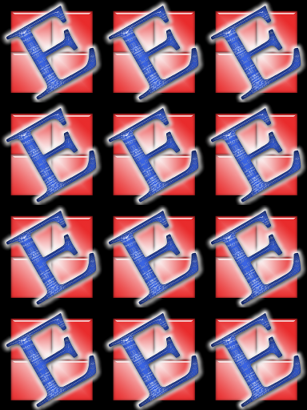

.. _Pixmap:

================
Pixmap
================

Pixmaps ("pixel maps") are objects at the heart of MuPDF's rendering capabilities. They represent plane rectangular sets of pixels. Each pixel is described by a number of bytes ("components") plus an (optional since v1.10.0) alpha byte.

In PyMuPDF, there exist several ways to create a pixmap. Except one, all of them are available as overloaded constructors. A pixmap can be created ...

1. from a document page (via methods :meth:`Page.getPixmap` or :meth:`Document.getPagePixmap`)
2. empty based on :ref:`Colorspace` and :ref:`IRect` information
3. from an image file
4. from an in-memory image (bytearray)
5. from a memory area of plain pixels
6. from an image inside a PDF document
7. as a copy of another pixmap

.. NOTE:: A number of image formats are supported as input using the **file** or **in-memory constructors**. For a list see section below.

Have a look at the **example** section to see some pixmap usage "at work".

============================= ===================================================
**Method / Attribute**        **Short Description**
============================= ===================================================
:meth:`Pixmap.clearWith`      clears (parts of) a pixmap
:meth:`Pixmap.copyPixmap`     copy parts of another pixmap
:meth:`Pixmap.gammaWith`      applies a gamma factor to the pixmap
:meth:`Pixmap.getPNGData`     returns a PNG as a memory area
:meth:`Pixmap.invertIRect`    invert the pixels of a given area
:meth:`Pixmap.tintWith`       tints a pixmap with a color
:meth:`Pixmap.writeImage`     saves a pixmap in a variety of image formats
:meth:`Pixmap.writePNG`       saves a pixmap as a PNG file
:attr:`Pixmap.alpha`          indicates whether transparency is included
:attr:`Pixmap.colorspace`     contains the :ref:`Colorspace`
:attr:`Pixmap.height`         height of the region in pixels
:attr:`Pixmap.interpolate`    interpolation method indicator
:attr:`Pixmap.irect`          contains the :ref:`IRect`
:attr:`Pixmap.n`              number of bytes per pixel including alpha byte
:attr:`Pixmap.samples`        the components data for all pixels
:attr:`Pixmap.size`           contains the pixmap's total length
:attr:`Pixmap.stride`         number of bytes of one image row
:attr:`Pixmap.width`          width of the region in pixels
:attr:`Pixmap.x`              X-coordinate of top-left corner of pixmap
:attr:`Pixmap.xres`           resolution in X-direction
:attr:`Pixmap.y`              Y-coordinate of top-left corner of pixmap
:attr:`Pixmap.yres`           resolution in Y-direction
============================= ===================================================

**Class API**

.. class:: Pixmap

   .. method:: __init__(self, colorspace, irect, alpha)

      This constructor creates an empty pixmap of a size and an origin specified by the irect object. So, for a ``fitz.IRect(x0, y0, x1, y1)``, ``fitz.Point(x0, y0)`` designates the top left corner of the pixmap. Note that the image area is **not initialized** and will contain crap data.

      :param `colorspace`: The colorspace of the pixmap.
      :type `colorspace`: :ref:`Colorspace`

      :param `irect`: Specifies the pixmap's area and its location.
      :type `irect`: :ref:`IRect`

      :param `alpha`: Specifies whether transparency bytes should be included. Default is ``False``.
      :type `alpha`: bool

   .. method:: __init__(self, doc, xref)

      This constructor creates a pixmap with origin ``(0, 0)`` from an image contained in PDF document ``doc`` identified by its XREF number.

      :param `doc`: an opened **PDF** document.
      :type `doc`: :ref:`Document`

      :param `xref`: the XREF number of the image.
      :type `xref`: int

   .. method:: __init__(self, colorspace, sourcepix)

      This constructor creates a new pixmap as a copy of another one, ``sourcepix``. If the two colorspaces differ, a conversion will take place. Any combination of supported colorspaces is possible. The result will have the same alpha as the source.

      :param `colorspace`: The colorspace of the pixmap.
      :type `colorspace`: :ref:`Colorspace`

      :param `sourcepix`: the source pixmap.
      :type `sourcepix`: ``Pixmap``

   .. method:: __init__(self, filename)

      This constructor creates a pixmap from the image contained in file ``filename``. The image type is determined automatically.

      :param `filename`: Path / name of the file. The origin of the resulting pixmap is ``(0, 0)``.
      :type `filename`: string

   .. method:: __init__(self, img)

      This constructor creates a non-empty pixmap from ``img``, which is assumed to contain a supported image as a bytearray. The image type is determined automatically.

      :param `img`: Data containing a complete, valid image in one of the supported formats. E.g. this may have been obtained from a statement like ``img = bytearray(open('somepic.png', 'rb').read())``. The origin of the resulting pixmap is (0,0).
      :type `img`: bytearray

   .. method:: __init__(self, colorspace, width, height, samples, alpha)

      This constructor creates a non-empty pixmap from ``samples``, which is assumed to contain an image in "plain pixel" format. This means that each pixel is represented by ``n`` bytes (as controlled by the ``colorspace`` parameter). The origin of the resulting pixmap is (0,0). This method is useful when raw image data are provided by some other program - see examples below.

      :param `colorspace`: Colorspace of the image. Together with ``alpha`` this parameter controls the interpretation of the ``samples`` area: for :data:`CS_GRAY`, :data:`CS_RGB` and :data:`CS_CMYK`, ``1 + alpha``, ``3 + alpha`` or ``4 + alpha`` bytes in samples will be assumed to define one pixel, respectively. Calling this number ``n``, the following must evaluate to ``True``: ``n * width * height == len(samples)``.
      :type `colorspace`: :ref:`Colorspace`

      :param `width`: Width of the image in pixels
      :type `width`: int

      :param `height`: Height of the image in pixels
      :type `height`: int

      :param `samples`: ``bytearray``, ``bytes`` or ``string`` (Python 2 only) containing consecutive bytes describing all pixels of the image.
      :type `samples`: bytearray, bytes or str

      :param `alpha`: a transparency channel is included in samples.
      :type `alpha`: bool

   .. method:: clearWith(value, [irect])

      Clears an area specified by the :ref:`IRect` ``irect`` within a pixmap. To clear the whole pixmap omit ``irect``.

      :param `value`: Values from 0 to 255 are valid. Each color byte of each pixel will be set to this value, while alpha will always be set to 255 (non-transparent) if present. Default is 0 (black).
      :type `value`: int

      :param `irect`: An ``IRect`` object specifying the area to be cleared.
      :type `irect`: :ref:`IRect`

   .. method:: tintWith(red, green, blue)

      Colorizes (tints) a pixmap with a color provided as a value triple (red, green, blue). Use this method only for :data:`CS_GRAY` or :data:`CS_RGB` colorspaces. A ``TypeError`` exception will otherwise be raised.

      If the colorspace is :data:`CS_GRAY`, ``(red + green + blue)/3`` will be taken as the tinting value.

      :param `red`: The ``red`` component. Values from 0 to 255 are valid.
      :type `red`: int

      :param `green`: The ``green`` component. Values from 0 to 255 are valid.
      :type `green`: int

      :param `blue`: The ``blue`` component. Values from 0 to 255 are valid.
      :type `blue`: int

   .. method:: gammaWith(gamma)

      Applies a gamma factor to a pixmap, i.e. lightens or darkens it.

      :param `gamma`: ``gamma = 1.0`` does nothing, ``gamma < 1.0`` lightens, ``gamma > 1.0`` darkens the image.
      :type `gamma`: float

   .. method:: invertIRect(irect)

      Invert the color of all pixels in an area specified by :ref:`IRect` ``irect``. To invert everything, use ``getIRect()`` or omit this parameter.

      :param `irect`: The area to be inverted.
      :type `irect`: :ref:`IRect`

   .. method:: copyPixmap(source, irect)

      Copies the :ref:`IRect` part of the ``source`` pixmap into the corresponding area of this one. The two pixmaps may have different dimensions and different colorspaces (provided each is either :data:`CS_GRAY` or :data:`CS_RGB`), but currently **must** have the same alpha property. The copy mechanism automatically adjusts discrepancies between source and target pixmap like so:

      If copying from :data:`CS_GRAY` to :data:`CS_RGB`, the source gray-shade value will be put into each of the three rgb component bytes. If the other way round, (r + g + b) / 3 will be taken as the gray-shade value of the target.

      Between the specified ``irect`` and the target pixmap's :ref:`Irect`, an "intersection" rectangle is calculated at first. Then the corresponding data of this intersection are being copied. If the intersection is empty, nothing will happen.

      If you want your ``source`` pixmap image to land at a specific position of the target, set its ``x`` and ``y`` attributes to the top left point of the desired rectangle before copying. See the example below for how this works.

      :param `source`: The pixmap from where to copy.
      :type `source`: :ref:`Pixmap`

      :param `irect`: An IRect object specifying the area to be copied.
      :type `irect`: :ref:`IRect`

   .. method:: writePNG(filename)

      Saves a pixmap as a PNG file. Please note that only grayscale and RGB colorspaces can be saved in PNG format (this is a MuPDF restriction). CMYK colorspaces must either be saved as ``*.pam`` files or be converted. Since MuPDF v1.10a the ``savealpha`` option is no longer supported and will be ignored with a warning.

      :param `filename`: The filename to save as (the extension ``png`` must be specified).
      :type `filename`: string

   .. method:: getPNGData()

      Returns the pixmap as an image area (bytearray) in PNG format. Please note that only grayscale and RGB colorspaces can be produced in PNG format (this is a MuPDF restriction). CMYK colorspaces must be converted first. Since MuPDF v1.10a the ``savealpha`` option is no longer supported and will be ignored with a warning.

      :rtype: bytearray

   .. method:: writeImage(filename, output="png")

      Saves a pixmap as an image file. This method is an extension to ``writePNG()``. Depending on the output chosen, some or all colorspaces are supported and different file extensions can be chosen. Please see the table below. Since MuPDF v1.10a the ``savealpha`` option is no longer supported and will be ignored with a warning.

      :param `filename`: The filename to save to. Depending on the chosen output format, possible file extensions are ``.pam``, ``.pbm``, ``.pgm``, ``ppm``, ``.pnm``, ``.png`` and ``.tga``.
      :type `filename`: string

      :param `output`: The requested image format. The default is ``png`` for which this function is equivalent to ``writePNG()``. Other possible values are ``pam``, ``pnm`` and ``tga``.
      :type `output`: string

   .. attribute:: alpha

      Indicates whether this pixmap contains transparency information

      :rtype: bool

   .. attribute:: colorspace

      The colorspace of the pixmap.

      :rtype: str

   .. attribute:: stride

      Contains the length of one row of image data in ``samples``. This is primarily used for calculation purposes. The following expressions are ``True``: ``len(samples) == height * stride``, ``width * n == stride``, ``Colorspace.nbytes + alpha == n``.

      :rtype: int

   .. attribute:: irect

      Contains the :ref:`IRect` of the pixmap.

      :rtype: :ref:`IRect`

   .. attribute:: samples

      The color and transparency values for all pixels. ``samples`` is a memory area of size ``width * height * n`` bytes. Each n bytes define one pixel. Each successive n bytes yield another pixel in scanline order. Subsequent scanlines follow each other with no padding. E.g. for an RGBA colorspace this means, ``samples`` is a bytearray like ``..., R, G, B, A, ...``, and the four byte values R, G, B, A define one pixel.

      This area can also be used by other graphics libraries like PIL (Python Imaging Library) to do additional processing like saving the pixmap in other image formats. See example 3.

      :rtype: bytearray

   .. attribute:: size

      Contains the total length of the pixmap. This will generally equal ``len(pix.samples) + 60``. The following will evaluate to ``True``: ``len(pixmap) == pixmap.size``.

      :rtype: int

   .. attribute:: width

      The width of the region in pixels. For compatibility reasons, ``w`` is also supported.

      :rtype: int

   .. attribute:: height

      The height of the region in pixels. For compatibility reasons, ``h`` is also supported.

      :rtype: int

   .. attribute:: x

      X-coordinate of top-left corner

      :rtype: int

   .. attribute:: y

      Y-coordinate of top-left corner

      :rtype: int

   .. attribute:: n

      Number of components per pixel. This number depends on colorspace and alpha (see remark above).

      :rtype: int

   .. attribute:: xres

      Horizontal resolution in dpi (dots per inch).

      :rtype: int

   .. attribute:: yres

      Vertical resolution in dpi.

      :rtype: int

   .. attribute:: interpolate

      An information-only boolean flag set to ``True`` if the image will be drawn using "linear interpolation". If ``False`` "nearest neighbour sampling" will be used.

      :rtype: bool

Supported Pixmap Construction Image Types
-------------------------------------------
The following file types are supported as input to construct pixmaps: BMP, JPEG, GIF, TIFF, JXR, and PNG.

Details on Saving Images with ``writeImage()``
-----------------------------------------------

The following table shows possible combinations of file extensions, output formats and colorspaces of method ``writeImage()``.

.. image:: writeimage.png

.. note:: Not all image file types are available, or at least common on all platforms, e.g. PAM is mostly unknown on Windows. Especially pertaining to CMYK colorspaces, you can always convert a CMYK pixmap to an RGB-pixmap with ``rgb_pix = fitz.Pixmap(fitz.csRGB, cmyk_pix)`` and then save that as a PNG.

Pixmap Example Code Snippets
-----------------------------

**Example 1**

This shows how pixmaps can be used for purely graphical, non-PDF purposes. The script reads a PNG picture and creates a new PNG file which consist of 3 * 4 tiles of the original one:
::
 import fitz
 # create a pixmap of a picture
 pix0 = fitz.Pixmap("editra.png")

 # set target colorspace and pixmap dimensions and create it
 tar_width  = pix0.width * 3              # 3 tiles per row
 tar_height = pix0.height * 4             # 4 tiles per column
 tar_irect  = fitz.IRect(0, 0, tar_width, tar_height)
 # create empty target pixmap
 tar_pix    = fitz.Pixmap(fitz.csRGB, tar_irect, pix0.alpha)
 # clear target with a very lively stone-gray (thanks and R.I.P., Loriot)
 tar_pix.clearWith(90)

 # now fill target with 3 * 4 tiles of input picture
 for i in range(4):
     pix0.y = i * pix0.height                     # modify input's y coord
     for j in range(3):
         pix0.x = j * pix0.width                  # modify input's x coord
         tar_pix.copyPixmap(pix0, pix0.irect)     # copy input to new loc
         # save all intermediate images to show what is happening
         fn = "target-" + str(i) + str(j) + ".png"
         tar_pix.writePNG(fn)

This is the input picture ``editra.png`` (taken from the wxPython directory ``/tools/Editra/pixmaps``):

.. image:: editra.png

Here is the output, showing some intermediate picture and the final result:

.. image:: target-11.png

**Example 2**

This shows how to create a PNG file from a numpy array (several times faster than most other methods):
::
 import numpy as np
 import fitz
 #==============================================================================
 # create a fun-colored width * height PNG with fitz and numpy
 #==============================================================================
 height = 150
 width  = 100
 bild=np.ndarray((height, width, 3), dtype=np.uint8)

 for i in range(height):
     for j in range(width):
         # one pixel (some fun coloring)
         bild[i, j] = [(i+j)%256, i%256, j%256]

 samples = bytearray(bild.tostring())    # get plain pixel data from numpy array
 pix=fitz.Pixmap(fitz.csRGB, width, height, samples, alpha=False)
 pix.writePNG("test.png")

**Example 3**

This shows how to interface with ``PIL / Pillow`` (the Python Imaging Library), thereby extending the reach of image files that can be processed:
::
 import fitz
 from PIL import Image

 pix = fitz.Pixmap(...)
 ... # any code here
 # create and save a PIL image
 img = Image.frombytes("RGB", [pix.width, pix.height], str(pix.samples))
 img.save(filename, 'jpeg')

 # an example for the opposite direction
 # create a pixmap from any PIL-supported image file "some_image.xxx"

 img = Image.open("some_image.xxx").convert("RGB")
 samples = bytearray(img.tobytes())
 pix = fitz.Pixmap(fitz.csRGB, img.size[0], img.size[1], samples, alpha=False)

