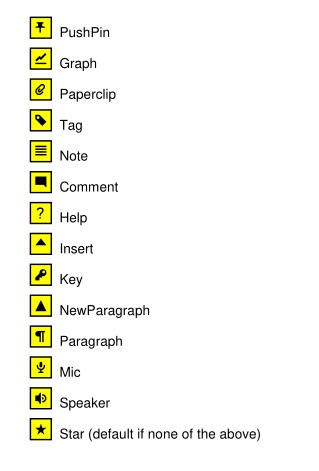
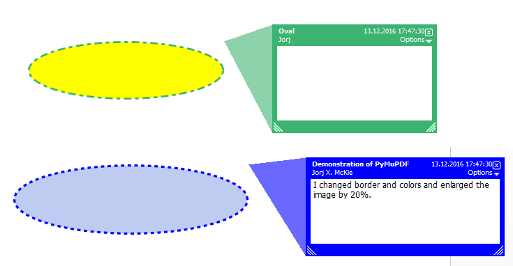

.. _Annot:

================
Annot
================
**This class is supported for PDF documents only.**

Quote from the :ref:`AdobeManual`: "An annotation associates an object such as a note, sound, or movie with a location on a page of a PDF document, or provides a way to interact with the user by means of the mouse and keyboard."

There is a parent-child relationship between an annotation and its page. If the page object becomes unusable (closed document, any document structure change, etc.), then so does every of its existing annotation objects -- an exception is raised saying that the object is "orphaned", whenever an annotation property or method is accessed.

=============================== ==============================================================
**Attribute**                   **Short Description**
=============================== ==============================================================
:meth:`Annot.blendMode`         return the annotation's blend mode
:meth:`Annot.setBlendMode`      set the annotation's blend mode
:meth:`Annot.delete_responses`  delete all responding annotions
:meth:`Annot.fileGet`           return attached file content
:meth:`Annot.fileInfo`          return attached file information
:meth:`Annot.fileUpd`           set attached file new content
:meth:`Annot.getPixmap`         image of the annotation as a pixmap
:meth:`Annot.getText`           extract annotation text
:meth:`Annot.getTextbox`        extract annotation text
:meth:`Annot.setBorder`         change the border
:meth:`Annot.setColors`         change the colors
:meth:`Annot.setFlags`          change the flags
:meth:`Annot.setInfo`           change various properties
:meth:`Annot.setLineEnds`       set line ending styles
:meth:`Annot.setName`           change the "Name" field (e.g. icon name)
:meth:`Annot.setOpacity`        change transparency
:meth:`Annot.setRect`           change the rectangle
:meth:`Annot.setRotation`       change rotation
:meth:`Annot.update`            apply accumulated annot changes
:attr:`Annot.border`            border details
:attr:`Annot.colors`            border / background and fill colors
:attr:`Annot.flags`             annotation flags
:attr:`Annot.info`              various information
:attr:`Annot.lineEnds`          start / end appearance of line-type annotations
:attr:`Annot.next`              link to the next annotation
:attr:`Annot.opacity`           the annot's transparency
:attr:`Annot.parent`            page object of the annotation
:attr:`Annot.rect`              rectangle containing the annotation
:attr:`Annot.type`              type of the annotation
:attr:`Annot.vertices`          point coordinates of Polygons, PolyLines, etc.
:attr:`Annot.xref`              the PDF :data:`xref` number
=============================== ==============================================================

**Class API**

.. class:: Annot

   .. index::
      pair: matrix; getPixmap
      pair: colorspace; getPixmap
      pair: alpha; getPixmap

   .. method:: getPixmap(matrix=fitz.Identity, colorspace=fitz.csRGB, alpha=False)

      Creates a pixmap from the annotation as it appears on the page in untransformed coordinates. The pixmap's :ref:`IRect` equals *Annot.rect.irect* (see below).

      :arg matrix_like matrix: a matrix to be used for image creation. Default is the *fitz.Identity* matrix.

      :arg colorspace: a colorspace to be used for image creation. Default is *fitz.csRGB*.
      :type colorspace: :ref:`Colorspace`

      :arg bool alpha: whether to include transparency information. Default is *False*.

      :rtype: :ref:`Pixmap`

      .. note:: If the annotation has just been created or modified, you should reload the page first via *page = doc.reload_page(page)*.

   .. index::
      pair: blocks; Annot.getText
      pair: dict; Annot.getText
      pair: clip; Annot.getText
      pair: flags; Annot.getText
      pair: html; Annot.getText
      pair: json; Annot.getText
      pair: rawdict; Annot.getText
      pair: text; Annot.getText
      pair: words; Annot.getText
      pair: xhtml; Annot.getText
      pair: xml; Annot.getText

   .. method:: getText(opt="text", clip=None, flags=None)

      *(New in 1.18.0)*

      Retrieves the content of the annotation in a variety of formats -- much like the same method for :ref:`Page`.. This currently only delivers relevant data for annotation types 'FreeText' and 'Stamp'. Other type will return an empty string (or equivalent objects).

      :arg str opt: the desired format - one of the following values. Please note that this method works exactly like the same-named method of :ref:`Page`.

         * "text" -- :meth:`TextPage.extractTEXT`, default
         * "blocks" -- :meth:`TextPage.extractBLOCKS`
         * "words" -- :meth:`TextPage.extractWORDS`
         * "html" -- :meth:`TextPage.extractHTML`
         * "xhtml" -- :meth:`TextPage.extractXHTML`
         * "xml" -- :meth:`TextPage.extractXML`
         * "dict" -- :meth:`TextPage.extractDICT`
         * "json" -- :meth:`TextPage.extractJSON`
         * "rawdict" -- :meth:`TextPage.extractRAWDICT`

      :arg rect-like clip: restrict the extraction to this area. Should hardly ever be required, defaults to :attr:`Annot.rect`.
      :arg int flags: control the amount of data returned. Defaults to simple text extraction.

   .. method:: getTextbox(rect)

      *(New in 1.18.0)*

      Return the annotation text. Mostly (except line breaks) equal to :meth:`Annot.getText` with the "text" option.

      :arg rect-like rect: the area to consider, defaults to :attr:`Annot.rect`.

   .. method:: setInfo(info=None, content=None, title=None, creationDate=None, modDate=None, subject=None)

      *(Changed in version 1.16.10)*

      Changes annotation properties. These include dates, contents, subject and author (title). Changes for *name* and *id* will be ignored. The update happens selectively: To leave a property unchanged, set it to *None*. To delete existing data, use an empty string.

      :arg dict info: a dictionary compatible with the *info* property (see below). All entries must be strings. If this argument is not a dictionary, the other arguments are used instead -- else they are ignored.
      :arg str content: *(new in v1.16.10)* see description in :attr:`info`.
      :arg str title: *(new in v1.16.10)* see description in :attr:`info`.
      :arg str creationDate: *(new in v1.16.10)* date of annot creation. If given, should be in PDF datetime format.
      :arg str modDate: *(new in v1.16.10)* date of last modification. If given, should be in PDF datetime format.
      :arg str subject: *(new in v1.16.10)* see description in :attr:`info`.

   .. method:: setLineEnds(start, end)

      Sets an annotation's line ending styles. Each of these annotation types is defined by a list of points which are connected by lines. The symbol identified by *start* is attached to the first point, and *end* to the last point of this list. For unsupported annotation types, a no-operation with a warning message results.

      .. note::

         * While only 'FreeText', 'Line', 'PolyLine', and 'Polygon' annotations can have these properties, (Py-) MuPDF does not support line ends for 'FreeText', because the call-out variant for these is not supported.
         * *(Changed in v1.16.16)* Some symbols have an interior area (diamonds, circles, squares, etc.). By default, these areas are filled with the fill color of the annotation. If this is *None*, then white is chosen. The *fill_color* argument of :meth:`Annot.update` can now be used to override this.

      :arg int start: The symbol number for the first point.
      :arg int end: The symbol number for the last point.

   .. method:: setOpacity(value)

      Set the annotation's transparency. Opacity can also be set in :meth:`Annot.update`.

      :arg float value: a float in range *[0, 1]*. Any value outside is assumed to be 1. E.g. a value of 0.5 sets the transparency to 50%.

      Three overlapping 'Circle' annotations with each opacity set to 0.5:

      .. image:: images/img-opacity.jpg

   .. method:: blendMode()

      *(New in v1.16.14)* Return the annotation's blend mode. See :ref:`AdobeManual`, page 520 for explanations.

      :rtype: str
      :returns: the blend mode or *None*.

         >>> annot=page.firstAnnot
         >>> annot.blendMode()
         'Multiply'

   .. method:: setBlendMode(blend_mode)

      *(New in v1.16.14)* Set the annotation's blend mode. See :ref:`AdobeManual`, page 520 for explanations. The blend mode can also be set in :meth:`Annot.update`.

      :arg str blend_mode: set the blend mode. Use :meth:`Annot.update` to reflect this in the visual appearance. For predefined values see :ref:`BlendModes`. The best way to **remove** a special blend mode is choosing ``PDF_BM_Normal``.

         >>> annot.setBlendMode(fitz.PDF_BM_Multiply)
         >>> annot.update()
         >>> # or in one statement:
         >>> annot.update(blend_mode=fitz.PDF_BM_Multiply, ...)

   .. method:: setName(name)

      *(New in version 1.16.0)* Change the name field of any annotation type. For 'FileAttachment' and 'Text' annotations, this is the icon name, for 'Stamp' annotations the text in the stamp. The visual result (if any) depends on your PDF viewer. See also :ref:`mupdficons`.

      :arg str name: the new name.

      .. caution:: If you set the name of a 'Stamp' annotation, then this will **not change** the rectangle, nor will the text be layouted in any way. If you choose a standard text from :ref:`StampIcons` (the **exact** name piece after "STAMP_"), you should receive the original layout. An **arbitrary text** will not be changed to upper case, but be written in font "Times-Bold" as is, horizontally centered in **one line** and be shortened to fit. To get your text fully displayed, its length using fontsize 20 must not exceed 190 pixels. So please make sure that the following inequality is true: ``fitz.getTextlength(text, fontname="tibo", fontsize=20) <= 190``.

   .. method:: setRect(rect)

      Change the rectangle of an annotation. The annotation can be moved around and both sides of the rectangle can be independently scaled. However, the annotation appearance will never get rotated, flipped or sheared.

      :arg rect_like rect: the new rectangle of the annotation (finite and not empty). E.g. using a value of *annot.rect + (5, 5, 5, 5)* will shift the annot position 5 pixels to the right and downwards.

      .. note:: You **need not** invoke :meth:`Annot.update` for activation of the effect.

   .. method:: setRotation(angle)

      Set the rotation of an annotation. This rotates the annotation rectangle around its center point. Then a **new annotation rectangle** is calculated from the resulting quad.

      :arg int angle: rotation angle in degrees. Arbitrary values are possible, but will be clamped to the interval 0 <= angle < 360.

      .. note::
        * You **must invoke** :meth:`Annot.update` to activate the effect.
        * For PDF_ANNOT_FREE_TEXT, only one of the values 0, 90, 180 and 270 is possible and will **rotate the text** inside the current rectangle (which remains unchanged). Other values are silently ignored and replaced by 0.
        * Otherwise, only the following :ref:`AnnotationTypes` can be rotated: 'Square', 'Circle', 'Caret', 'Text', 'FileAttachment', 'Ink', 'Line', 'Polyline', 'Polygon', and 'Stamp'. For all others the method is a no-op.

   .. method:: setBorder(border=None, width=0, style=None, dashes=None)

      PDF only: Change border width and dashing properties.

      *Changed in version 1.16.9:* Allow specification without using a dictionary. The direct parameters are used if *border* is not a dictionary.

      :arg dict border: a dictionary as returned by the :attr:`border` property, with keys *"width"* (*float*), *"style"* (*str*) and *"dashes"* (*sequence*). Omitted keys will leave the resp. property unchanged. To e.g. remove dashing use: *"dashes": []*. If dashes is not an empty sequence, "style" will automatically be set to "D" (dashed).

      :arg float width: see above.
      :arg str style: see above.
      :arg sequence dashes: see above.

   .. method:: setFlags(flags)

      Changes the annotation flags. Use the *|* operator to combine several.

      :arg int flags: an integer specifying the required flags.

   .. method:: setColors(colors=None, stroke=None, fill=None)

      Changes the "stroke" and "fill" colors for supported annotation types.

      *Changed in version 1.16.9:* Allow colors to be directly set. These parameters are used if *colors* is not a dictionary.

      :arg dict colors: a dictionary containing color specifications. For accepted dictionary keys and values see below. The most practical way should be to first make a copy of the *colors* property and then modify this dictionary as required.
      :arg sequence stroke: see above.
      :arg sequence fill: see above.

   .. method:: delete_responses()

      *(New in version 1.16.12)* Delete annotations referring to this one. This includes any 'Popup' annotations and all annotations responding to it.

   .. index::
      pair: blend_mode; update
      pair: fontsize; update
      pair: text_color; update
      pair: border_color; update
      pair: fill_color; update
      pair: cross_out; update
      pair: rotate; update

   .. method:: update(opacity=None, blend_mode=None, fontsize=0, text_color=None, border_color=None, fill_color=None, cross_out=True, rotate=-1)

      Synchronize the appearance of an annotation with its properties after any changes. 

      You can safely omit this method **only** for the following changes:

         * :meth:`setRect`
         * :meth:`setFlags`
         * :meth:`fileUpd`
         * :meth:`setInfo` (except any changes to *"content"*)

      All arguments are optional. *(Changed in v1.16.14)* Blend mode and opacity are applicable to **all annotation types**. The other arguments are mostly special use, as described below.

      Color specifications may be made in the usual format used in PuMuPDF as sequences of floats ranging from 0.0 to 1.0 (including both). The sequence length must be 1, 3 or 4 (supporting GRAY, RGB and CMYK colorspaces respectively). For mono-color, just a float is also acceptable and yields some shade of gray.

      :arg float opacity: *(new in v1.16.14)* **valid for all annotation types:** change or set the annotation's transparency. Valid values are *0 <= opacity < 1*.
      :arg str blend_mode: *(new in v1.16.14)* **valid for all annotation types:** change or set the annotation's blend mode. For valid values see :ref:`BlendModes`.
      :arg float fontsize: change font size of the text. 'FreeText' annotations only.
      :arg sequence,float text_color: change the text color. 'FreeText' annotations only.
      :arg sequence,float border_color: change the border color. 'FreeText' annotations only.
      :arg sequence,float fill_color: the fill color.
      
          * 'FreeText' annotations: If you set (or leave) this to *None*, then **no rectangle at all** will be drawn around the text, and the border color will be ignored. This will leave anything "under" the text visible.
          * 'Line', 'Polyline', 'Polygon' annotations: use it to give applicable line end symbols a fill color other than that of the annotation *(changed in v1.16.16)*.

      :arg bool cross_out: *(new in v1.17.2)* add two diagonal lines to the annotation rectangle. 'Redact' annotations only. If not desired, *False* must be specified even if the annotation was created with *False*.
      :arg int rotate: new rotation value. Default (-1) means no change. Supports 'FreeText' and several other annotation types (see :meth:`Annot.setRotation`), [#f1]_. Only choose 0, 90, 180, or 270 degrees for 'FreeText'. Otherwise any integer is acceptable.

      :rtype: bool

   .. method:: fileInfo()

      Basic information of the annot's attached file.

      :rtype: dict
      :returns: a dictionary with keys *filename*, *ufilename*, *desc* (description), *size* (uncompressed file size), *length* (compressed length) for FileAttachment annot types, else *None*.

   .. method:: fileGet()

      Returns attached file content.

      :rtype: bytes
      :returns: the content of the attached file.

   .. index::
      pair: buffer; fileUpd
      pair: filename; fileUpd
      pair: ufilename; fileUpd
      pair: desc; fileUpd

   .. method:: fileUpd(buffer=None, filename=None, ufilename=None, desc=None)

      Updates the content of an attached file. All arguments are optional. No arguments lead to a no-op.

      :arg bytes|bytearray|BytesIO buffer: the new file content. Omit to only change meta-information.

         *(Changed in version 1.14.13)* *io.BytesIO* is now also supported.

      :arg str filename: new filename to associate with the file.

      :arg str ufilename: new unicode filename to associate with the file.

      :arg str desc: new description of the file content.

   .. attribute:: opacity

      The annotation's transparency. If set, it is a value in range *[0, 1]*. The PDF default is *1.0*. However, in an effort to tell the difference, we return *-1.0* if not set.

      :rtype: float

   .. attribute:: parent

      The owning page object of the annotation.

      :rtype: :ref:`Page`

   .. attribute:: rotation

      The annot rotation.

      :rtype: int
      :returns: a value [-1, 359]. If rotation is not at all, -1 is returned (and implies a rotation angle of 0). Other possible values are normalized to some value value 0 <= angle < 360.

   .. attribute:: rect

      The rectangle containing the annotation.

      :rtype: :ref:`Rect`

   .. attribute:: next

      The next annotation on this page or None.

      :rtype: *Annot*

   .. attribute:: type

      A number and one or two strings describing the annotation type, like **[2, 'FreeText', 'FreeTextCallout']**. The second string entry is optional and may be empty. See the appendix :ref:`AnnotationTypes` for a list of possible values and their meanings.

      :rtype: list

   .. attribute:: info

      A dictionary containing various information. All fields are optional strings. If an information is not provided, an empty string is returned.

      * *name* -- e.g. for 'Stamp' annotations it will contain the stamp text like "Sold" or "Experimental", for other annot types you will see the name of the annot's icon here ("PushPin" for FileAttachment).

      * *content* -- a string containing the text for type *Text* and *FreeText* annotations. Commonly used for filling the text field of annotation pop-up windows.

      * *title* -- a string containing the title of the annotation pop-up window. By convention, this is used for the **annotation author**.

      * *creationDate* -- creation timestamp.

      * *modDate* -- last modified timestamp.

      * *subject* -- subject.

      * *id* -- *(new in version 1.16.10)* a unique identification of the annotation. This is taken from PDF key */NM*. Annotations added by PyMuPDF will have a unique name, which appears here.

      :rtype: dict

   .. attribute:: flags

      An integer whose low order bits contain flags for how the annotation should be presented.

      :rtype: int

   .. attribute:: lineEnds

      A pair of integers specifying start and end symbol of annotations types 'FreeText', 'Line', 'PolyLine', and 'Polygon'. *None* if not applicable. For possible values and descriptions in this list, see the :ref:`AdobeManual`, table 8.27 on page 630.

      :rtype: tuple

   .. attribute:: vertices

      A list containing a variable number of point ("vertices") coordinates (each given by a pair of floats) for various types of annotations:

      * 'Line' -- the starting and ending coordinates (2 float pairs).
      * 'FreeText' -- 2 or 3 float pairs designating the starting, the (optional) knee point, and the ending coordinates.
      * 'PolyLine' / 'Polygon' -- the coordinates of the edges connected by line pieces (n float pairs for n points).
      * text markup annotations -- 4 float pairs specifying the *QuadPoints* of the marked text span (see :ref:`AdobeManual`, page 634).
      * 'Ink' -- list of one to many sublists of vertex coordinates. Each such sublist represents a separate line in the drawing.

      :rtype: list

   .. attribute:: colors

      dictionary of two lists of floats in range *0 <= float <= 1* specifying the "stroke" and the interior ("fill") colors. The stroke color is used for borders and everything that is actively painted or written ("stroked"). The fill color is used for the interior of objects like line ends, circles and squares. The lengths of these lists implicitely determine the colorspaces used: 1 = GRAY, 3 = RGB, 4 = CMYK. So "[1.0, 0.0, 0.0]" stands for RGB color red. Both lists can be empty if no color is specified.

      :rtype: dict

   .. attribute:: xref

      The PDF :data:`xref`.

      :rtype: int

   .. attribute:: border

      A dictionary containing border characteristics. Empty if no border information exists. The following keys may be present:

      * *width* -- a float indicating the border thickness in points. The value is -1.0 if no width is specified.

      * *dashes* -- a sequence of integers specifying a line dash pattern. *[]* means no dashes, *[n]* means equal on-off lengths of *n* points, longer lists will be interpreted as specifying alternating on-off length values. See the :ref:`AdobeManual` page 217 for more details.

      * *style* -- 1-byte border style: **"S"** (Solid) = solid rectangle surrounding the annotation, **"D"** (Dashed) = dashed rectangle surrounding the annotation, the dash pattern is specified by the *dashes* entry, **"B"** (Beveled) = a simulated embossed rectangle that appears to be raised above the surface of the page, **"I"** (Inset) = a simulated engraved rectangle that appears to be recessed below the surface of the page, **"U"** (Underline) = a single line along the bottom of the annotation rectangle.

      :rtype: dict

.. _mupdficons:

Annotation Icons in MuPDF
-------------------------
This is a list of icons referencable by name for annotation types 'Text' and 'FileAttachment'. You can use them via the *icon* parameter when adding an annotation, or use the as argument in :meth:`Annot.setName`. It is left to your discretion which item to choose when -- no mechanism will keep you from using e.g. the "Speaker" icon for a 'FileAttachment'.

Example
--------
Change the graphical image of an annotation. Also update the "author" and the text to be shown in the popup window::

 doc = fitz.open("circle-in.pdf")
 page = doc[0]                          # page 0
 annot = page.firstAnnot                # get the annotation
 annot.setBorder({"dashes": [3]})       # set dashes to "3 on, 3 off ..."

 # set stroke and fill color to some blue
 annot.setColors({"stroke":(0, 0, 1), "fill":(0.75, 0.8, 0.95)})
 info = annot.info                      # get info dict
 info["title"] = "Jorj X. McKie"        # set author

 # text in popup window ...
 info["content"] = "I changed border and colors and enlarged the image by 20%."
 info["subject"] = "Demonstration of PyMuPDF"     # some PDF viewers also show this
 annot.setInfo(info)                    # update info dict
 r = annot.rect                         # take annot rect
 r.x1 = r.x0 + r.width  * 1.2           # new location has same top-left
 r.y1 = r.y0 + r.height * 1.2           # but 20% longer sides
 annot.setRect(r)                       # update rectangle
 annot.update()                         # update the annot's appearance
 doc.save("circle-out.pdf")             # save

This is how the circle annotation looks like before and after the change (pop-up windows displayed using Nitro PDF viewer):

|circle|

.. rubric:: Footnotes

.. [#f1] Rotating an annotation generally also changes its rectangle. Depending on how the annotation was defined, the original rectangle in general is **not reconstructible** by setting the rotation value to zero. This information may be lost. 
