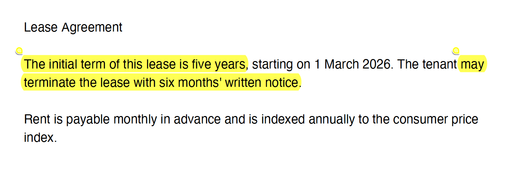
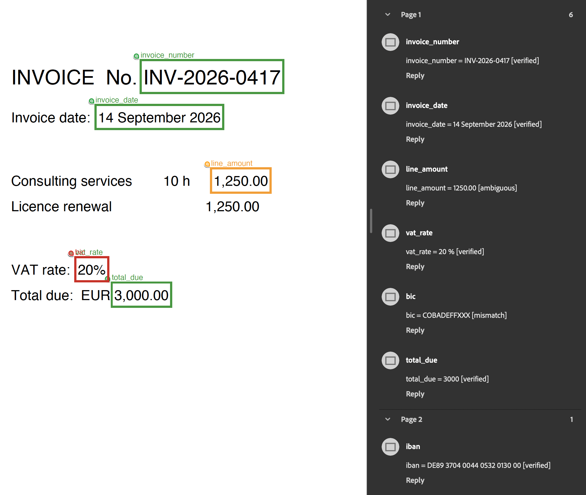
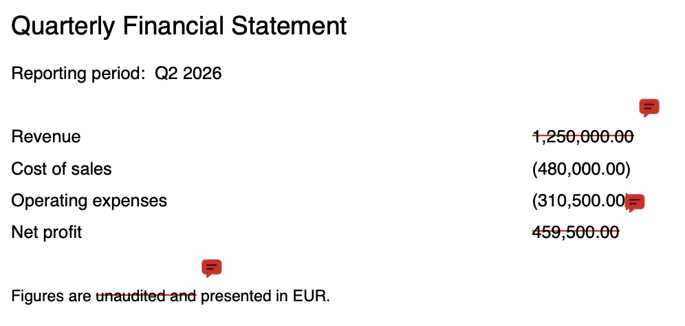

.. include:: header.rst

.. _Grounding:

 
==============================
PyMuPDF & Grounding
==============================

Grounding is about connecting output back to source evidence. This means ensuring that every extracted claim is traceable to a specific, verifiable location in the source document. In document data extraction, it is the practice of anchoring what a model says back to what a document actually contains — not what seems plausible given the context, but what is factually, verifiably present in the source.

This section explores 3 grounding patterns and how |PyMuPDF| uses **deterministic reasoning** and grounding techniques to extract and connect information from documents.

|PyMuPDF| helps you build **verifiable evidence objects**, that is: extracted content linked to its source document, page, and region, with enough context to inspect it and ground its origin.

Grounding: 3 patterns
-----------------------

These examples illustrate three common grounding patterns used in document data extraction. The scripts provided demonstrate each pattern and are self-contained for easy experimentation.

----

1. Answer and citation grounding
~~~~~~~~~~~~~~~~~~~~~~~~~~~~~~~~~~~

This applies when an LLM answers questions about a document. The answer carries verbatim quotes, each one located and highlighted in the source PDF, so every claim can be traced to the passage behind it. Unverifiable quotes are flagged rather than trusted.

Our example highlights how an answer is **grounded with citations directly linked to the source document** and we use a simulated LLM to demonstrate this process.





The code example creates a basic PDF with sample text content and asks PyMuPDF to highlight the areas that support the answer from the LLM response.


.. code-block:: python

    """
    Answer and citation grounding with PyMuPDF
    ==========================================
    
    Goal: The goal of the answer and citation grounding sample is to make an AI-generated
    answer checkable against the source PDF. Every claim in the answer should point to the
    exact passage that supports it, and that passage should be highlighted in the original
    document so a person can confirm it in seconds instead of rereading the whole file.

    Pipeline:
    1. Extract text chunks from a PDF, keeping page number + bounding box.
    2. Retrieve the chunks relevant to a question (simple keyword scoring here;
        swap in your vector store).
    3. Ask an LLM to answer ONLY from those chunks and return verbatim quotes
        with the chunk id they came from (LLM call is a pluggable stub).
    4. Locate each quote on the page (exact search, then a word-level fallback
        that tolerates line breaks, hyphenation and whitespace differences).
    5. Highlight the evidence in a copy of the PDF, attach a note with the
        citation number, and render a PNG snippet of each cited region.

    Requires: pip install pymupdf
    """

    import json
    import re
    from dataclasses import dataclass, field

    import pymupdf

    # --------------------------------------------------------------------------
    # 1. Extraction: text chunks with page + position
    # --------------------------------------------------------------------------
    @dataclass
    class Chunk:
        id: str
        page: int                # 0-based page index
        bbox: tuple              # (x0, y0, x1, y1) in PDF points
        text: str


    def extract_chunks(doc: pymupdf.Document) -> list[Chunk]:
        """One chunk per text block. Use paragraphs/sections in production."""
        chunks = []
        for page in doc:
            for x0, y0, x1, y1, text, block_no, block_type in page.get_text("blocks", sort=True):
                if block_type != 0 or not text.strip():   # 0 = text, 1 = image
                    continue
                chunks.append(Chunk(
                    id=f"p{page.number}-b{block_no}",
                    page=page.number,
                    bbox=(x0, y0, x1, y1),
                    text=" ".join(text.split()),
                ))
        return chunks


    # --------------------------------------------------------------------------
    # 2. Retrieval (placeholder: keyword overlap)
    # --------------------------------------------------------------------------
    def tokens(s: str) -> list[str]:
        return re.findall(r"[a-z0-9]+", s.lower())


    def retrieve(chunks: list[Chunk], question: str, k: int = 4) -> list[Chunk]:
        q = set(tokens(question))
        scored = sorted(chunks, key=lambda c: len(q & set(tokens(c.text))), reverse=True)
        return [c for c in scored[:k] if q & set(tokens(c.text))]


    # --------------------------------------------------------------------------
    # 3. LLM call (stub): must return verbatim quotes tied to chunk ids
    # --------------------------------------------------------------------------
    PROMPT = """Answer the question using ONLY the sources below.
    Return JSON: {{"answer": "... [1] ... [2]",
                "citations": [{{"n": 1, "chunk_id": "...", "quote": "exact words copied from the source"}}]}}
    Quotes must be copied verbatim (no paraphrasing), ideally one sentence.

    Question: {question}

    Sources:
    {sources}"""


    def call_llm(prompt: str) -> str:
        """Replace with your provider, e.g. the Anthropic SDK:

            import anthropic
            msg = anthropic.Anthropic().messages.create(
                model="claude-sonnet-4-6", max_tokens=1024,
                messages=[{"role": "user", "content": prompt}])
            return msg.content[0].text
        """
        raise NotImplementedError


    def answer_with_citations(question: str, context: list[Chunk], llm=call_llm) -> dict:
        sources = "\n".join(f"[{c.id}] {c.text}" for c in context)
        raw = llm(PROMPT.format(question=question, sources=sources))
        raw = re.sub(r"^```(?:json)?|```$", "", raw.strip(), flags=re.M)
        return json.loads(raw)


    # --------------------------------------------------------------------------
    # 4. Locate the quote on the page
    # --------------------------------------------------------------------------
    def locate_quote(page: pymupdf.Page, quote: str, clip=None) -> list:
        """Return quads covering `quote`, or [] if it cannot be found."""
        quote = " ".join(quote.split())

        # a) Exact search (case-insensitive, spans line breaks).
        quads = page.search_for(quote, clip=clip, quads=True)
        if quads:
            return quads

        # b) Word-sequence fallback: normalise words on both sides and look for
        #    the quote as a contiguous run. Handles hyphenation, ligatures,
        #    punctuation and whitespace differences.
        words = page.get_text("words", clip=clip, sort=True)   # (x0,y0,x1,y1,word,...)
        norm = lambda w: re.sub(r"[^a-z0-9]", "", w.lower())
        page_words = [(norm(w[4]), w) for w in words if norm(w[4])]
        target = [t for t in (norm(w) for w in quote.split()) if t]
        if not target:
            return []

        joined = [pw[0] for pw in page_words]
        n = len(target)
        for i in range(len(joined) - n + 1):
            if joined[i:i + n] == target:
                return [pymupdf.Rect(w[:4]).quad for _, w in page_words[i:i + n]]

        # c) Partial match: longest leading run of the quote (min 4 words).
        for size in range(n - 1, 3, -1):
            head = target[:size]
            for i in range(len(joined) - size + 1):
                if joined[i:i + size] == head:
                    return [pymupdf.Rect(w[:4]).quad for _, w in page_words[i:i + size]]
        return []


    # --------------------------------------------------------------------------
    # 5. Highlight, annotate and render evidence
    # --------------------------------------------------------------------------
    @dataclass
    class Grounding:
        n: int
        chunk_id: str
        quote: str
        page: int | None = None
        rects: list = field(default_factory=list)
        status: str = "not_found"      # exact | fallback_to_chunk | not_found
        snippet: str | None = None


    def ground_citations(doc, result: dict, chunks: list[Chunk],
                        out_pdf: str, snippet_prefix: str | None = None) -> list[Grounding]:
        by_id = {c.id: c for c in chunks}
        grounded = []

        for cit in result.get("citations", []):
            g = Grounding(n=cit["n"], chunk_id=cit["chunk_id"], quote=cit["quote"])
            chunk = by_id.get(g.chunk_id)
            if chunk is None:                       # hallucinated source id
                grounded.append(g)
                continue

            page = doc[chunk.page]
            clip = pymupdf.Rect(chunk.bbox) + (-2, -2, 2, 2)   # search inside the cited chunk
            quads = locate_quote(page, g.quote, clip=clip) or locate_quote(page, g.quote)

            if quads:
                annot = page.add_highlight_annot(quads)
                g.status = "exact"
                g.rects = [q.rect for q in quads]
            else:
                # Quote not verifiable: mark the whole chunk so a reviewer can check.
                annot = page.add_rect_annot(clip)
                annot.set_colors(stroke=(1, 0.5, 0))
                g.status = "fallback_to_chunk"
                g.rects = [clip]

            annot.set_info(title=f"Citation [{g.n}]", content=g.quote)
            annot.update()
            g.page = page.number

            if snippet_prefix:
                region = pymupdf.Rect(g.rects[0])
                for r in g.rects[1:]:
                    region |= r
                region = (region + (-20, -20, 20, 20)) & page.rect
                pix = page.get_pixmap(clip=region, dpi=150)   # rendered after annotation
                g.snippet = f"{snippet_prefix}_cite{g.n}.png"
                pix.save(g.snippet)

            grounded.append(g)

        doc.save(out_pdf, garbage=3, deflate=True)
        return grounded


    # --------------------------------------------------------------------------
    # End-to-end
    # --------------------------------------------------------------------------
    def run(pdf_path: str, question: str, llm=call_llm,
            out_pdf: str = "grounded.pdf", snippet_prefix: str | None = "evidence") -> dict:
        doc = pymupdf.open(pdf_path)
        chunks = extract_chunks(doc)
        context = retrieve(chunks, question)
        result = answer_with_citations(question, context, llm=llm)
        grounded = ground_citations(doc, result, chunks, out_pdf, snippet_prefix)
        doc.close()

        return {
            "answer": result["answer"],
            "citations": [
                {"n": g.n, "page": None if g.page is None else g.page + 1,
                "status": g.status, "quote": g.quote, "snippet": g.snippet,
                "boxes": [tuple(round(v, 1) for v in r) for r in g.rects]}
                for g in grounded
            ],
            "annotated_pdf": out_pdf,
        }
    

    # --------------------------------------------------------------------------
    # Self-contained demo (creates a sample PDF and uses a fake LLM)
    # --------------------------------------------------------------------------
    if __name__ == "__main__":
        sample = pymupdf.open()
        page = sample.new_page()
        page.insert_textbox(pymupdf.Rect(72, 72, 520, 300), (
            "Lease Agreement\n\n"
            "The initial term of this lease is five years, starting on 1 March 2026. "
            "The tenant may terminate the lease with six months' written notice.\n\n"
            "Rent is payable monthly in advance and is indexed annually to the "
            "consumer price index."
        ), fontsize=12)
        sample.save("sample_lease.pdf")

        def fake_llm(prompt: str) -> str:
            ids = re.findall(r"^\[(p\d+-b\d+)\] (.*)$", prompt, flags=re.M)
            term_id = next(i for i, t in ids if "five years" in t)
            return json.dumps({
                "answer": "The lease runs for five years [1] and can be ended "
                        "with six months' written notice [2].",
                "citations": [
                    {"n": 1, "chunk_id": term_id,
                    "quote": "The initial term of this lease is five years"},
                    {"n": 2, "chunk_id": term_id,
                    "quote": "may terminate the lease with six months' written notice"},
                ],
            })

        report = run("sample_lease.pdf", "How long is the lease and how can it be terminated?",
                    llm=fake_llm, out_pdf="sample_lease_grounded.pdf")
        print(json.dumps(report, indent=2))

----

2. Extracted-data grounding
~~~~~~~~~~~~~~~~~~~~~~~~~~~~~~~~~~~

This applies when values are pulled out of a document, whether by AI, OCR or rules. Each value is marked on the page it was read from and checked against the text actually there, so a reviewer sees the source rather than a bare field.

Our example demonstrates how extracted data is grounded by marking each value on the page it was read from as well as highlighting mismatches or ambiguous data.




The validation produces a grounding PDF example with matches for validated areas (green), ambiguous areas (orange), and mismatches (red).


.. code-block:: python

    """
    Extracted-data grounding with PyMuPDF 
    =====================================
    
    Goal: every extracted value (total, date, rate, ...) carries evidence of
    WHERE it came from in the source PDF, and that evidence is checked.

    Two common situations are covered:

    A. Values come from an extractor that gives NO coordinates
        (an LLM, a regex over plain text, a database record).
        -> Locate each value on the page, using its label as an anchor to pick
            the right occurrence when the value appears more than once.

    B. Values come from an OCR / document-AI service that DOES give
        coordinates, but in its own space (inches, image pixels, a rotated view).
        -> Convert those coordinates to PDF space.

    Both paths then:
    - verify the value really is inside the box (re-read the text there),
    - mark it on a copy of the PDF with a labelled, color-coded box,
    - render an evidence snippet,
    - return a JSON-ready record: field, value, page, bbox, status.

    Requires: pip install pymupdf
    """

    import json
    import re
    from dataclasses import dataclass, field, asdict

    import pymupdf

    # Coordinate notes (PyMuPDF):
    #   * Text extraction, search and annotation methods use UNROTATED page
    #     coordinates (points, origin top-left).
    #   * page.rect, rendered pixmaps and get_pixmap(clip=...) use the page AS
    #     DISPLAYED (rotated).
    #   * page.derotation_matrix maps displayed coordinates -> unrotated ones.

    GREEN, AMBER, RED = (0.1, 0.6, 0.2), (1.0, 0.6, 0.0), (0.85, 0.1, 0.1)


    @dataclass
    class Extracted:
        """One value produced by any extractor."""
        field: str
        value: str
        label: str | None = None          # text near the value, e.g. "Total due"
        page: int | None = None           # 0-based, if the extractor knows it
        bbox: tuple | None = None         # already in PDF points (unrotated), if known


    @dataclass
    class GroundedValue:
        field: str
        value: str
        page: int | None = None
        bbox: tuple | None = None
        status: str = "not_found"         # verified | ambiguous | mismatch | not_found
        found_text: str | None = None
        candidates: int = 0
        snippet: str | None = None
        notes: list = field(default_factory=list)


    # --------------------------------------------------------------------------
    # Value normalisation: "€ 1.250,00", "1,250.00" and "1250" should all match
    # --------------------------------------------------------------------------
    def normalise(value: str) -> str:
        v = value.strip().lower()
        v = re.sub(r"[€$£%]|usd|eur|gbp", "", v)
        num = re.sub(r"[\s'’]", "", v)
        if re.fullmatch(r"[-+(]?[\d.,]+\)?", num):
            num = num.strip("()+")
            # decide which separator is the decimal one (last one with 1-2 digits after it)
            m = re.search(r"[.,](\d{1,2})$", num)
            if m:
                whole, dec = num[:m.start()], m.group(1)
            else:
                whole, dec = num, ""
            whole = re.sub(r"[.,]", "", whole)
            return f"{int(whole or 0)}.{dec.ljust(2, '0')}" if dec else str(int(whole or 0))
        return re.sub(r"[^a-z0-9]", "", v)


    def same_value(a: str, b: str) -> bool:
        na, nb = normalise(a), normalise(b)
        if na == nb:
            return True
        try:                                     # 1250 vs 1250.00
            return abs(float(na) - float(nb)) < 1e-9
        except ValueError:
            return False


    # --------------------------------------------------------------------------
    # Locating a value on a page (path A)
    # --------------------------------------------------------------------------
    def word_runs(page: pymupdf.Page, value: str) -> list[pymupdf.Rect]:
        """Find `value` as a run of 1..n consecutive words, comparing normalised text.
        Catches formatting differences an exact search would miss."""
        words = page.get_text("words", sort=True)
        n_tokens = max(1, len(value.split()))
        hits = []
        for size in {n_tokens, 1, 2, 3}:
            for i in range(len(words) - size + 1):
                run = words[i:i + size]
                # keep runs on one line
                if len({(w[5], w[6]) for w in run}) > 1:
                    continue
                text = " ".join(w[4] for w in run)
                if same_value(text.strip(":;"), value):
                    r = pymupdf.Rect(run[0][:4])
                    for w in run[1:]:
                        r |= pymupdf.Rect(w[:4])
                    hits.append(r)
        # de-duplicate overlapping hits
        unique = []
        for r in hits:
            if not any(abs(r & u) > 0.8 * min(abs(r), abs(u)) for u in unique):
                unique.append(r)
        return unique


    def distance_from_label(value_rect: pymupdf.Rect, label_rect: pymupdf.Rect) -> float:
        """Values usually sit to the right of, or just below, their label."""
        dx = value_rect.x0 - label_rect.x1
        dy = value_rect.y0 - label_rect.y0
        same_line = abs((value_rect.y0 + value_rect.y1) - (label_rect.y0 + label_rect.y1)) / 2 < 4
        if same_line and dx >= -2:
            return dx                           # best: same line, to the right
        if 0 <= dy < 60:
            return 200 + dy + abs(value_rect.x0 - label_rect.x0)   # below the label
        return 10_000 + abs(dx) + abs(dy)       # anywhere else


    def locate_value(doc, item: Extracted) -> tuple[int | None, pymupdf.Rect | None, int]:
        """Return (page, rect, number_of_candidates)."""
        pages = [doc[item.page]] if item.page is not None else list(doc)
        candidates = []                              # (score, page_no, rect)
        for page in pages:
            rects = page.search_for(item.value) or word_runs(page, item.value)
            if not rects:
                continue
            labels = page.search_for(item.label) if item.label else []
            for r in rects:
                score = min((distance_from_label(r, lr) for lr in labels), default=50_000)
                candidates.append((score, page.number, r))

        if not candidates:
            return None, None, 0
        candidates.sort(key=lambda c: c[0])
        _, page_no, rect = candidates[0]
        return page_no, rect, len(candidates)


    # --------------------------------------------------------------------------
    # Converting external coordinates to PDF space (path B)
    # --------------------------------------------------------------------------
    def from_inches(page: pymupdf.Page, polygon: list[float]) -> tuple:
        """Document-AI style polygon [x1,y1,x2,y2,...] in inches on the displayed page
        (e.g. Azure Document Intelligence for PDFs)."""
        xs, ys = polygon[0::2], polygon[1::2]
        shown = pymupdf.Rect(min(xs), min(ys), max(xs), max(ys)) * 72
        return tuple(shown * page.derotation_matrix)


    def from_pixels(page: pymupdf.Page, box: tuple, dpi: int) -> tuple:
        """(x0, y0, x1, y1) in pixels of an image rendered with page.get_pixmap(dpi=dpi),
        e.g. boxes returned by an OCR or vision model that received that image."""
        shown = pymupdf.Rect(box) * (72 / dpi)
        return tuple(shown * page.derotation_matrix)


    # --------------------------------------------------------------------------
    # Verification, marking and evidence
    # --------------------------------------------------------------------------
    def text_in_box(page: pymupdf.Page, rect: pymupdf.Rect) -> str:
        """Words whose centre lies inside rect (more robust than clipping characters)."""
        words = []
        for w in page.get_text("words", sort=True):
            wr = pymupdf.Rect(w[:4])
            centre = pymupdf.Point((wr.x0 + wr.x1) / 2, (wr.y0 + wr.y1) / 2)
            if centre in rect:
                words.append(w[4])
        return " ".join(words)


    def ground_values(doc, items: list[Extracted], out_pdf: str,
                    snippet_prefix: str | None = None) -> list[GroundedValue]:
        results = []
        for item in items:
            g = GroundedValue(field=item.field, value=item.value)

            if item.bbox is not None and item.page is not None:        # path B
                page_no, rect, g.candidates = item.page, pymupdf.Rect(item.bbox), 1
                g.notes.append("coordinates supplied by extractor")
            else:                                                       # path A
                page_no, rect, g.candidates = locate_value(doc, item)

            if rect is None:
                results.append(g)
                continue

            page = doc[page_no]
            g.page, g.bbox = page_no, tuple(round(v, 1) for v in rect)
            g.found_text = text_in_box(page, rect + (-1, -1, 1, 1))

            if not same_value(g.found_text.strip(":;"), item.value):
                g.status, color = "mismatch", RED
                g.notes.append("text at this location does not match the extracted value")
            elif g.candidates > 1 and not item.label:
                g.status, color = "ambiguous", AMBER
                g.notes.append("value occurs more than once; add a label to disambiguate")
            else:
                g.status, color = "verified", GREEN

            box = rect + (-2, -2, 2, 2)
            annot = page.add_rect_annot(box)
            annot.set_colors(stroke=color)
            annot.set_border(width=1.5)
            annot.set_info(title=item.field,
                        content=f"{item.field} = {item.value} [{g.status}]")
            annot.update()

            # Small visible tag above the box. insert_text expects unrotated
            # coordinates; `rotate` keeps the tag upright on rotated pages.
            page.insert_text(box.tl + (0, -2), item.field, fontsize=6,
                            color=color, rotate=page.rotation)

            if snippet_prefix:
                # get_pixmap's clip is in DISPLAYED coordinates, so rotate the box first.
                region = (box * page.rotation_matrix + (-40, -25, 40, 15)) & page.rect
                pix = page.get_pixmap(clip=region, dpi=150)
                g.snippet = f"{snippet_prefix}_{item.field}.png"
                pix.save(g.snippet)

            results.append(g)

        doc.save(out_pdf, garbage=3, deflate=True)
        return results


    # --------------------------------------------------------------------------
    # Self-contained demo
    # --------------------------------------------------------------------------
    if __name__ == "__main__":
        # Build a sample two-page PDF; page 2 is rotated like a landscape scan.
        doc = pymupdf.open()
        p1 = doc.new_page()
        p1.insert_text((72, 80), "INVOICE  No. INV-2026-0417", fontsize=16)
        p1.insert_text((72, 110), "Invoice date:  14 September 2026", fontsize=11)
        p1.insert_text((72, 160), "Consulting services        10 h      1,250.00", fontsize=11)
        p1.insert_text((72, 180), "Licence renewal                        1,250.00", fontsize=11)
        p1.insert_text((72, 230), "VAT rate:  20%", fontsize=11)
        p1.insert_text((72, 250), "Total due:  EUR 3,000.00", fontsize=11)

        p2 = doc.new_page()
        p2.insert_text((72, 80), "Payment terms", fontsize=14)
        p2.insert_text((72, 110), "IBAN:  DE89 3704 0044 0532 0130 00", fontsize=11)
        p2.set_rotation(90)
        doc.save("sample_invoice.pdf")
        doc.close()

        doc = pymupdf.open("sample_invoice.pdf")
        page2 = doc[1]

        # Pretend an OCR service rendered page 2 at 200 dpi and returned a pixel box
        # for the IBAN (computed here from the real position, for the demo only).
        real = page2.search_for("DE89 3704 0044 0532 0130 00")[0]
        shown_px = tuple((real * page2.rotation_matrix) * (200 / 72))

        # A box that points at the wrong place (simulated extractor error).
        wrong_box = tuple(doc[0].search_for("20%")[0])

        items = [
            # Path A: no coordinates (e.g. from an LLM). Different number formats on purpose.
            Extracted("invoice_number", "INV-2026-0417", label="Invoice"),
            Extracted("invoice_date", "14 September 2026", label="Invoice date"),
            Extracted("vat_rate", "20 %", label="VAT rate"),
            Extracted("total_due", "3000", label="Total due"),
            Extracted("line_amount", "1250.00"),                    # appears twice, no label
            Extracted("po_number", "PO-99812", label="PO"),         # not in the document
            # Path B: coordinates from an OCR service, converted to PDF space.
            Extracted("iban", "DE89 3704 0044 0532 0130 00", page=1,
                    bbox=from_pixels(page2, shown_px, dpi=200)),
            # Path B with a wrong box (extractor error) -> should be flagged.
            Extracted("bic", "COBADEFFXXX", page=0, bbox=wrong_box),
        ]

        results = ground_values(doc, items, "sample_invoice_grounded.pdf",
                                snippet_prefix="evidence")
        doc.close()
        print(json.dumps([asdict(r) for r in results], indent=2))


----


3. Verification grounding
~~~~~~~~~~~~~~~~~~~~~~~~~~~~~~~~~~~

This applies when a document is checked against something trusted, either reference data or an earlier version. Each discrepancy is pinned to its location on the page, so reviewing means looking at the differences instead of reading everything.



Our example shows how a CSV input source is used as the trusted reference, with discrepancies in the document highlighted and linked back to their locations on the page.

.. code-block:: python

    """
    Verification grounding with PyMuPDF
    ===================================

    Goal: check a PDF against something trusted and pin every discrepancy to
    its exact location on the page, so a reviewer sees WHAT is wrong and WHERE.

    Two common checks are covered:

    A. PDF vs reference data (Excel/CSV/database/ERP record)
        For each expected field: find its label on the page, read the value
        printed next to it, compare with the reference, mark the result.
        green  = matches    red   = differs (note shows expected vs found)
        orange = label found but no value     (label missing -> report only)

    B. PDF vs PDF (old version vs new version)
        Word-level diff of the two documents. Changed/inserted words are
        highlighted in the new version; deleted/replaced words are struck out
        in the old version. Every change is reported with page and position.

    Both write annotated PDFs, evidence snippets and a JSON-ready report.

    Requires: pip install pymupdf   (reading .xlsx references: pip install openpyxl)
    """

    import csv
    import difflib
    import json
    import re
    from dataclasses import dataclass, field, asdict

    import pymupdf

    # Coordinate notes: text search/extraction and annotations use UNROTATED page
    # coordinates; page.rect and get_pixmap(clip=...) use the page AS DISPLAYED.

    GREEN, ORANGE, RED, BLUE = (0.1, 0.6, 0.2), (1.0, 0.55, 0.0), (0.85, 0.1, 0.1), (0.2, 0.4, 0.9)


    # --------------------------------------------------------------------------
    # Shared helpers
    # --------------------------------------------------------------------------
    def normalise(value: str) -> str:
        """'EUR 1.250,00', '1,250.00' and '1250' -> '1250.00' / '1250'; text -> lowercase alnum."""
        v = re.sub(r"[€$£%]|\b(usd|eur|gbp)\b", "", str(value).strip().lower())
        num = re.sub(r"[\s'’]", "", v)
        if re.fullmatch(r"[-+(]?[\d.,]+\)?", num) and re.search(r"\d", num):
            neg = num.startswith(("-", "("))
            num = num.strip("()+-")
            m = re.search(r"[.,](\d{1,2})$", num)
            whole, dec = (num[:m.start()], m.group(1)) if m else (num, "")
            whole = re.sub(r"[.,]", "", whole) or "0"
            out = f"{int(whole)}.{dec.ljust(2, '0')}" if dec else str(int(whole))
            return f"-{out}" if neg else out
        return re.sub(r"[^a-z0-9]", "", v)


    def same_value(a, b, tolerance: float = 0.0) -> bool:
        na, nb = normalise(a), normalise(b)

        if na == nb:
            return True
        try:
            return abs(float(na) - float(nb)) <= tolerance
        except ValueError:
            return False


    def mark(page: pymupdf.Page, rect: pymupdf.Rect, color, title: str, note: str):
        annot = page.add_rect_annot(rect + (-2, -2, 2, 2))
        annot.set_colors(stroke=color)
        annot.set_border(width=1.5)
        annot.set_info(title=title, content=note)
        annot.update()


    def snippet(page: pymupdf.Page, rect: pymupdf.Rect, path: str, dpi: int = 150) -> str:
        shown = (pymupdf.Rect(rect) * page.rotation_matrix + (-60, -25, 60, 25)) & page.rect
        page.get_pixmap(clip=shown, dpi=dpi).save(path)
        return path


    def union(rects) -> pymupdf.Rect:
        r = pymupdf.Rect(rects[0])
        for x in rects[1:]:
            r |= pymupdf.Rect(x)
        return r


    # ==========================================================================
    # A. PDF vs reference data
    # ==========================================================================
    @dataclass
    class Check:
        field: str                 # name in the reference data
        label: str                 # text printed in the PDF before the value
        expected: str              # value from the reference data
        pick: str = "first"        # "first" value right of the label, or "last" (table rows)
        page: int | None = None    # restrict to a page (0-based) if known
        tolerance: float = 0.0     # numeric tolerance, e.g. 0.01 for rounding


    @dataclass
    class CheckResult:
        field: str
        expected: str
        found: str | None = None
        status: str = "label_not_found"    # match | mismatch | value_not_found | label_not_found
        page: int | None = None
        label_bbox: tuple | None = None
        value_bbox: tuple | None = None
        snippet: str | None = None


    def read_value_right_of(page: pymupdf.Page, label: pymupdf.Rect, pick: str = "first",
                            max_gap: float = 40) -> tuple[str | None, pymupdf.Rect | None]:
        """Read the words on the same line to the right of `label`.
        pick='first': the first group of words (stops at a large horizontal gap).
        pick='last' : the last group on the line (typical for table rows / amounts)."""
        mid = (label.y0 + label.y1) / 2
        line = [w for w in page.get_text("words", sort=True)
                if w[0] >= label.x1 - 1 and w[1] <= mid <= w[3]]
        line.sort(key=lambda w: w[0])
        line = [w for w in line if w[4] not in (":", "-", "–")]
        if not line:
            return None, None

        groups, current = [], [line[0]]
        for prev, w in zip(line, line[1:]):
            if w[0] - prev[2] > max_gap:
                groups.append(current)
                current = []
            current.append(w)
        groups.append(current)

        chosen = groups[-1] if pick == "last" else groups[0]
        text = " ".join(w[4] for w in chosen).strip(":; ")
        return text, union([w[:4] for w in chosen])


    def verify_against_reference(doc, checks: list[Check], out_pdf: str,
                                snippet_prefix: str | None = None) -> list[CheckResult]:
        results = []
        for c in checks:
            r = CheckResult(field=c.field, expected=str(c.expected))
            pages = [doc[c.page]] if c.page is not None else list(doc)

            # Every occurrence of the label is a candidate; prefer the one whose
            # value matches, otherwise report the first one found.
            candidates = []
            for page in pages:
                for lr in page.search_for(c.label):
                    text, vr = read_value_right_of(page, lr, c.pick)
                    candidates.append((page, lr, text, vr))
            if not candidates:
                results.append(r)
                continue

            best = next((x for x in candidates if x[2] and same_value(x[2], c.expected, c.tolerance)),
                        candidates[0])
            page, lr, text, vr = best
            r.page, r.found = page.number, text
            r.label_bbox = tuple(round(v, 1) for v in lr)

            if text is None:
                r.status = "value_not_found"
                mark(page, lr, ORANGE, c.field, f"{c.field}: no value next to label; expected {c.expected}")
                target = lr
            else:
                r.value_bbox = tuple(round(v, 1) for v in vr)
                target = vr
                if same_value(text, c.expected):
                    r.status = "match"
                    mark(page, vr, GREEN, c.field, f"{c.field} OK: {text}")
                elif c.tolerance > 0:
                    if same_value(text, c.expected, c.tolerance):
                        r.status = "close match"
                        mark(page, vr, ORANGE, c.field, f"{c.field} PDF shows {text}, reference has {c.expected}, but within tolerance: {c.tolerance} ")
                    else:
                        r.status = "mismatch"
                        mark(page, vr, RED, c.field, f"{c.field}: PDF shows {text}, reference has {c.expected}, not within tolerance: {c.tolerance} ")
                else:
                    r.status = "mismatch"
                    mark(page, vr, RED, c.field, f"{c.field}: PDF shows {text}, reference has {c.expected}")

            if snippet_prefix:
                r.snippet = snippet(page, target | lr, f"{snippet_prefix}_{c.field}.png")
            results.append(r)

        doc.save(out_pdf, garbage=3, deflate=True)
        return results


    def checks_from_csv(path: str, pick: str = "last") -> list[Check]:
        """CSV/Excel export with columns: field,label,expected[,tolerance]"""
        with open(path, newline="", encoding="utf-8-sig") as f:
            return [Check(row["field"], row["label"], row["expected"], pick=pick,
                        tolerance=float(row.get("tolerance") or 0))
                    for row in csv.DictReader(f)]


    def checks_from_xlsx(path: str, sheet: str | None = None, pick: str = "last") -> list[Check]:
        from openpyxl import load_workbook
        ws = load_workbook(path, data_only=True)[sheet] if sheet else load_workbook(path, data_only=True).active
        rows = ws.iter_rows(values_only=True)
        header = [str(h).strip().lower() for h in next(rows)]
        out = []
        for row in rows:
            d = dict(zip(header, row))
            if d.get("label"):
                out.append(Check(str(d["field"]), str(d["label"]), str(d["expected"]), pick=pick,
                                tolerance=float(d.get("tolerance") or 0)))
        return out


    # ==========================================================================
    # B. PDF vs PDF (version comparison)
    # ==========================================================================
    @dataclass
    class Change:
        kind: str                  # replace | insert | delete
        old_text: str
        new_text: str
        old_page: int | None = None
        new_page: int | None = None
        old_bbox: tuple | None = None
        new_bbox: tuple | None = None


    def doc_words(doc) -> list[tuple]:
        """(page_no, rect, word, line_key) for every word in reading order."""
        out = []
        for page in doc:
            for w in page.get_text("words", sort=True):
                out.append((page.number, pymupdf.Rect(w[:4]), w[4], (page.number, w[5], w[6])))
        return out


    def group_by_line(words: list[tuple]) -> list[tuple[int, pymupdf.Rect]]:
        """Merge consecutive words on the same line into one rect per line."""
        groups = []
        for pno, rect, _, key in words:
            if groups and groups[-1][0] == key:
                groups[-1][2] |= rect
            else:
                groups.append([key, pno, pymupdf.Rect(rect)])
        return [(g[1], g[2]) for g in groups]


    def compare_versions(old_doc, new_doc, old_out: str, new_out: str,
                        snippet_prefix: str | None = None) -> list[Change]:
        old_w, new_w = doc_words(old_doc), doc_words(new_doc)
        a = [normalise(w[2]) or w[2] for w in old_w]
        b = [normalise(w[2]) or w[2] for w in new_w]
        # For very large documents, diff page by page (or paragraph by paragraph) instead.
        sm = difflib.SequenceMatcher(a=a, b=b, autojunk=False)

        changes = []
        for tag, i1, i2, j1, j2 in sm.get_opcodes():
            if tag == "equal":
                continue
            ow, nw = old_w[i1:i2], new_w[j1:j2]
            ch = Change(kind=tag,
                        old_text=" ".join(w[2] for w in ow),
                        new_text=" ".join(w[2] for w in nw))

            if ow:                                      # struck out in the old version
                ch.old_page = ow[0][0]
                for pno, rect in group_by_line(ow):
                    page = old_doc[pno]
                    annot = page.add_strikeout_annot(rect)
                    annot.set_colors(stroke=RED)
                    annot.set_info(title="Removed/changed",
                                content=f"was: {ch.old_text}\nnow: {ch.new_text or '(deleted)'}")
                    annot.update()
                ch.old_bbox = tuple(round(v, 1) for v in union([w[1] for w in ow if w[0] == ch.old_page]))

            if nw:                                      # highlighted in the new version
                ch.new_page = nw[0][0]
                for pno, rect in group_by_line(nw):
                    page = new_doc[pno]
                    annot = page.add_highlight_annot(rect)
                    annot.set_colors(stroke=(1, 0.85, 0.2) if tag == "replace" else (0.6, 0.9, 0.6))
                    annot.set_info(title="Changed" if tag == "replace" else "Inserted",
                                content=f"now: {ch.new_text}\nwas: {ch.old_text or '(new)'}")
                    annot.update()
                ch.new_bbox = tuple(round(v, 1) for v in union([w[1] for w in nw if w[0] == ch.new_page]))
            else:                                       # pure deletion: point at where it was
                anchor = new_w[j1] if j1 < len(new_w) else new_w[-1] if new_w else None
                if anchor:
                    ch.new_page = anchor[0]
                    r = anchor[1]
                    pin = pymupdf.Rect(r.x0 - 3, r.y0, r.x0 - 1, r.y1)
                    annot = new_doc[anchor[0]].add_rect_annot(pin)
                    annot.set_colors(stroke=RED, fill=RED)
                    annot.set_info(title="Deleted", content=f"removed: {ch.old_text}")
                    annot.update()
                    ch.new_bbox = tuple(round(v, 1) for v in pin)

            changes.append(ch)

        if snippet_prefix:
            for n, ch in enumerate(changes, 1):
                if ch.new_page is not None:
                    snippet(new_doc[ch.new_page], pymupdf.Rect(ch.new_bbox),
                            f"{snippet_prefix}_change{n}.png")

        old_doc.save(old_out, garbage=3, deflate=True)
        new_doc.save(new_out, garbage=3, deflate=True)
        return changes


    # --------------------------------------------------------------------------
    # Self-contained demo
    # --------------------------------------------------------------------------
    def make_statement(path: str, rows: list[tuple[str, str]], footer: str):
        doc = pymupdf.open()
        page = doc.new_page()
        page.insert_text((72, 72), "Quarterly Financial Statement", fontsize=16)
        page.insert_text((72, 100), "Reporting period:  Q2 2026", fontsize=11)
        y = 140
        for label, amount in rows:
            page.insert_text((72, y), label, fontsize=11)
            page.insert_text((400, y), amount, fontsize=11)
            y += 20
        page.insert_text((72, y + 20), footer, fontsize=10)
        doc.save(path)
        doc.close()


    if __name__ == "__main__":
        make_statement("statement_v1.pdf",
                    [("Revenue", "1,250,000.00"), ("Cost of sales", "(480,000.00)"),
                        ("Operating expenses", "(310,500.00)"), ("Net profit", "459,500.00")],
                    "Figures are unaudited and presented in EUR.")
        make_statement("statement_v2.pdf",
                    [("Revenue", "1,265,000.00"), ("Cost of sales", "(480,000.00)"),
                        ("Operating expenses", "(310,500.00)"), ("Other income", "12,000.00"),
                        ("Net profit", "486,500.00")],
                    "Figures are presented in EUR.")

        # --- A. Verify v2 against reference data (e.g. an Excel export) --------
        with open("reference.csv", "w", newline="") as f:
            f.write("field,label,expected,tolerance\n"
                    "period,Reporting period,Q2 2026,\n"
                    "revenue,Revenue,1265000,\n"
                    "cost_of_sales,Cost of sales,-480000,\n"
                    "operating_expenses,Operating expenses,-310500,\n"
                    "net_profit,Net profit,485700,1000\n" # wrong in the PDF, but with a tolerance value which puts it "in bounds"
                    "tax,Income tax,-95000,\n") # not in the PDF

        checks = checks_from_csv("reference.csv")
        checks[0].pick = "first"
        doc = pymupdf.open("statement_v2.pdf")
        report_a = verify_against_reference(doc, checks, "statement_v2_verified.pdf",
                                            snippet_prefix="check")
        doc.close()

        # --- B. Compare v1 and v2 ---------------------------------------------
        report_b = compare_versions(pymupdf.open("statement_v1.pdf"),
                                    pymupdf.open("statement_v2.pdf"),
                                    "statement_v1_marked.pdf", "statement_v2_marked.pdf",
                                    snippet_prefix="diff")

        print(json.dumps({"reference_check": [asdict(r) for r in report_a],
                        "version_changes": [asdict(c) for c in report_b]}, indent=2))


.. include:: footer.rst
 