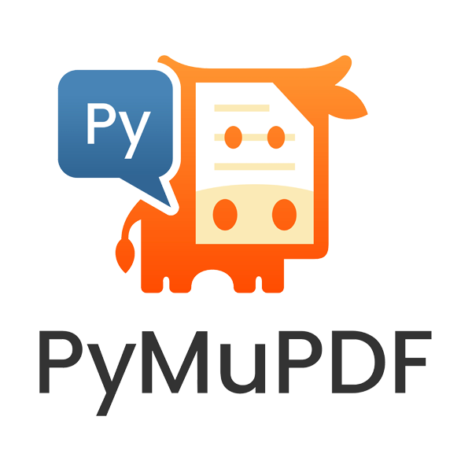

.. include:: header.rst

Introduction
==============

..
   Don't delete the bar symbol - it forces a line break beneath the image - which is required.

|

**PyMuPDF** is a Python binding for `MuPDF <https://www.mupdf.com/>`_ --  a lightweight PDF, XPS, and E-book viewer, renderer, and toolkit, which is maintained and developed by Artifex Software, Inc

MuPDF can access files in PDF, XPS, OpenXPS, CBZ, EPUB, MOBI and FB2 (e-books) formats, and it is known for its top performance and high rendering quality.

MuPDF stands out among all similar products for its top rendering capability and unsurpassed processing speed. At the same time, its "light weight" makes it an excellent choice for platforms where resources are typically limited, like smartphones.

Check this out yourself and compare the various free PDF-viewers. In terms of speed and rendering quality `SumatraPDF <http://www.sumatrapdfreader.org/>`_ ranges at the top (apart from MuPDF's own standalone viewer) -- since it has changed its library basis to  MuPDF!

With PyMuPDF you can access files with extensions like “.pdf”, “.xps”, “.oxps”, “.cbz”, “.fb2”, ".mobi" or “.epub”. In addition, about 10 popular image formats can also be opened and handled like documents.

PyMuPDF provides access to many important functions of MuPDF from within a Python environment, and we are continuously seeking to expand this function set.

PyMuPDF runs and has been tested on Mac, Linux and Windows for Python versions 3.8 [#f1]_ and up. Other platforms should work too, as long as MuPDF and Python support them.

PyMuPDF is hosted on `GitHub <https://github.com/pymupdf/PyMuPDF>`_ and registered on `PyPI <https://pypi.org/project/PyMuPDF/>`_.

For MS Windows, Mac OSX and Linux Python wheels are available -- please see the installation chapter.

The GitHub repository `PyMuPDF-Utilities <https://github.com/pymupdf/PyMuPDF-Utilities>`_ contains a full range of examples, demonstrations and use cases.

Note on the Name *fitz*
--------------------------
The top level Python import name for this library is **"fitz"**. This has historical reasons:

The original rendering library for MuPDF was called *Libart*.

*"After Artifex Software acquired the MuPDF project, the development focus shifted on writing a new modern graphics library called "Fitz". Fitz was originally intended as an R&D project to replace the aging Ghostscript graphics library, but has instead become the rendering engine powering MuPDF."* (Quoted from `Wikipedia <https://en.wikipedia.org/wiki/MuPDF>`_).

So PyMuPDF **cannot coexist** with packages named "fitz" in the same Python environment.

License and Copyright
----------------------
In order to comply with MuPDF’s dual licensing model, PyMuPDF has entered into an agreement with Artifex who has the right to sublicense PyMuPDF to third parties.

PyMuPDF and MuPDF are now available under both, open-source AGPL and commercial license agreements. Please read the full text of the AGPL license agreement, available in the distribution material (file COPYING) and `here <https://www.gnu.org/licenses/agpl-3.0.html>`_, to ensure that your use case complies with the guidelines of the license. If you determine you cannot meet the requirements of the AGPL, please contact `Artifex <https://artifex.com/contact/>`_ for more information regarding a commercial license.

Artifex is the exclusive commercial licensing agent for MuPDF.

Artifex, the Artifex logo, MuPDF, and the MuPDF logo are registered trademarks of Artifex Software Inc. © 2022 Artifex Software, Inc. All rights reserved.

.. include:: version.rst

-----

.. rubric:: Footnotes

.. [#f1] PyMuPDF generally only supports Python versions that are still maintained by the Python Software Foundation. Once a Python version is being retired, PyMuPDF support will also be ended. This means that wheels for a retired Python platform will no longer be provided, and that Python language features may be used that did not exist in the retired Python version.

.. include:: footer.rst
