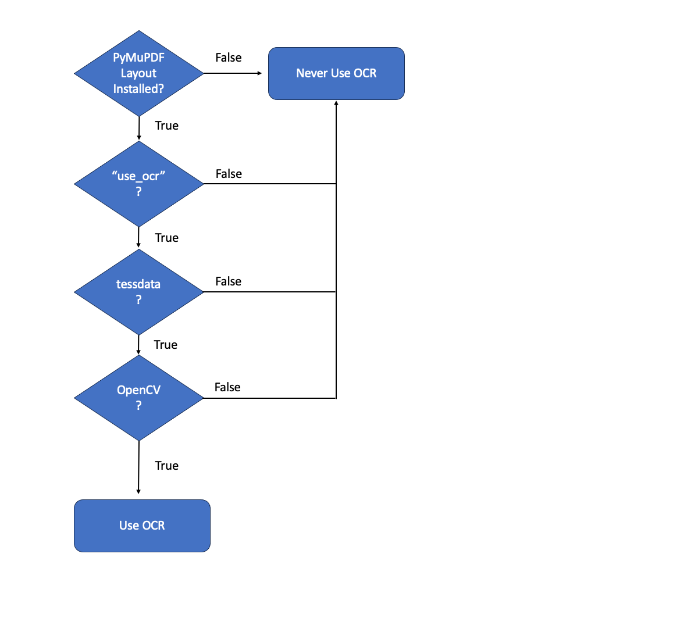

.. include:: ../header.rst

.. _pymupdf-layout:

.. raw:: html

    

 
PyMuPDF Layout
===========================================================================

|PyMuPDF Layout| is a lightweight layout analysis extension for |PyMuPDF| that turns PDFs into clean, structured data with minimal setup. It’s fast, accurate, and efficient without any GPU requirement.

It is an optional, but recommended, addition to the |PyMuPDF| library especially if you are required to more accurately extract structured data with better semantic information.

.. raw:: html

   <button id="tryButton" class="cta orange" onclick="window.location='https://demo.pymupdf.io'">Try Demo</button>
   

Installing
----------------------------------

Install from |PyPI| with::

    pip install pymupdf-layout

.. _pymupdf_layout_using:

Using
----------------------------------

In nutshell, |PyMuPDF Layout| detects the layout to extract, but we need |PyMuPDF4LLM| for the API interface. This provides us with options to extract document content as |Markdown|, |JSON| or |TXT|.

Let's set up the Python coding environment to get started and open a PDF then we'll move on to the semantic data extraction.

Register packages and open a PDF
~~~~~~~~~~~~~~~~~~~~~~~~~~~~~~~~~~

First up let's import the libraries and open a sample document::

    import pymupdf.layout
    import pymupdf4llm
    doc = pymupdf.open("sample.pdf")

Note, in the above code, that |PyMuPDF Layout| must be imported as shown and before importing |PyMuPDF4LLM| to activate |PyMuPDF|'s layout feature and make it available to |PyMuPDF4LLM|.

Omitting the first line would cause execution of standard |PyMuPDF4LLM| - without the layout feature!

Extract the structured data
~~~~~~~~~~~~~~~~~~~~~~~~~~~~~~~~~~

We've activated the |PyMuPDF Layout| library and we've loaded a document, next let's extract the structured data. This is now like a super-charged version of standard |PyMuPDF4LLM| with ``Layout`` working behind the scenes combining heuristics with machine learning - for better extraction results.

Extract as Markdown
""""""""""""""""""""""""

.. code-block:: python

    md = pymupdf4llm.to_markdown(doc)

Extract as JSON
"""""""""""""""""

.. code-block:: python

    json = pymupdf4llm.to_json(doc)

Extract as TXT
"""""""""""""""""

.. code-block:: python

    txt = pymupdf4llm.to_text(doc)

.. note::

    Please refer top the full :ref:`PyMuPDF4LLM API <pymupdf4llm-api>` for more.

Finally we can save the output to an external file as follows::

    from pathlib import Path
    suffix = ".md" # or ".json" or ".txt"
    Path(doc.name).with_suffix(suffix).write_bytes(md.encode())

Headers & Footers
~~~~~~~~~~~~~~~~~~~~~~~

Many documents will have header and footer information on each page of a PDF which you may or may not want to include. This information can be repetitive and simply not needed ( e.g. the same logo and document title or page number information is not always really important when it comes to extracting the document content ).

|PyMuPDF Layout| is trained in detecting these typical document elements and able to omit them.

So in this case we can adjust our API calls to ignore these elements as follows::

    md = pymupdf4llm.to_markdown(doc, header=False, footer=False)
    txt = pymupdf4llm.to_text(doc, header=False, footer=False)

.. note::

    Please note that page ``header`` / ``footer`` exclusion is not applicable to JSON output as it aims to always represent all data for the included pages. Please refer to the full :ref:`PyMuPDF4LLM API <pymupdf4llm-api>` for more.

Extending Capability
----------------------------------

Using with Pro
~~~~~~~~~~~~~~~~~

We are able to extend |PyMuPDF Layout| to work with |PyMuPDF Pro| and thus increase our capability by allowing Office documents to be provided as input files. In this case all we have to do is to add the import for |PyMuPDF Pro| and unlock it::

    import pymupdf.layout
    import pymupdf4llm
    import pymupdf.pro
    pymupdf.pro.unlock()

Now we can happily load Office files and convert them as follows::

    md = pymupdf4llm.to_markdown("sample.docx")

.. _pymupdf_layout_ocr_support:

OCR support
~~~~~~~~~~~~~~~~~

The new layout-sensitive |PyMuPDF4LLM| version also evaluates whether a page would benefit from applying OCR to it. If its heuristics come to this conclusion, the built-in Tesseract-OCR module is automatically invoked. Its results are then handled like normal page content.
 
If a page contains (roughly) no text at all, but is covered with images or many character-sized vectors, a check is made using `OpenCV <https://pypi.org/project/opencv-python/>`_ whether text is *probably* detectable on the page at all. This is done to tell apart image-based text from ordinary pictures (like photographs).

If the page does contain text but too many characters are unreadable (like "�����"), OCR is also executed, but **for the affected text areas only** -- not the full page. This way, we avoid losing already existing text and other content like images and vectors.

For these heuristics to work we need both, an existing :ref:`Tesseract installation <installation_ocr>` and the availability of `OpenCV <https://pypi.org/project/opencv-python/>`_ in the Python environment. If either is missing, no OCR is attempted at all.

The decision tree for whether OCR is actually used or not depends on the following:

1. :ref:`PyMuPDF Layout is imported <pymupdf_layout_using>`

2. In the :ref:`PyMuPDF4LLM API <pymupdf4llm-api>` you have `use_ocr` enabled (this is set to `True` by default)

3. :ref:`Tesseract is correctly installed <installation_ocr>`

4. `OpenCV <https://pypi.org/project/opencv-python/>`_ is available in your Python environment

.. _pymupdf_layout_ocr_engines:

OCR engines
~~~~~~~~~~~~~~~~~~~~~~~

Tesseract 
""""""""""""""""""""""""""""""""""

Tesseract is the default OCR engine used by |PyMuPDF4LLM| when the above criteria are met. It is a widely used open-source OCR engine that supports multiple languages and is known for its accuracy.

.. _pymupdf_layout_rapid_ocr:

RapidOCR 
""""""""""""""""""""""""""""""""""

If you want to use an OCR engine other than Tesseract, you can do so by providing your own OCR function via the `ocr_function` parameter of the :ref:`PyMuPDF4LLM API <pymupdf4llm-api>`. 

If `RapidOCR <https://github.com/RapidAI/RapidOCR?tab=readme-ov-file>`_ and the RapidOCR ONNX Runtime are available, you can use a pre-made callable OCR function for it, which is provided in the `pymupdf4llm.ocr` module as `rapidocr_api.exec_ocr`. 

Example
''''''''''''''''''''''''''''
::

    from pymupdf4llm.ocr import rapidocr_api

    md = pymupdf4llm.to_markdown(
        doc,
        ocr_function=rapidocr_api.exec_ocr,
        force_ocr=True
    )

In this way RapidOCR can be used as an alternative OCR engine to Tesseract for all pages (if `force_ocr=True`) or just for those pages which meet the default criteria for applying OCR (if `force_ocr=False` or omitted). 

RapidOCR & Tesseract side-by-side
""""""""""""""""""""""""""""""""""

If you want to use both OCR engines side-by-side, you can do so by implementing a custom OCR function which calls both OCR engines - one for bbox recognition (RapidOCR) and the other for text recognition (Tesseract) - and then combines their results.

This pre-made callable OCR function can be found in the `pymupdf4llm.ocr` module as `rapidtess_api.exec_ocr`. 

Example
''''''''''''''''''''''''''''
::

    from pymupdf4llm.ocr import rapidtess_api

    md = pymupdf4llm.to_markdown(
        doc,
        ocr_function=rapidtess_api.exec_ocr,
        force_ocr=True
    )

----

.. _pymupdf_layout_and_pymupdf4llm_api:

|PyMuPDF Layout| and |PyMuPDF4LLM| parameter caveats
-----------------------------------------------------

If you have imported ``pymupdf.layout``, |PyMuPDF4LLM| changes its behavior in various areas quite significantly. New methods become available and also some features are no longer supported. Please visit `this site <https://github.com/pymupdf/pymupdf4llm/discussions/327>`_ for a detailed description of the changes. That web site is being kept up to date while we continue to work on improvements.

.. include:: ../footer.rst
