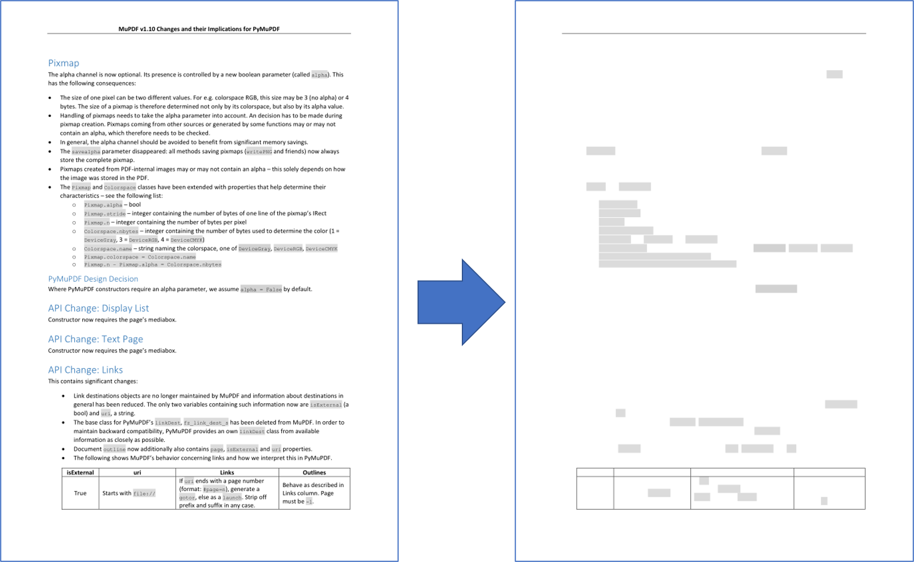

.. include:: header.rst

.. _RecipesDrawingAndGraphics:

==============================
Drawing and Graphics
==============================

.. note::

    When the terms "Drawings" or "Graphics" are mentioned here we are referring to "Vector Graphics" or "Line Art".

    Therefore please consider these terms as being synonymous!

PDF files support elementary drawing operations as part of their syntax. These are **vector graphics** and include basic geometrical objects like lines, curves, circles, rectangles including specifying colors.

The syntax for such operations is defined in "A Operator Summary" on page 643 of the :ref:`AdobeManual`. Specifying these operators for a PDF page happens in its :data:`contents` objects.

|PyMuPDF| implements a large part of the available features via its :ref:`Shape` class, which is comparable to notions like "canvas" in other packages (e.g. `reportlab <https://pypi.org/project/reportlab/>`_).

A shape is always created as a **child of a page**, usually with an instruction like `shape = page.new_shape()`. The class defines numerous methods that perform drawing operations on the page's area. For example, `last_point = shape.draw_rect(rect)` draws a rectangle along the borders of a suitably defined `rect = pymupdf.Rect(...)`.

The returned *last_point* **always** is the :ref:`Point` where drawing operation ended ("last point"). Every such elementary drawing requires a subsequent :meth:`Shape.finish` to "close" it, but there may be multiple drawings which have one common ``finish()`` method.

In fact, :meth:`Shape.finish` *defines* a group of preceding draw operations to form one -- potentially rather complex -- graphics object. |PyMuPDF| provides several predefined graphics in `shapes_and_symbols.py <https://github.com/pymupdf/PyMuPDF-Utilities/blob/master/shapes/shapes_and_symbols.py>`_ which demonstrate how this works.

If you import this script, you can also directly use its graphics as in the following example::

    # -*- coding: utf-8 -*-
    """
    Created on Sun Dec  9 08:34:06 2018

    @author: Jorj
    @license: GNU AFFERO GPL V3

    Create a list of available symbols defined in shapes_and_symbols.py

    This also demonstrates an example usage: how these symbols could be used
    as bullet-point symbols in some text.

    """

    import pymupdf
    import shapes_and_symbols as sas

    # list of available symbol functions and their descriptions
    tlist = [
             (sas.arrow, "arrow (easy)"),
             (sas.caro, "caro (easy)"),
             (sas.clover, "clover (easy)"),
             (sas.diamond, "diamond (easy)"),
             (sas.dontenter, "do not enter (medium)"),
             (sas.frowney, "frowney (medium)"),
             (sas.hand, "hand (complex)"),
             (sas.heart, "heart (easy)"),
             (sas.pencil, "pencil (very complex)"),
             (sas.smiley, "smiley (easy)"),
             ]

    r = pymupdf.Rect(50, 50, 100, 100)  # first rect to contain a symbol
    d = pymupdf.Rect(0, r.height + 10, 0, r.height + 10)  # displacement to next rect
    p = (15, -r.height * 0.2)  # starting point of explanation text
    rlist = [r]  # rectangle list

    for i in range(1, len(tlist)):  # fill in all the rectangles
        rlist.append(rlist[i-1] + d)

    doc = pymupdf.open()  # create empty PDF
    page = doc.new_page()  # create an empty page
    shape = page.new_shape()  # start a Shape (canvas)

    for i, r in enumerate(rlist):
        tlist[i][0](shape, rlist[i])  # execute symbol creation
        shape.insert_text(rlist[i].br + p,  # insert description text
                       tlist[i][1], fontsize=r.height/1.2)

    # store everything to the page's /Contents object
    shape.commit()

    import os
    scriptdir = os.path.dirname(__file__)
    doc.save(os.path.join(scriptdir, "symbol-list.pdf"))  # save the PDF

This is the script's outcome:

.. image:: images/img-symbols.*
   :scale: 50

------------------------------

.. _RecipesDrawingAndGraphics_Extract_Drawings:

How to Extract Drawings
~~~~~~~~~~~~~~~~~~~~~~~~~~~~~~~~~~~~~

* New in v1.18.0

Drawing commands (**vector graphics**) issued by a page can be extracted as a list of dictionaries. Interestingly, this is possible for :ref:`all supported document types<Supported_File_Types>` -- not just PDF: so you can use it for XPS, EPUB and others as well.

Page method, :meth:`Page.get_drawings()` accesses draw commands and converts them into a list of Python dictionaries. Each dictionary -- called a "path" -- represents a separate drawing -- it may be simple like a single line, or a complex combination of lines and curves representing one of the shapes of the previous section.

The *path* dictionary has been designed such that it can easily be used by the :ref:`Shape` class and its methods. Here is an example for a page with one path, that draws a red-bordered yellow circle inside rectangle `Rect(100, 100, 200, 200)`::

    >>> pprint(page.get_drawings())
    [{'closePath': True,
    'color': [1.0, 0.0, 0.0],
    'dashes': '[] 0',
    'even_odd': False,
    'fill': [1.0, 1.0, 0.0],
    'items': [('c',
                Point(100.0, 150.0),
                Point(100.0, 177.614013671875),
                Point(122.38600158691406, 200.0),
                Point(150.0, 200.0)),
                ('c',
                Point(150.0, 200.0),
                Point(177.61399841308594, 200.0),
                Point(200.0, 177.614013671875),
                Point(200.0, 150.0)),
                ('c',
                Point(200.0, 150.0),
                Point(200.0, 122.385986328125),
                Point(177.61399841308594, 100.0),
                Point(150.0, 100.0)),
                ('c',
                Point(150.0, 100.0),
                Point(122.38600158691406, 100.0),
                Point(100.0, 122.385986328125),
                Point(100.0, 150.0))],
    'lineCap': (0, 0, 0),
    'lineJoin': 0,
    'opacity': 1.0,
    'rect': Rect(100.0, 100.0, 200.0, 200.0),
    'width': 1.0}]
    >>>

.. note:: You need (at least) 4 Bézier curves (of 3rd order) to draw a circle with acceptable precision. See this `Wikipedia article <https://en.wikipedia.org/wiki/B%C3%A9zier_curve>`_ for some background.

The following is a code snippet which extracts the drawings of a page and re-draws them on a new page::

    import pymupdf
    doc = pymupdf.open("some.file")
    page = doc[0]
    paths = page.get_drawings()  # extract existing drawings
    # this is a list of "paths", which can directly be drawn again using Shape
    # -------------------------------------------------------------------------
    #
    # define some output page with the same dimensions
    outpdf = pymupdf.open()
    outpage = outpdf.new_page(width=page.rect.width, height=page.rect.height)
    shape = outpage.new_shape()  # make a drawing canvas for the output page
    # --------------------------------------
    # loop through the paths and draw them
    # --------------------------------------
    for path in paths:
        # ------------------------------------
        # draw each entry of the 'items' list
        # ------------------------------------
        for item in path["items"]:  # these are the draw commands
            if item[0] == "l":  # line
                shape.draw_line(item[1], item[2])
            elif item[0] == "re":  # rectangle
                shape.draw_rect(item[1])
            elif item[0] == "qu":  # quad
                shape.draw_quad(item[1])
            elif item[0] == "c":  # curve
                shape.draw_bezier(item[1], item[2], item[3], item[4])
            else:
                raise ValueError("unhandled drawing", item)
        # ------------------------------------------------------
        # all items are drawn, now apply the common properties
        # to finish the path
        # ------------------------------------------------------
        shape.finish(
            fill=path["fill"],  # fill color
            color=path["color"],  # line color
            dashes=path["dashes"],  # line dashing
            even_odd=path.get("even_odd", True),  # control color of overlaps
            closePath=path["closePath"],  # whether to connect last and first point
            lineJoin=path["lineJoin"],  # how line joins should look like
            lineCap=max(path["lineCap"]),  # how line ends should look like
            width=path["width"],  # line width
            stroke_opacity=path.get("stroke_opacity", 1),  # same value for both
            fill_opacity=path.get("fill_opacity", 1),  # opacity parameters
            )
    # all paths processed - commit the shape to its page
    shape.commit()
    outpdf.save("drawings-page-0.pdf")

As can be seen, there is a high congruence level with the :ref:`Shape` class. With one exception: For technical reasons `lineCap` is a tuple of 3 numbers here, whereas it is an integer in :ref:`Shape` (and in PDF). So we simply take the maximum value of that tuple.

Here is a comparison between input and output of an example page, created by the previous script:

.. note:: The reconstruction of graphics, like shown here, is not perfect. The following aspects will not be reproduced as of this version:

   * Page definitions can be complex and include instructions for not showing / hiding certain areas to keep them invisible. Things like this are ignored by :meth:`Page.get_drawings` - it will always return all paths.

.. note:: You can use the path list to make your own lists of e.g. all lines or all rectangles on the page and subselect them by criteria, like color or position on the page etc.

.. _RecipesDrawingAndGraphics_Delete_Drawings:

How to Delete Drawings
~~~~~~~~~~~~~~~~~~~~~~~~~~~~~~~~~~~~~

To delete drawings/vector graphics we must use a :ref:`Redaction Annotation <The_Basics_Redacting>` with the bounding box of the drawing and then **add and apply** a redaction to it to delete it.

The following code shows an example of deleting the first drawing found on the page::

    paths = page.get_drawings()
    rect = paths[0]["rect"]  # rectangle of the 1st drawing
    page.add_redact_annot(rect)
    page.apply_redactions(0,2,1)  # potentially set options for any of images, drawings, text

.. note::

    See :meth:`Page.apply_redactions` for the parameter options which can be sent - you are able to apply deletion options to image, drawing and text objects which are bound by the annotation area.

How to Draw Graphics
~~~~~~~~~~~~~~~~~~~~~~~~~~~~~~~~~

Drawing graphics is as simple as calling the type of :meth:`Drawing Method <Page.draw_line>` you may want. You can draw graphics directly on pages or within shape objects.

For example, to draw a circle::

    # Draw a circle on the page using the Page method
    page.draw_circle((center_x, center_y), radius, color=(1, 0, 0), width=2)

    # Draw a circle on the page using a Shape object
    shape = page.new_shape()
    shape.draw_circle((center_x, center_y), radius)
    shape.finish(color=(1, 0, 0), width=2)
    shape.commit(overlay=True)

The :ref:`Shape` object can be used to combine multiple drawings that should receive common properties as specified by :meth:`Shape.finish`.

.. include:: footer.rst
