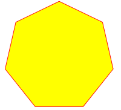
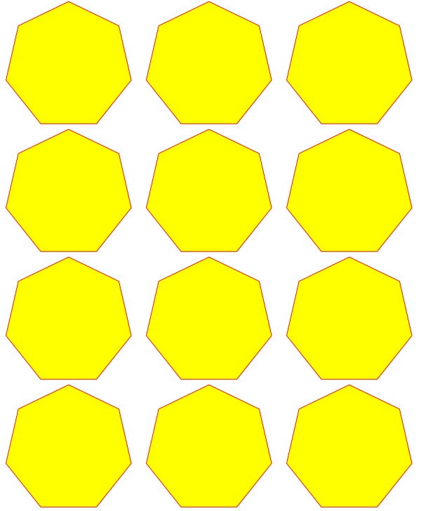
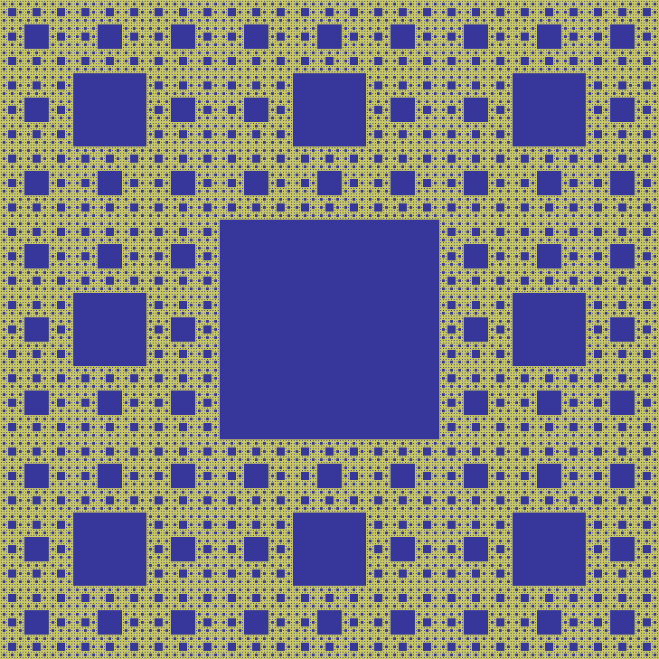

.. include:: header.rst

.. _RecipesImages:

==============================
Images
==============================

.. _RecipesImages_A:

How to Make Images from Document Pages
~~~~~~~~~~~~~~~~~~~~~~~~~~~~~~~~~~~~~~~~~~~~~~~~~~~~~~~~~~~~~~~~~~~~

This little script will take a document filename and generate a PNG file from each of its pages.

The document can be any :ref:`supported type<Supported_File_Types>`.

The script works as a command line tool which expects the filename being supplied as a parameter. The generated image files (1 per page) are stored in the directory of the script::

    import sys, pymupdf  # import the bindings
    fname = sys.argv[1]  # get filename from command line
    doc = pymupdf.open(fname)  # open document
    for page in doc:  # iterate through the pages
        pix = page.get_pixmap()  # render page to an image
        pix.save("page-%i.png" % page.number)  # store image as a PNG

The script directory will now contain PNG image files named *page-0.png*, *page-1.png*, etc. Pictures have the dimension of their pages with width and height rounded to integers, e.g. 595 x 842 pixels for an A4 portrait sized page. They will have a resolution of 96 dpi in x and y dimension and have no transparency. You can change all that -- for how to do this, read the next sections.

----------

.. _RecipesImages_B:

How to Increase :index:`Image Resolution <pair: image; resolution>`
~~~~~~~~~~~~~~~~~~~~~~~~~~~~~~~~~~~~~~~~~~~~~~~~~~~~~~~~~~~~~~~~~~~~

The image of a document page is represented by a :ref:`Pixmap`, and the simplest way to create a pixmap is via method :meth:`Page.get_pixmap`.

This method has many options to influence the result. The most important among them is the :ref:`Matrix`, which lets you :index:`zoom`, rotate, distort or mirror the outcome.

:meth:`Page.get_pixmap` by default will use the :ref:`Identity` matrix, which does nothing.

In the following, we apply a :index:`zoom factor <pair: resolution;zoom>` of 2 to each dimension, which will generate an image with a four times better resolution for us (and also about 4 times the size)::

    zoom_x = 2.0  # horizontal zoom
    zoom_y = 2.0  # vertical zoom
    mat = pymupdf.Matrix(zoom_x, zoom_y)  # zoom factor 2 in each dimension
    pix = page.get_pixmap(matrix=mat)  # use 'mat' instead of the identity matrix

Since version 1.19.2 there is a more direct way to set the resolution: Parameter `"dpi"` (dots per inch) can be used in place of `"matrix"`. To create a 300 dpi image of a page specify `pix = page.get_pixmap(dpi=300)`. Apart from notation brevity, this approach has the additional advantage that the **dpi value is saved with the image** file -- which does not happen automatically when using the Matrix notation.

----------

.. _RecipesImages_C:

How to Create :index:`Partial Pixmaps` (Clips)
~~~~~~~~~~~~~~~~~~~~~~~~~~~~~~~~~~~~~~~~~~~~~~~~~~~~~~~
You do not always need or want the full image of a page. This is the case e.g. when you display the image in a GUI and would like to fill the respective window with a zoomed part of the page.

Let's assume your GUI window has room to display a full document page, but you now want to fill this room with the bottom right quarter of your page, thus using a four times better resolution.

To achieve this, define a rectangle equal to the area you want to appear in the GUI and call it "clip". One way of constructing rectangles in PyMuPDF is by providing two diagonally opposite corners, which is what we are doing here.

.. image:: images/img-clip.*
   :width: 50%

::

    mat = pymupdf.Matrix(2, 2)  # zoom factor 2 in each direction
    rect = page.rect  # the page rectangle
    mp = (rect.tl + rect.br) / 2  # its middle point, becomes top-left of clip
    clip = pymupdf.Rect(mp, rect.br)  # the area we want
    pix = page.get_pixmap(matrix=mat, clip=clip)

In the above we construct *clip* by specifying two diagonally opposite points: the middle point *mp* of the page rectangle, and its bottom right, *rect.br*.

----------

.. _RecipesImages_D:

How to Zoom a Clip to a GUI Window
~~~~~~~~~~~~~~~~~~~~~~~~~~~~~~~~~~~~
Please also read the previous section. This time we want to **compute the zoom factor** for a clip, such that its image best fits a given GUI window. This means, that the image's width or height (or both) will equal the window dimension. For the following code snippet you need to provide the WIDTH and HEIGHT of your GUI's window that should receive the page's clip rectangle.

::

    # WIDTH: width of the GUI window
    # HEIGHT: height of the GUI window
    # clip: a subrectangle of the document page
    # compare width/height ratios of image and window

    if clip.width / clip.height < WIDTH / HEIGHT:
        # clip is narrower: zoom to window HEIGHT
        zoom = HEIGHT / clip.height
    else:  # clip is broader: zoom to window WIDTH
        zoom = WIDTH / clip.width
    mat = pymupdf.Matrix(zoom, zoom)
    pix = page.get_pixmap(matrix=mat, clip=clip)

For the other way round, now assume you **have** the zoom factor and need to **compute the fitting clip**.

In this case we have `zoom = HEIGHT/clip.height = WIDTH/clip.width`, so we must set `clip.height = HEIGHT/zoom` and, `clip.width = WIDTH/zoom`. Choose the top-left point `tl` of the clip on the page to compute the right pixmap::

    width = WIDTH / zoom
    height = HEIGHT / zoom
    clip = pymupdf.Rect(tl, tl.x + width, tl.y + height)
    # ensure we still are inside the page
    clip &= page.rect
    mat = pymupdf.Matrix(zoom, zoom)
    pix = pymupdf.Pixmap(matrix=mat, clip=clip)

----------

.. _RecipesImages_E:

How to Create or Suppress Annotation Images
~~~~~~~~~~~~~~~~~~~~~~~~~~~~~~~~~~~~~~~~~~~~~~~~~~~~
Normally, the pixmap of a page also shows the page's annotations. Occasionally, this may not be desirable.

To suppress the annotation images on a rendered page, just specify `annots=False` in :meth:`Page.get_pixmap`.

You can also render annotations separately: they have their own :meth:`Annot.get_pixmap` method. The resulting pixmap has the same dimensions as the annotation rectangle.

----------

.. index::
   triple: extract;image;non-PDF
   pair: convert_to_pdf;examples

.. _RecipesImages_F:

How to Extract Images: Non-PDF Documents
~~~~~~~~~~~~~~~~~~~~~~~~~~~~~~~~~~~~~~~~~~~~~~~~~~~~~~~~~~~~~~~~~~~~~~~~~

In contrast to the previous sections, this section deals with **extracting** images **contained** in documents, so they can be displayed as part of one or more pages.

If you want to recreate the original image in file form or as a memory area, you have basically two options:

1. Convert your document to a PDF, and then use one of the PDF-only extraction methods. This snippet will convert a document to PDF::

    >>> pdfbytes = doc.convert_to_pdf()  # this a bytes object
    >>> pdf = pymupdf.open("pdf", pdfbytes)  # open it as a PDF document
    >>> # now use 'pdf' like any PDF document

2. Use :meth:`Page.get_text` with the "dict" parameter. This works for all document types. It will extract all text and images shown on the page, formatted as a Python dictionary. Every image will occur in an image block, containing meta information and **the binary image data**. For details of the dictionary's structure, see :ref:`TextPage`. The method works equally well for PDF files. This creates a list of all images shown on a page::

    >>> d = page.get_text("dict")
    >>> blocks = d["blocks"]  # the list of block dictionaries
    >>> imgblocks = [b for b in blocks if b["type"] == 1]
    >>> pprint(imgblocks[0])
    {'bbox': (100.0, 135.8769989013672, 300.0, 364.1230163574219),
     'bpc': 8,
     'colorspace': 3,
     'ext': 'jpeg',
     'height': 501,
     'image': b'\xff\xd8\xff\xe0\x00\x10JFIF\...',  # CAUTION: LARGE!
     'size': 80518,
     'transform': (200.0, 0.0, -0.0, 228.2460174560547, 100.0, 135.8769989013672),
     'type': 1,
     'width': 439,
     'xres': 96,
     'yres': 96}

----------

.. index::
   triple: extract;image;PDF
   pair: extract_image;examples

.. _RecipesImages_G:

How to Extract Images: PDF Documents
~~~~~~~~~~~~~~~~~~~~~~~~~~~~~~~~~~~~~~~~~~~~~~~~~~~~~~~~~~~~~~~~~~~~

Like any other "object" in a PDF, images are identified by a cross reference number (:data:`xref`, an integer). If you know this number, you have two ways to access the image's data:

1. **Create** a :ref:`Pixmap` of the image with instruction *pix = pymupdf.Pixmap(doc, xref)*. This method is **very** fast (single digit micro-seconds). The pixmap's properties (width, height, ...) will reflect the ones of the image. In this case there is no way to tell which image format the embedded original has.

2. **Extract** the image with *img = doc.extract_image(xref)*. This is a dictionary containing the binary image data as *img["image"]*. A number of meta data are also provided -- mostly the same as you would find in the pixmap of the image. The major difference is string *img["ext"]*, which specifies the image format: apart from "png", strings like "jpeg", "bmp", "tiff", etc. can also occur. Use this string as the file extension if you want to store to disk. The execution speed of this method should be compared to the combined speed of the statements *pix = pymupdf.Pixmap(doc, xref);pix.tobytes()*. If the embedded image is in PNG format, the speed of :meth:`Document.extract_image` is about the same (and the binary image data are identical). Otherwise, this method is **thousands of times faster**, and the **image data is much smaller**.

The question remains: **"How do I know those 'xref' numbers of images?"**. There are two answers to this:

a. **"Inspect the page objects:"** Loop through the items of :meth:`Page.get_images`. It is a list of list, and its items look like *[xref, smask, ...]*, containing the :data:`xref` of an image. This :data:`xref` can then be used with one of the above methods. Use this method for **valid (undamaged)** documents. Be wary however, that the same image may be referenced multiple times (by different pages), so you might want to provide a mechanism avoiding multiple extracts.
b. **"No need to know:"** Loop through the list of **all xrefs** of the document and perform a :meth:`Document.extract_image` for each one. If the returned dictionary is empty, then continue -- this :data:`xref` is no image. Use this method if the PDF is **damaged (unusable pages)**. Note that a PDF often contains "pseudo-images" ("stencil masks") with the special purpose of defining the transparency of some other image. You may want to provide logic to exclude those from extraction. Also have a look at the next section.

For both extraction approaches, there exist ready-to-use general purpose scripts:

`extract-from-pages.py <https://github.com/pymupdf/PyMuPDF-Utilities/blob/master/examples/extract-images/extract-from-pages.py>`_ extracts images page by page:

.. image:: images/img-extract-imga.*
   :scale: 80

and `extract-from-xref.py <https://github.com/pymupdf/PyMuPDF-Utilities/blob/master/examples/extract-images/extract-from-xref.py>`_ extracts images by xref table:

.. image:: images/img-extract-imgb.*
   :scale: 80

----------

.. _RecipesImages_H:

How to Handle Image Masks
~~~~~~~~~~~~~~~~~~~~~~~~~~~~~~~~~~~~~
Some images in PDFs are accompanied by **image masks**. In their simplest form, masks represent alpha (transparency) bytes stored as separate images. In order to reconstruct the original of an image, which has a mask, it must be "enriched" with transparency bytes taken from its mask.

Whether an image does have such a mask can be recognized in one of two ways in PyMuPDF:

1. An item of :meth:`Document.get_page_images` has the general format `(xref, smask, ...)`, where *xref* is the image's :data:`xref` and *smask*, if positive, then it is the :data:`xref` of a mask.
2. The (dictionary) results of :meth:`Document.extract_image` have a key *"smask"*, which also contains any mask's :data:`xref` if positive.

If *smask == 0* then the image encountered via :data:`xref` can be processed as it is.

To recover the original image using PyMuPDF, the procedure depicted as follows must be executed:

.. image:: images/img-stencil.*
   :scale: 60

>>> pix1 = pymupdf.Pixmap(doc.extract_image(xref)["image"])    # (1) pixmap of image w/o alpha
>>> mask = pymupdf.Pixmap(doc.extract_image(smask)["image"])   # (2) mask pixmap
>>> pix = pymupdf.Pixmap(pix1, mask)                           # (3) copy of pix1, image mask added

Step (1) creates a pixmap of the basic image. Step (2) does the same with the image mask. Step (3) adds an alpha channel and fills it with transparency information.

The scripts `extract-from-pages.py <https://github.com/pymupdf/PyMuPDF-Utilities/blob/master/examples/extract-images/extract-from-pages.py>`_, and `extract-from-xref.py <https://github.com/pymupdf/PyMuPDF-Utilities/blob/master/examples/extract-images/extract-from-xref.py>`_ above also contain this logic.

----------

.. index::
   triple: picture;embed;PDF
   pair: show_pdf_page;examples
   pair: insert_image;examples
   pair: embfile_add;examples
   pair: add_file_annot;examples

.. _RecipesImages_I:

How to Make one PDF of all your Pictures (or Files)
~~~~~~~~~~~~~~~~~~~~~~~~~~~~~~~~~~~~~~~~~~~~~~~~~~~~~~~~~~~~~~~~~~~~~~~~~~~~~~
We show here **three scripts** that take a list of (image and other) files and put them all in one PDF.

**Method 1: Inserting Images as Pages**

The first one converts each image to a PDF page with the same dimensions. The result will be a PDF with one page per image. It will only work for :ref:`supported image<Supported_File_Types>` file formats::

 import os, pymupdf
 import PySimpleGUI as psg  # for showing a progress bar
 doc = pymupdf.open()  # PDF with the pictures
 imgdir = "D:/2012_10_05"  # where the pics are
 imglist = os.listdir(imgdir)  # list of them
 imgcount = len(imglist)  # pic count

 for i, f in enumerate(imglist):
     img = pymupdf.open(os.path.join(imgdir, f))  # open pic as document
     rect = img[0].rect  # pic dimension
     pdfbytes = img.convert_to_pdf()  # make a PDF stream
     img.close()  # no longer needed
     imgPDF = pymupdf.open("pdf", pdfbytes)  # open stream as PDF
     page = doc.new_page(width = rect.width,  # new page with ...
                        height = rect.height)  # pic dimension
     page.show_pdf_page(rect, imgPDF, 0)  # image fills the page
     psg.EasyProgressMeter("Import Images",  # show our progress
         i+1, imgcount)

 doc.save("all-my-pics.pdf")

This will generate a PDF only marginally larger than the combined pictures' size. Some numbers on performance:

The above script needed about 1 minute on my machine for 149 pictures with a total size of 514 MB (and about the same resulting PDF size).

.. image:: images/img-import-progress.*
   :scale: 80

Look `here <https://github.com/pymupdf/PyMuPDF-Utilities/blob/master/examples/insert-images/insert.py>`_ for a more complete source code: it offers a directory selection dialog and skips unsupported files and non-file entries.

.. note:: We might have used :meth:`Page.insert_image` instead of :meth:`Page.show_pdf_page`, and the result would have been a similar looking file. However, depending on the image type, it may store **images uncompressed**. Therefore, the save option *deflate = True* must be used to achieve a reasonable file size, which hugely increases the runtime for large numbers of images. So this alternative **cannot be recommended** here.

**Method 2: Embedding Files**

The second script **embeds** arbitrary files -- not only images. The resulting PDF will have just one (empty) page, required for technical reasons. To later access the embedded files again, you would need a suitable PDF viewer that can display and / or extract embedded files::

 import os, pymupdf
 import PySimpleGUI as psg  # for showing progress bar
 doc = pymupdf.open()  # PDF with the pictures
 imgdir = "D:/2012_10_05"  # where my files are

 imglist = os.listdir(imgdir)  # list of pictures
 imgcount = len(imglist)  # pic count
 imglist.sort()  # nicely sort them

 for i, f in enumerate(imglist):
     img = open(os.path.join(imgdir,f), "rb").read()  # make pic stream
     doc.embfile_add(img, f, filename=f,  # and embed it
                         ufilename=f, desc=f)
     psg.EasyProgressMeter("Embedding Files",  # show our progress
         i+1, imgcount)

 page = doc.new_page()  # at least 1 page is needed

 doc.save("all-my-pics-embedded.pdf")

.. image:: images/img-embed-progress.*
   :scale: 80

This is by far the fastest method, and it also produces the smallest possible output file size. The above pictures needed 20 seconds on my machine and yielded a PDF size of 510 MB. Look `here <https://github.com/pymupdf/PyMuPDF-Utilities/tree/master/examples/embed-images/embed.py>`_ for a more complete source code: it offers a directory selection dialog and skips non-file entries.

**Method 3: Attaching Files**

A third way to achieve this task is **attaching files** via page annotations see `here <https://github.com/pymupdf/PyMuPDF-Utilities/blob/master/examples/attach-images/attach.py>`_ for the complete source code.

This has a similar performance as the previous script and it also produces a similar file size. It will produce PDF pages which show a 'FileAttachment' icon for each attached file.

.. image:: images/img-attach-result.*

.. note:: Both, the **embed** and the **attach** methods can be used for **arbitrary files** -- not just images.

.. note:: We strongly recommend using the awesome package `PySimpleGUI <https://pypi.org/project/PySimpleGUI/>`_ to display a progress meter for tasks that may run for an extended time span. It's pure Python, uses Tkinter (no additional GUI package) and requires just one more line of code!

----------

.. index::
   triple: vector;image;SVG
   pair: show_pdf_page;examples
   pair: insert_image;examples
   pair: embfile_add;examples

.. _RecipesImages_J:

How to Create Vector Images
~~~~~~~~~~~~~~~~~~~~~~~~~~~~~~~~~~~~~~~~~~~~~~~~~~~~~~~~~~~~~~~~~
The usual way to create an image from a document page is :meth:`Page.get_pixmap`. A pixmap represents a raster image, so you must decide on its quality (i.e. resolution) at creation time. It cannot be changed later.

PyMuPDF also offers a way to create a **vector image** of a page in SVG format (scalable vector graphics, defined in XML syntax). SVG images remain precise across zooming levels (of course with the exception of any raster graphic elements embedded therein).

Instruction *svg = page.get_svg_image(matrix=pymupdf.Identity)* delivers a UTF-8 string *svg* which can be stored with extension ".svg".

----------

.. index::
   pair: save;examples
   pair: tobytes;examples
   pair: Photoshop;examples
   pair: Postscript;examples
   pair: JPEG;examples
   pair: PhotoImage;examples

.. _RecipesImages_K:

How to Convert Images
~~~~~~~~~~~~~~~~~~~~~~~~~~~~~~~~~~~~~~~~~~~~~~~~~~~~~~~~~~~~~~~~~
Just as a feature among others, PyMuPDF's image conversion is easy. It may avoid using other graphics packages like PIL/Pillow in many cases.

Notwithstanding that interfacing with Pillow is almost trivial.

================= ================== =========================================
**Input Formats** **Output Formats** **Description**
================= ================== =========================================
BMP               .                  Windows Bitmap
JPEG              JPEG               Joint Photographic Experts Group
JXR               .                  JPEG Extended Range
JPX/JP2           .                  JPEG 2000
GIF               .                  Graphics Interchange Format
TIFF              .                  Tagged Image File Format
PNG               PNG                Portable Network Graphics
PNM               PNM                Portable Anymap
PGM               PGM                Portable Graymap
PBM               PBM                Portable Bitmap
PPM               PPM                Portable Pixmap
PAM               PAM                Portable Arbitrary Map
.                 PSD                Adobe Photoshop Document
.                 PS                 Adobe Postscript
================= ================== =========================================

The general scheme is just the following two lines::

    pix = pymupdf.Pixmap("input.xxx")  # any supported input format
    pix.save("output.yyy")  # any supported output format

**Remarks**

1. The **input** argument of *pymupdf.Pixmap(arg)* can be a file or a bytes / io.BytesIO object containing an image.
2. Instead of an output **file**, you can also create a bytes object via *pix.tobytes("yyy")* and pass this around.
3. As a matter of course, input and output formats must be compatible in terms of colorspace and transparency. The *Pixmap* class has batteries included if adjustments are needed.

.. note::
        **Convert JPEG to Photoshop**::

          pix = pymupdf.Pixmap("myfamily.jpg")
          pix.save("myfamily.psd")

.. note::
        Convert **JPEG to Tkinter PhotoImage**. Any **RGB / no-alpha** image works exactly the same. Conversion to one of the **Portable Anymap** formats (PPM, PGM, etc.) does the trick, because they are supported by all Tkinter versions::

          import tkinter as tk
          pix = pymupdf.Pixmap("input.jpg")  # or any RGB / no-alpha image
          tkimg = tk.PhotoImage(data=pix.tobytes("ppm"))

.. note::
        Convert **PNG with alpha** to Tkinter PhotoImage. This requires **removing the alpha bytes**, before we can do the PPM conversion::

          import tkinter as tk
          pix = pymupdf.Pixmap("input.png")  # may have an alpha channel
          if pix.alpha:  # we have an alpha channel!
              pix = pymupdf.Pixmap(pix, 0)  # remove it
          tkimg = tk.PhotoImage(data=pix.tobytes("ppm"))

----------

.. index::
   pair: copy;examples

.. _RecipesImages_L:

How to Use Pixmaps: Gluing Images
~~~~~~~~~~~~~~~~~~~~~~~~~~~~~~~~~~~

This shows how pixmaps can be used for purely graphical, non-document purposes. The script reads an image file and creates a new image which consist of 3 * 4 tiles of the original::

 import pymupdf
 src = pymupdf.Pixmap("img-7edges.png")      # create pixmap from a picture
 col = 3                                  # tiles per row
 lin = 4                                  # tiles per column
 tar_w = src.width * col                  # width of target
 tar_h = src.height * lin                 # height of target

 # create target pixmap
 tar_pix = pymupdf.Pixmap(src.colorspace, (0, 0, tar_w, tar_h), src.alpha)

 # now fill target with the tiles
 for i in range(col):
     for j in range(lin):
         src.set_origin(src.width * i, src.height * j)
         tar_pix.copy(src, src.irect) # copy input to new loc

 tar_pix.save("tar.png")

This is the input picture:

Here is the output:

----------

.. index::
   pair: set_rect;examples
   pair: invert_irect;examples
   pair: copy;examples
   pair: save;examples

.. _RecipesImages_M:

How to Use Pixmaps: Making a Fractal
~~~~~~~~~~~~~~~~~~~~~~~~~~~~~~~~~~~~~

Here is another Pixmap example that creates **Sierpinski's Carpet** -- a fractal generalizing the **Cantor Set** to two dimensions. Given a square carpet, mark its 9 sub-suqares (3 times 3) and cut out the one in the center. Treat each of the remaining eight sub-squares in the same way, and continue *ad infinitum*. The end result is a set with area zero and fractal dimension 1.8928...

This script creates an approximate image of it as a PNG, by going down to one-pixel granularity. To increase the image precision, change the value of n (precision)::

    import pymupdf, time
    if not list(map(int, pymupdf.VersionBind.split("."))) >= [1, 14, 8]:
        raise SystemExit("need PyMuPDF v1.14.8 for this script")
    n = 6                             # depth (precision)
    d = 3**n                          # edge length

    t0 = time.perf_counter()
    ir = (0, 0, d, d)                 # the pixmap rectangle

    pm = pymupdf.Pixmap(pymupdf.csRGB, ir, False)
    pm.set_rect(pm.irect, (255,255,0)) # fill it with some background color

    color = (0, 0, 255)               # color to fill the punch holes

    # alternatively, define a 'fill' pixmap for the punch holes
    # this could be anything, e.g. some photo image ...
    fill = pymupdf.Pixmap(pymupdf.csRGB, ir, False) # same size as 'pm'
    fill.set_rect(fill.irect, (0, 255, 255))   # put some color in

    def punch(x, y, step):
        """Recursively "punch a hole" in the central square of a pixmap.

        Arguments are top-left coords and the step width.

        Some alternative punching methods are commented out.
        """
        s = step // 3                 # the new step
        # iterate through the 9 sub-squares
        # the central one will be filled with the color
        for i in range(3):
            for j in range(3):
                if i != j or i != 1:  # this is not the central cube
                    if s >= 3:        # recursing needed?
                        punch(x+i*s, y+j*s, s)       # recurse
                else:                 # punching alternatives are:
                    pm.set_rect((x+s, y+s, x+2*s, y+2*s), color)     # fill with a color
                    #pm.copy(fill, (x+s, y+s, x+2*s, y+2*s))  # copy from fill
                    #pm.invert_irect((x+s, y+s, x+2*s, y+2*s))       # invert colors

        return

    #==============================================================================
    # main program
    #==============================================================================
    # now start punching holes into the pixmap
    punch(0, 0, d)
    t1 = time.perf_counter()
    pm.save("sierpinski-punch.png")
    t2 = time.perf_counter()
    print ("%g sec to create / fill the pixmap" % round(t1-t0,3))
    print ("%g sec to save the image" % round(t2-t1,3))

The result should look something like this:

----------

.. _RecipesImages_N:

How to Interface with NumPy
~~~~~~~~~~~~~~~~~~~~~~~~~~~~~~~~~

This shows how to create a PNG file from a numpy array (several times faster than most other methods)::

 import numpy as np
 import pymupdf
 #==============================================================================
 # create a fun-colored width * height PNG with pymupdf and numpy
 #==============================================================================
 height = 150
 width  = 100
 bild = np.ndarray((height, width, 3), dtype=np.uint8)

 for i in range(height):
     for j in range(width):
         # one pixel (some fun coloring)
         bild[i, j] = [(i+j)%256, i%256, j%256]

 samples = bytearray(bild.tostring())    # get plain pixel data from numpy array
 pix = pymupdf.Pixmap(pymupdf.csRGB, width, height, samples, alpha=False)
 pix.save("test.png")

----------

.. _RecipesImages_O:

How to Add Images to a PDF Page
~~~~~~~~~~~~~~~~~~~~~~~~~~~~~~~~~

There are two methods to add images to a PDF page: :meth:`Page.insert_image` and :meth:`Page.show_pdf_page`. Both methods have things in common, but there are also differences.

============================== ===================================== =========================================
**Criterion**                  :meth:`Page.insert_image`              :meth:`Page.show_pdf_page`
============================== ===================================== =========================================
displayable content            image file, image in memory, pixmap   PDF page
display resolution             image resolution                      vectorized (except raster page content)
rotation                       0, 90, 180 or 270 degrees             any angle
clipping                       no (full image only)                  yes
keep aspect ratio              yes (default option)                  yes (default option)
transparency (water marking)   depends on the image                  depends on the page
location / placement           scaled to fit target rectangle        scaled to fit target rectangle
performance                    automatic prevention of duplicates;   automatic prevention of duplicates;
multi-page image support       no                                    yes
ease of use                    simple, intuitive;                    simple, intuitive;
                                                                     **usable for all document types**
                                                                     (including images!) after conversion to
                                                                     PDF via :meth:`Document.convert_to_pdf`
============================== ===================================== =========================================

Basic code pattern for :meth:`Page.insert_image`. **Exactly one** of the parameters **filename / stream / pixmap** must be given, if not re-inserting an existing image::

    page.insert_image(
        rect,                  # where to place the image (rect-like)
        filename=None,         # image in a file
        stream=None,           # image in memory (bytes)
        pixmap=None,           # image from pixmap
        mask=None,             # specify alpha channel separately
        rotate=0,              # rotate (int, multiple of 90)
        xref=0,                # re-use existing image
        oc=0,                  # control visibility via OCG / OCMD
        keep_proportion=True,  # keep aspect ratio
        overlay=True,          # put in foreground
    )

Basic code pattern for :meth:`Page.show_pdf_page`. Source and target PDF must be different :ref:`Document` objects (but may be opened from the same file)::

    page.show_pdf_page(
        rect,                  # where to place the image (rect-like)
        src,                   # source PDF
        pno=0,                 # page number in source PDF
        clip=None,             # only display this area (rect-like)
        rotate=0,              # rotate (float, any value)
        oc=0,                  # control visibility via OCG / OCMD
        keep_proportion=True,  # keep aspect ratio
        overlay=True,          # put in foreground
    )

.. _RecipesImages_P:

How to Use Pixmaps: Checking Text Visibility
~~~~~~~~~~~~~~~~~~~~~~~~~~~~~~~~~~~~~~~~~~~~~

Whether or not a given piece of text is actually visible on a page depends on a number of factors:

1. Text is not covered by another object but may have the same color as the background i.e., white-on-white etc.
2. Text may be covered by an image or vector graphics. Detecting this is an important capability, for example to uncover badly anonymized legal documents.
3. Text is created hidden. This technique is usually used by OCR tools to store the recognized text in an invisible layer on the page.

The following shows how to detect situation 1. above, or situation 2. if the covering object is unicolor::

    pix = page.get_pixmap(dpi=150)  # make page image with a decent resolution
     
    # the following matrix transforms page to pixmap coordinates
    mat = page.rect.torect(pix.irect)
     
    # search for some string "needle"
    rlist = page.search_for("needle")
    # check the visibility for each hit rectangle
    for rect in rlist:
        if pix.color_topusage(clip=rect * mat)[0] > 0.95:
            print("'needle' is invisible here:", rect)

Method :meth:`Pixmap.color_topusage` returns a tuple `(ratio, pixel)` where 0 < ratio <= 1 and *pixel* is the pixel value of the color. Please note that we create a **pixmap only once**. This can save a lot of processing time if there are multiple hit rectangles.

The logic of the above code is: If the needle's rectangle is ("almost": > 95%) unicolor, then the text cannot be visible. A typical result for visible text returns the color of the background (mostly white) and a ratio around 0.7 to 0.8, for example `(0.685, b'\xff\xff\xff')`.

.. include:: footer.rst
