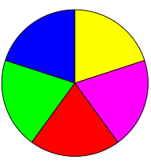

.. _Shape:

Shape
================

This class allows creating interconnected graphical elements on a PDF page. Its methods have the same meaning and name as the corresponding :ref:`Page` methods.

In fact, each :ref:`Page` draw method is just a convenience wrapper for (1) one shape draw method, (2) the :meth:`finish` method, and (3) the :meth:`commit` method. For page text insertion, only the :meth:`commit` method is invoked. If many draw and text operations are executed for a page, you should always consider using a Shape object.

Several draw methods can be executed in a row and each one of them will contribute to one drawing. Once the drawing is complete, the :meth:`finish` method must be invoked to apply color, dashing, width, morphing and other attributes.

**Draw** methods of this class (and :meth:`insertTextbox`) are logging the area they are covering in a rectangle (:attr:`Shape.rect`). This property can for instance be used to set :attr:`Page.CropBox`.

**Text insertions** :meth:`insertText` and :meth:`insertTextbox` implicitely execute a "finish" and therefore only require :meth:`commit` to become effective. As a consequence, both include parameters for controlling prperties like colors, etc.

================================ =====================================================
**Method / Attribute**             **Description**
================================ =====================================================
:meth:`Shape.commit`             update the page's contents
:meth:`Shape.drawBezier`         draw a cubic Bezier curve
:meth:`Shape.drawCircle`         draw a circle around a point
:meth:`Shape.drawCurve`          draw a cubic Bezier using one helper point
:meth:`Shape.drawLine`           draw a line
:meth:`Shape.drawOval`           draw an ellipse
:meth:`Shape.drawPolyline`       connect a sequence of points
:meth:`Shape.drawQuad`           draw a quadrilateral
:meth:`Shape.drawRect`           draw a rectangle
:meth:`Shape.drawSector`         draw a circular sector or piece of pie
:meth:`Shape.drawSquiggle`       draw a squiggly line
:meth:`Shape.drawZigzag`         draw a zigzag line
:meth:`Shape.finish`             finish a set of draw commands
:meth:`Shape.insertText`         insert text lines
:meth:`Shape.insertTextbox`      fit text into a rectangle
:attr:`Shape.doc`                stores the page's document
:attr:`Shape.draw_cont`          draw commands since last *finish()*
:attr:`Shape.height`             stores the page's height
:attr:`Shape.lastPoint`          stores the current point
:attr:`Shape.page`               stores the owning page
:attr:`Shape.rect`               rectangle surrounding drawings
:attr:`Shape.text_cont`          accumulated text insertions
:attr:`Shape.totalcont`          accumulated string to be stored in :data:`contents`
:attr:`Shape.width`              stores the page's width
================================ =====================================================

**Class API**

.. class:: Shape

   .. method:: __init__(self, page)

      Create a new drawing. During importing PyMuPDF, the *fitz.Page* object is being given the convenience method *newShape()* to construct a *Shape* object. During instantiation, a check will be made whether we do have a PDF page. An exception is otherwise raised.

      :arg page: an existing page of a PDF document.
      :type page: :ref:`Page`

   .. method:: drawLine(p1, p2)

      Draw a line from :data:`point_like` objects *p1* to *p2*.

      :arg point_like p1: starting point

      :arg point_like p2: end point

      :rtype: :ref:`Point`
      :returns: the end point, *p2*.

   .. index::
      pair: breadth; drawSquiggle

   .. method:: drawSquiggle(p1, p2, breadth=2)

      Draw a squiggly (wavy, undulated) line from :data:`point_like` objects *p1* to *p2*. An integer number of full wave periods will always be drawn, one period having a length of *4 * breadth*. The breadth parameter will be adjusted as necessary to meet this condition. The drawn line will always turn "left" when leaving *p1* and always join *p2* from the "right".

      :arg point_like p1: starting point

      :arg point_like p2: end point

      :arg float breadth: the amplitude of each wave. The condition *2 * breadth < abs(p2 - p1)* must be true to fit in at least one wave. See the following picture, which shows two points connected by one full period.

      :rtype: :ref:`Point`
      :returns: the end point, *p2*.

      .. image:: images/img-breadth.png

      Here is an example of three connected lines, forming a closed, filled triangle. Little arrows indicate the stroking direction.

      .. image:: images/img-squiggly.png

      .. note:: Waves drawn are **not** trigonometric (sine / cosine). If you need that, have a look at `draw-sines.py <https://github.com/pymupdf/PyMuPDF-Utilities/tree/master/demo/draw-sines.py>`_.

   .. index::
      pair: breadth; drawZigzag

   .. method:: drawZigzag(p1, p2, breadth=2)

      Draw a zigzag line from :data:`point_like` objects *p1* to *p2*. An integer number of full zigzag periods will always be drawn, one period having a length of *4 * breadth*. The breadth parameter will be adjusted to meet this condition. The drawn line will always turn "left" when leaving *p1* and always join *p2* from the "right".

      :arg point_like p1: starting point

      :arg point_like p2: end point

      :arg float breadth: the amplitude of the movement. The condition *2 * breadth < abs(p2 - p1)* must be true to fit in at least one period.

      :rtype: :ref:`Point`
      :returns: the end point, *p2*.

   .. method:: drawPolyline(points)

      Draw several connected lines between points contained in the sequence *points*. This can be used for creating arbitrary polygons by setting the last item equal to the first one.

      :arg sequence points: a sequence of :data:`point_like` objects. Its length must at least be 2 (in which case it is equivalent to *drawLine()*).

      :rtype: :ref:`Point`
      :returns: *points[-1]* -- the last point in the argument sequence.

   .. method:: drawBezier(p1, p2, p3, p4)

      Draw a standard cubic Bezier curve from *p1* to *p4*, using *p2* and *p3* as control points.

      All arguments are :data:`point_like` \s.

      :rtype: :ref:`Point`
      :returns: the end point, *p4*.

      .. note:: The points do not need to be different -- experiment a bit with some of them being equal!

      Example:

      .. image:: images/img-drawBezier.png

   .. method:: drawOval(tetra)

      Draw an "ellipse" inside the given tetragon (quadrilateral). If it is a square, a regular circle is drawn, a general rectangle will result in an ellipse. If a quadrilateral is used instead, a plethora of shapes can be the result.

      The drawing starts and ends at the middle point of the line connecting bottom-left and top-left corners in an anti-clockwise movement.

      :arg rect_like,quad_like tetra: :data:`rect_like` or :data:`quad_like`.

          *Changed in version 1.14.5:*  tetragons are now also supported.

      :rtype: :ref:`Point`
      :returns: the middle point of line from *rect.bl* to *rect.tl*, or from *quad.ll* to *quad.ul*, respectively. Look at just a few examples here, or at the *quad-show?.py* scripts in the PyMuPDF-Utilities repository.

      .. image:: images/img-drawquad.jpg
         :scale: 50

   .. method:: drawCircle(center, radius)

      Draw a circle given its center and radius. The drawing starts and ends at point *center - (radius, 0)* in an anti-clockwise movement. This corresponds to the middle point of the enclosing rectangle's left side.

      The method is a shortcut for *drawSector(center, start, 360, fullSector=False)*. To draw a circle in a clockwise movement, change the sign of the degree.

      :arg center: the center of the circle.
      :type center: point_like

      :arg float radius: the radius of the circle. Must be positive.

      :rtype: :ref:`Point`
      :returns: *center - (radius, 0)*.

      .. image:: images/img-drawcircle.jpg
         :scale: 60

   .. method:: drawCurve(p1, p2, p3)

      A special case of *drawBezier()*: Draw a cubic Bezier curve from *p1* to *p3*. On each of the two lines from *p1* to *p2* and from *p2* to *p3* one control point is generated. This guaranties that the curve's curvature does not change its sign. If these two connecting lines intersect with an angle of 90 degrees, then the resulting curve is a quarter ellipse (or quarter circle, if of same length) circumference.

      All arguments are :data:`point_like`.

      :rtype: :ref:`Point`
      :returns: the end point, *p3*.

      Example: a filled quarter ellipse segment.

      .. image:: images/img-drawCurve.png

   .. index::
      pair: fullSector; drawSector

   .. method:: drawSector(center, point, angle, fullSector=True)

      Draw a circular sector, optionally connecting the arc to the circle's center (like a piece of pie).

      :arg point_like center: the center of the circle.

      :arg point_like point: one of the two end points of the pie's arc segment. The other one is calculated from the *angle*.

      :arg float angle: the angle of the sector in degrees. Used to calculate the other end point of the arc. Depending on its sign, the arc is drawn anti-clockwise (postive) or clockwise.

      :arg bool fullSector: whether to draw connecting lines from the ends of the arc to the circle center. If a fill color is specified, the full "pie" is colored, otherwise just the sector.

      :returns: the other end point of the arc. Can be used as starting point for a following invocation to create logically connected pies charts.
      :rtype: :ref:`Point`

      Examples:

      .. image:: images/img-drawSector1.png

      .. image:: images/img-drawSector2.png

   .. method:: drawRect(rect)

      Draw a rectangle. The drawing starts and ends at the top-left corner in an anti-clockwise movement.

      :arg rect_like rect: where to put the rectangle on the page.

      :rtype: :ref:`Point`
      :returns: top-left corner of the rectangle.

   .. method:: drawQuad(quad)

      Draw a quadrilateral. The drawing starts and ends at the top-left corner (:attr:`Quad.ul`) in an anti-clockwise movement. It invokes :meth:`drawPolyline` with the argument *[ul, ll, lr, ur, ul]*.

      :arg quad_like quad: where to put the tetragon on the page.

      :rtype: :ref:`Point`
      :returns: :attr:`Quad.ul`.

   .. index::
      pair: border_width; insertText
      pair: color; insertText
      pair: encoding; insertText
      pair: fill; insertText
      pair: fontfile; insertText
      pair: fontname; insertText
      pair: fontsize; insertText
      pair: morph; insertText
      pair: render_mode; insertText
      pair: rotate; insertText

   .. method:: insertText(point, text, fontsize=11, fontname="helv", fontfile=None, set_simple=False, encoding=TEXT_ENCODING_LATIN, color=None, fill=None, render_mode=0, border_width=1, rotate=0, morph=None)

      Insert text lines start at *point*.

      :arg point_like point: the bottom-left position of the first character of *text* in pixels. It is important to understand, how this works in conjunction with the *rotate* parameter. Please have a look at the following picture. The small red dots indicate the positions of *point* in each of the four possible cases.

         .. image:: images/img-inserttext.jpg
            :scale: 33

      :arg str/sequence text: the text to be inserted. May be specified as either a string type or as a sequence type. For sequences, or strings containing line breaks *\n*, several lines will be inserted. No care will be taken if lines are too wide, but the number of inserted lines will be limited by "vertical" space on the page (in the sense of reading direction as established by the *rotate* parameter). Any rest of *text* is discarded -- the return code however contains the number of inserted lines.

      :arg int rotate: determines whether to rotate the text. Acceptable values are multiples of 90 degrees. Default is 0 (no rotation), meaning horizontal text lines oriented from left to right. 180 means text is shown upside down from **right to left**. 90 means anti-clockwise rotation, text running **upwards**. 270 (or -90) means clockwise rotation, text running **downwards**. In any case, *point* specifies the bottom-left coordinates of the first character's rectangle. Multiple lines, if present, always follow the reading direction established by this parameter. So line 2 is located **above** line 1 in case of *rotate = 180*, etc.

      :rtype: int
      :returns: number of lines inserted.

      For a description of the other parameters see :ref:`CommonParms`.

   .. index::
      pair: align; insertTextbox
      pair: border_width; insertTextbox
      pair: color; insertTextbox
      pair: encoding; insertTextbox
      pair: expandtabs; insertTextbox
      pair: fill; insertTextbox
      pair: fontfile; insertTextbox
      pair: fontname; insertTextbox
      pair: fontsize; insertTextbox
      pair: morph; insertTextbox
      pair: render_mode; insertTextbox
      pair: rotate; insertTextbox

   .. method:: insertTextbox(rect, buffer, fontsize=11, fontname="helv", fontfile=None, set_simple=False, encoding=TEXT_ENCODING_LATIN, color=None, fill=None, render_mode=0, border_width=1, expandtabs=8, align=TEXT_ALIGN_LEFT, rotate=0, morph=None)

      PDF only: Insert text into the specified rectangle. The text will be split into lines and words and then filled into the available space, starting from one of the four rectangle corners, which depends on *rotate*. Line feeds will be respected as well as multiple spaces will be.

      :arg rect_like rect: the area to use. It must be finite and not empty.

      :arg str/sequence buffer: the text to be inserted. Must be specified as a string or a sequence of strings. Line breaks are respected also when occurring in a sequence entry.

      :arg int align: align each text line. Default is 0 (left). Centered, right and justified are the other supported options, see :ref:`TextAlign`. Please note that the effect of parameter value *TEXT_ALIGN_JUSTIFY* is only achievable with "simple" (single-byte) fonts (including the :ref:`Base-14-Fonts`). Refer to :ref:`AdobeManual`, section 5.2.2, page 399.

      :arg int expandtabs: controls handling of tab characters *\t* using the *string.expandtabs()* method **per each line**.

      :arg int rotate: requests text to be rotated in the rectangle. This value must be a multiple of 90 degrees. Default is 0 (no rotation). Effectively, four different values are processed: 0, 90, 180 and 270 (= -90), each causing the text to start in a different rectangle corner. Bottom-left is 90, bottom-right is 180, and -90 / 270 is top-right. See the example how text is filled in a rectangle. This argument takes precedence over morphing. See the second example, which shows text first rotated left by 90 degrees and then the whole rectangle rotated clockwise around is lower left corner.

      :rtype: float
      :returns:
          **If positive or zero**: successful execution. The value returned is the unused rectangle line space in pixels. This may safely be ignored -- or be used to optimize the rectangle, position subsequent items, etc.

          **If negative**: no execution. The value returned is the space deficit to store text lines. Enlarge rectangle, decrease *fontsize*, decrease text amount, etc.

      .. image:: images/img-rotate.png

      .. image:: images/img-rot+morph.png

      For a description of the other parameters see :ref:`CommonParms`.

   .. index::
      pair: closePath; finish
      pair: color; finish
      pair: dashes; finish
      pair: even_odd; finish
      pair: fill; finish
      pair: lineCap; finish
      pair: lineJoin; finish
      pair: morph; finish
      pair: width; finish

   .. method:: finish(width=1, color=None, fill=None, lineCap=0, lineJoin=0, dashes=None, closePath=True, even_odd=False, morph=(fixpoint, matrix))

      Finish a set of *draw*()* methods by applying :ref:`CommonParms` to all of them. This method also supports morphing the resulting compound drawing using a fixpoint :ref:`Point`.

      :arg sequence morph: morph the text or the compound drawing around some arbitrary :ref:`Point` *fixpoint* by applying :ref:`Matrix` *matrix* to it. This implies that *fixpoint* is a **fixed point** of this operation: it will not change its position. Default is no morphing (*None*). The matrix can contain any values in its first 4 components, *matrix.e == matrix.f == 0* must be true, however. This means that any combination of scaling, shearing, rotating, flipping, etc. is possible, but translations are not.

      :arg bool even_odd: request the **"even-odd rule"** for filling operations. Default is *False*, so that the **"nonzero winding number rule"** is used. These rules are alternative methods to apply the fill color where areas overlap. Only with fairly complex shapes a different behavior is to be expected with these rules. For an in-depth explanation, see :ref:`AdobeManual`, pp. 232 ff. Here is an example to demonstrate the difference.

      .. image:: images/img-even-odd.png

      .. note:: For each pixel in a drawing the following will happen:

         1. Rule **"even-odd"** counts, how many areas are overlapping at a pixel. If this count is **odd** the pixel is regarded **inside**, if it is **even**, the pixel is **outside**.

         2. Default rule **"nonzero winding"** also looks at the orientation of overlapping areas: it **adds 1** if an area is drawn anit-clockwise and it **subtracts 1** for clockwise areas. If the result is zero, the pixel is regarded **outside**, pixels with a non-zero count are **inside**.

         In the top two shapes, three circles are drawn in standard manner (anti-clockwise, look at the arrows). The lower two shapes contain one (top-left) circle drawn clockwise. As can be seen, area orientation is irrelevant for the even-odd rule.

   .. index::
      pair: overlay; commit

   .. method:: commit(overlay=True)

      Update the page's :data:`contents` with the accumulated draw commands and text insertions. If a *Shape* is not committed, the page will not be changed.

      The method will reset attributes :attr:`Shape.rect`, :attr:`lastPoint`, :attr:`draw_cont`, :attr:`text_cont` and :attr:`totalcont`. Afterwards, the shape object can be reused for the **same page**.

      :arg bool overlay: determine whether to put content in foreground (default) or background. Relevant only, if the page already has a non-empty :data:`contents` object.

   .. attribute:: doc

      For reference only: the page's document.

      :type: :ref:`Document`

   .. attribute:: page

      For reference only: the owning page.

      :type: :ref:`Page`

   .. attribute:: height

      Copy of the page's height

      :type: float

   .. attribute:: width

      Copy of the page's width.

      :type: float

   .. attribute:: draw_cont

      Accumulated command buffer for **draw methods** since last finish.

      :type: str

   .. attribute:: text_cont

      Accumulated text buffer. All **text insertions** go here. On :meth:`commit` this buffer will be appended to :attr:`totalcont`, so that text will never be covered by drawings in the same Shape.

      :type: str

   .. attribute:: rect

      Rectangle surrounding drawings. This attribute is at your disposal and may be changed at any time. Its value is set to *None* when a shape is created or committed. Every *draw** method, and :meth:`Shape.insertTextbox` update this property (i.e. **enlarge** the rectangle as needed). **Morphing** operations, however (:meth:`Shape.finish`, :meth:`Shape.insertTextbox`) are ignored.

      A typical use of this attribute would be setting :attr:`Page.CropBox` to this value, when you are creating shapes for later or external use. If you have not manipulated the attribute yourself, it should reflect a rectangle that contains all drawings so far.

      If you have used morphing and need a rectangle containing the morphed objects, use the following code::

         >>> # assuming ...
         >>> morph = (point, matrix)
         >>> # ... recalculate the shape rectangle like so:
         >>> shape.rect = (shape.rect - fitz.Rect(point, point)) * ~matrix + fitz.Rect(point, point)

      :type: :ref:`Rect`

   .. attribute:: totalcont

      Total accumulated command buffer for draws and text insertions. This will be used by :meth:`Shape.commit`.

      :type: str

   .. attribute:: lastPoint

      For reference only: the current point of the drawing path. It is *None* at *Shape* creation and after each *finish()* and *commit()*.

      :type: :ref:`Point`

Usage
------
A drawing object is constructed by *shape = page.newShape()*. After this, as many draw, finish and text insertions methods as required may follow. Each sequence of draws must be finished before the drawing is committed. The overall coding pattern looks like this::

   >>> shape = page.newShape()
   >>> shape.draw1(...)
   >>> shape.draw2(...)
   >>> ...
   >>> shape.finish(width=..., color=..., fill=..., morph=...)
   >>> shape.draw3(...)
   >>> shape.draw4(...)
   >>> ...
   >>> shape.finish(width=..., color=..., fill=..., morph=...)
   >>> ...
   >>> shape.insertText*
   >>> ...
   >>> shape.commit()
   >>> ....

.. note::

   1. Each *finish()* combines the preceding draws into one logical shape, giving it common colors, line width, morphing, etc. If *closePath* is specified, it will also connect the end point of the last draw with the starting point of the first one.

   2. To successfully create compound graphics, let each draw method use the end point of the previous one as its starting point. In the above pseudo code, *draw2* should hence use the returned :ref:`Point` of *draw1* as its starting point. Failing to do so, would automatically start a new path and *finish()* may not work as expected (but it won't complain either).

   3. Text insertions may occur anywhere before the commit (they neither touch :attr:`Shape.draw_cont` nor :attr:`Shape.lastPoint`). They are appended to *Shape.totalcont* directly, whereas draws will be appended by *Shape.finish*.

   4. Each *commit* takes all text insertions and shapes and places them in foreground or background on the page -- thus providing a way to control graphical layers.

   5. **Only** *commit* **will update** the page's contents, the other methods are basically string manipulations.

Examples
---------
1. Create a full circle of pieces of pie in different colors::

      shape = page.newShape()  # start a new shape
      cols = (...)  # a sequence of RGB color triples
      pieces = len(cols)  # number of pieces to draw
      beta = 360. / pieces  # angle of each piece of pie
      center = fitz.Point(...)  # center of the pie
      p0 = fitz.Point(...)  # starting point
      for i in range(pieces):
          p0 = shape.drawSector(center, p0, beta,
                                fullSector=True) # draw piece
          # now fill it but do not connect ends of the arc
          shape.finish(fill=cols[i], closePath=False)
      shape.commit()  # update the page

Here is an example for 5 colors:

2. Create a regular n-edged polygon (fill yellow, red border). We use *drawSector()* only to calculate the points on the circumference, and empty the draw command buffer again before drawing the polygon::

      shape = page.newShape() # start a new shape
      beta = -360.0 / n  # our angle, drawn clockwise
      center = fitz.Point(...)  # center of circle
      p0 = fitz.Point(...)  # start here (1st edge)
      points = [p0]  # store polygon edges
      for i in range(n):  # calculate the edges
          p0 = shape.drawSector(center, p0, beta)
          points.append(p0)
      shape.draw_cont = ""  # do not draw the circle sectors
      shape.drawPolyline(points)  # draw the polygon
      shape.finish(color=(1,0,0), fill=(1,1,0), closePath=False)
      shape.commit()

Here is the polygon for n = 7:

.. image:: images/img-7edges.png

.. _CommonParms:

Common Parameters
-------------------

**fontname** (*str*)

  In general, there are three options:

  1. Use one of the standard :ref:`Base-14-Fonts`. In this case, *fontfile* **must not** be specified and *"Helvetica"* is used if this parameter is omitted, too.
  2. Choose a font already in use by the page. Then specify its **reference** name prefixed with a slash "/", see example below.
  3. Specify a font file present on your system. In this case choose an arbitrary, but new name for this parameter (without "/" prefix).

  If inserted text should re-use one of the page's fonts, use its reference name appearing in :meth:`getFontList` like so:

  Suppose the font list has the entry *[1024, 0, 'Type1', 'CJXQIC+NimbusMonL-Bold', 'R366']*, then specify *fontname = "/R366", fontfile = None* to use font *CJXQIC+NimbusMonL-Bold*.

----

**fontfile** (*str*)

  File path of a font existing on your computer. If you specify *fontfile*, make sure you use a *fontname* **not occurring** in the above list. This new font will be embedded in the PDF upon *doc.save()*. Similar to new images, a font file will be embedded only once. A table of MD5 codes for the binary font contents is used to ensure this.

----

**set_simple** (*bool*)

  Fonts installed from files are installed as **Type0** fonts by default. If you want to use 1-byte characters only, set this to true. This setting cannot be reverted. Subsequent changes are ignored.

----

**fontsize** (*float*)

  Font size of text. This also determines the line height as *fontsize * 1.2*.

----

**dashes** (*str*)

  Causes lines to be dashed. A continuous line with no dashes is drawn with *"[] 0"* or *None* or *""*.. For (the rather complex) details on how to achieve dashing effects, see :ref:`AdobeManual`, page 217. Simple versions look like *"[3 4] 0"*, which means dashes of 3 and gaps of 4 pixels length follow each other. *"[3 3] 0"* and *"[3] 0"* do the same thing.

----

**color / fill** (*list, tuple*)

  Line and fill colors can be specified as tuples or list of of floats from 0 to 1. These sequences must have a length of 1 (GRAY), 3 (RGB) or 4 (CMYK). For GRAY colorspace, a single float instead of the unwieldy *(float,)* tuple spec is also accepted.

  To simplify color specification, method *getColor()* in *fitz.utils* may be used to get predefined RGB color triples by name. It accepts a string as the name of the color and returns the corresponding triple. The method knows over 540 color names -- see section :ref:`ColorDatabase`.

----

**border_width** (*float*)

  Set the border width for text insertions. New in v1.14.9. Relevant only if the render mode argument is used with a value greater zero.

----

**render_mode** (*int*)

  *New in version 1.14.9:* Integer in *range(8)* which controls the text appearance (:meth:`Shape.insertText` and :meth:`Shape.insertTextbox`). See page 398 in :ref:`AdobeManual`. New in v1.14.9. These methods now also differentiate between fill and stroke colors.

  * For default 0, only the text fill color is used to paint the text. For backward compatibility, using the *color* parameter instead also works.
  * For render mode 1, only the border of each glyph (i.e. text character) is drawn with a thickness as set in argument *border_width*. The color chosen in the *color* argument is taken for this, the *fill* parameter is ignored.
  * For render mode 2, the glyphs are filled and stroked, using both color parameters and the specified border width. You can use this value to simulate **bold text** without using another font: choose the same value for *fill* and *color* and an appropriate value for *border_width*.
  * For render mode 3, the glyphs are neither stroked nor filled: the text becomes invisible.

  The following examples use border_width=0.3, together with a fontsize of 15. Stroke color is blue and fill color is some yellow.

  .. image:: images/img-rendermode.jpg

----

**overlay** (*bool*)

  Causes the item to appear in foreground (default) or background.

----

**morph** (*sequence*)

  Causes "morphing" of either a shape, created by the *draw*()* methods, or the text inserted by page methods *insertTextbox()* / *insertText()*. If not *None*, it must be a pair *(fixpoint, matrix)*, where *fixpoint* is a :ref:`Point` and *matrix* is a :ref:`Matrix`. The matrix can be anything except translations, i.e. *matrix.e == matrix.f == 0* must be true. The point is used as a fixed point for the matrix operation. For example, if *matrix* is a rotation or scaling, then *fixpoint* is its center. Similarly, if *matrix* is a left-right or up-down flip, then the mirroring axis will be the vertical, respectively horizontal line going through *fixpoint*, etc.

  .. note:: Several methods contain checks whether the to be inserted items will actually fit into the page (like :meth:`Shape.insertText`, or :meth:`Shape.drawRect`). For the result of a morphing operation there is however no such guaranty: this is entirely the rpogrammer's responsibility.

----

**lineCap (deprecated: "roundCap")** (*int*)

  Controls the look of line ends. The default value 0 lets each line end at exactly the given coordinate in a sharp edge. A value of 1 adds a semi-circle to the ends, whose center is the end point and whose diameter is the line width. Value 2 adds a semi-square with an edge length of line width and a center of the line end.

  *Changed in version 1.14.15*

----

**lineJoin** (*int*)

  *New in version 1.14.15:* Controls the way how line connections look like. This may be either as a sharp edge (0), a rounded join (1), or a cut-off edge (2, "butt").

----

**closePath** (*bool*)

  Causes the end point of a drawing to be automatically connected with the starting point (by a straight line).
