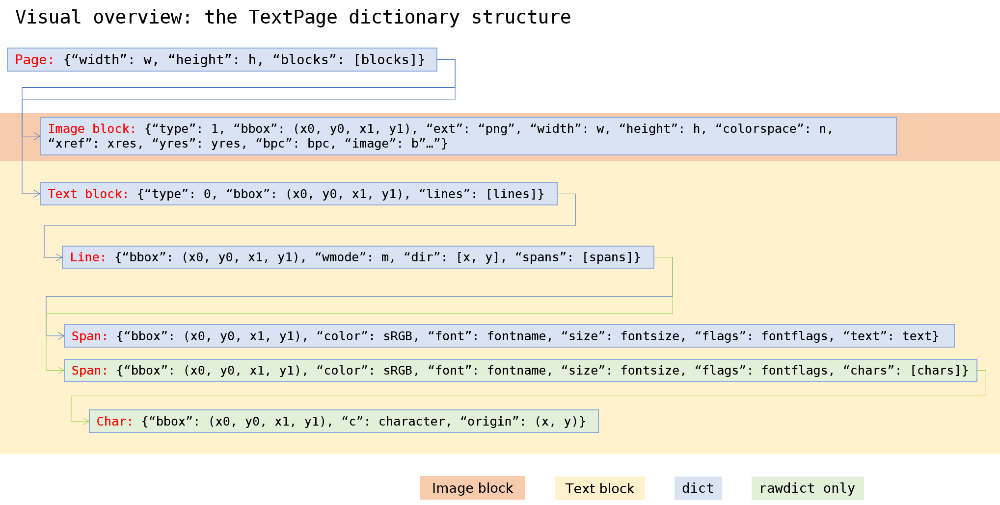
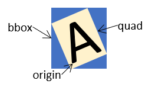

.. _TextPage:

================
TextPage
================

This class represents text and images shown on a document page. All MuPDF document types are supported.

The usual ways to create a textpage are :meth:`DisplayList.getTextPage` and :meth:`Page.getTextPage`. Because there is a limited set of methods in this class, there exist wrappers in the :ref:`Page` class, which incorporate creating an intermediate text page and then invoke one of the following methods. The last column of this table shows these corresponding :ref:`Page` methods.

For a description of what this class is all about, see Appendix 2.

======================== ================================ =============================
**Method**               **Description**                  page getText or search method
======================== ================================ =============================
:meth:`~.extractText`    extract plain text               "text"
:meth:`~.extractTEXT`    synonym of previous              "text"
:meth:`~.extractBLOCKS`  plain text grouped in blocks     "blocks"
:meth:`~.extractWORDS`   all words with their bbox        "words"
:meth:`~.extractHTML`    page content in HTML format      "html"
:meth:`~.extractJSON`    page content in JSON format      "json"
:meth:`~.extractXHTML`   page content in XHTML format     "xhtml"
:meth:`~.extractXML`     page text in XML format          "xml"
:meth:`~.extractDICT`    page content in *dict* format    "dict"
:meth:`~.extractRAWDICT` page content in *dict* format    "rawdict"
:meth:`~.search`         Search for a string in the page  searchFor()
======================== ================================ =============================

**Class API**

.. class:: TextPage

   .. method:: extractText

   .. method:: extractTEXT

      Return a string of the page's complete text. The text is UTF-8 unicode and in the same sequence as specified at the time of document creation.

      :rtype: str

   .. method:: extractBLOCKS

      Textpage content as a list of text lines grouped by block. Each list items looks like this::

         (x0, y0, x1, y1, "lines in blocks", block_type, block_no)

      The first four entries are the block's bbox coordinates, *block_type* is 1 for an image block, 0 for text. *block_no* is the block sequence number.

      For an image block, its bbox and a text line with image meta information is included -- not the image data itself.

      This is a high-speed method with enough information to rebuild a desired text sequence.

      :rtype: list

   .. method:: extractWORDS

      Textpage content as a list of single words with bbox information. An item of this list looks like this::

         (x0, y0, x1, y1, "word", block_no, line_no, word_no)

      Everything wrapped in spaces is treated as a *"word"* with this method.

      This is a high-speed method which e.g. allows extracting text from within a given rectangle.

      :rtype: list

   .. method:: extractHTML

      Textpage content in HTML format. This version contains complete formatting and positioning information. Images are included (encoded as base64 strings). You need an HTML package to interpret the output in Python. Your internet browser should be able to adequately display this information, but see :ref:`HTMLQuality`.

      :rtype: str

   .. method:: extractDICT

      Textpage content as a Python dictionary. Provides same information detail as HTML. See below for the structure.

      :rtype: dict

   .. method:: extractJSON

      Textpage content in JSON format. Created by  *json.dumps(TextPage.extractDICT())*. It is included for backlevel compatibility. You will probably use this method ever only for outputting the result in some file. The  method detects binary image data, like *bytearray* and *bytes* (Python 3 only) and converts them to base64 encoded strings on JSON output.

      :rtype: str

   .. method:: extractXHTML

      Textpage content in XHTML format. Text information detail is comparable with :meth:`extractTEXT`, but also contains images (base64 encoded). This method makes no attempt to re-create the original visual appearance.

      :rtype: str

   .. method:: extractXML

      Textpage content in XML format. This contains complete formatting information about every single character on the page: font, size, line, paragraph, location, color, etc. Contains no images. You probably need an XML package to interpret the output in Python.

      :rtype: str

   .. method:: extractRAWDICT

      Textpage content as a Python dictionary -- technically similar to :meth:`extractDICT`, and it contains that information as a subset (including any images). It provides additional detail down to each character, which makes using XML obsolete in many cases. See below for the structure.

      :rtype: dict

   .. method:: search(string, hit_max = 16, quads = False)

      Search for *string* and return a list of found locations.

      :arg str string: the string to search for. Upper / lower cases will all match.
      :arg int hit_max: maximum number of returned hits (default 16).
      :arg bool quads: return quadrilaterals instead of rectangles.
      :rtype: list
      :returns: a list of :ref:`Rect` or :ref:`Quad` objects, each surrounding a found *string* occurrence. The search string may contain spaces, it may therefore happen, that its parts are located on different lines. In this case, more than one rectangle (resp. quadrilateral) are returned. The method does **not support hyphenation**, so it will not find "meth-od" when searching for "method".

      Example: If the search for string "pymupdf" contains a hit like shown, then the corresponding entry will either be the blue rectangle, or, if *quads* was specified, *Quad(ul, ur, ll, lr)*.

      .. image:: images/img-quads.jpg

.. _textpagedict:

Dictionary Structure of :meth:`extractDICT` and :meth:`extractRAWDICT`
-------------------------------------------------------------------------

Page Dictionary
~~~~~~~~~~~~~~~~~
=============== ============================================
**Key**         **Value**
=============== ============================================
width           page width in pixels *(float)*
height          page height in pixels *(float)*
blocks          *list* of block dictionaries
=============== ============================================

Block Dictionaries
~~~~~~~~~~~~~~~~~~
Blocks come in two different formats: **image blocks** and **text blocks**.

*(Changed in v1.18.0)* -- new dict key *number*, the block number.

**Image block:**

=============== ===============================================================
**Key**             **Value**
=============== ===============================================================
type            1 = image *(int)*
bbox            block / image rectangle, formatted as *tuple(fitz.Rect)*
number          block number *(int)* (0-based)
ext             image type *(str)*, as file extension, see below
width           original image width *(int)*
height          original image height *(int)*
colorspace      colorspace.n *(int)*
xres            resolution in x-direction *(int)*
yres            resolution in y-direction *(int)*
bpc             bits per component *(int)*
image           image content *(bytes or bytearray)*
=============== ===============================================================

Possible values of key "ext" are "bmp", "gif", "jpeg", "jpx" (JPEG 2000), "jxr" (JPEG XR), "png", "pnm", and "tiff".

.. note::

   1. In some error situations, all of the above values may be zero or empty. So, please be prepared to digest items like::

      {"type": 1, "bbox": (0.0, 0.0, 0.0, 0.0), ..., "image": b""}

   2. :ref:`TextPage` and corresponding method :meth:`Page.getText` are **available for all document types**. Only for PDF documents, methods :meth:`Document.getPageImageList` / :meth:`Page.getImageList` offer some overlapping functionality as far as image lists are concerned. But both lists **may or may not** contain the same items. Any differences are most probably caused by one of the following:

       - "Inline" images (see page 352 of the :ref:`AdobeManual`) of a PDF page are contained in a textpage, but **not in** :meth:`Page.getImageList`.
       - Image blocks in a textpage are generated for **every** image location -- whether or not there are any duplicates. This is in contrast to :meth:`Page.getImageList`, which will contain each image only once.
       - Images mentioned in the page's :data:`object` definition will **always** appear in :meth:`Page.getImageList` [#f1]_. But it may happen, that there is no "display" command in the page's :data:`contents` (erroneously or on purpose). In this case the image will **not appear** in the textpage.

**Text block:**

=============== ====================================================
**Key**             **Value**
=============== ====================================================
type            0 = text *(int)*
bbox            block rectangle, formatted as *tuple(fitz.Rect)*
number          block number *(int)* (0-based)
lines           *list* of text line dictionaries
=============== ====================================================

Line Dictionary
~~~~~~~~~~~~~~~~~

=============== =====================================================
**Key**             **Value**
=============== =====================================================
bbox            line rectangle, formatted as *tuple(fitz.Rect)*
wmode           writing mode *(int)*: 0 = horizontal, 1 = vertical
dir             writing direction *(list of floats)*: *[x, y]*
spans           *list* of span dictionaries
=============== =====================================================

The value of key *"dir"* is a **unit vetor** and should be interpreted as follows:

* *x*: positive = "left-right", negative = "right-left", 0 = neither
* *y*: positive = "top-bottom", negative = "bottom-top", 0 = neither

The values indicate the "relative writing speed" in each direction, such that x\ :sup:`2` + y\ :sup:`2` = 1. In other words *dir = [cos(beta), sin(beta)]*, where *beta* is the writing angle relative to the horizontal.

Span Dictionary
~~~~~~~~~~~~~~~~~

Spans contain the actual text. A line contains **more than one span only**, if it contains text with different font properties.

*(Changed in version 1.14.17)* Spans now also have a *bbox* key (again).
*(Changed in version 1.17.6)* Spans now also have an *origin* key.

=============== =====================================================================
**Key**             **Value**
=============== =====================================================================
bbox            span rectangle, formatted as *tuple(fitz.Rect)*
origin          *tuple* coordinates of the first character's bottom left point
font            font name *(str)*
size            font size *(float)*
flags           font characteristics *(int)*
color           text color in sRGB format *(int)*
text            (only for :meth:`extractDICT`) text *(str)*
chars           (only for :meth:`extractRAWDICT`) *list* of character dictionaries
=============== =====================================================================

*(New in version 1.16.0)*

*"color"* is the text color encoded in sRGB (int) format, e.g. 0xFF0000 for red. There are functions for converting this integer back to formats (r, g, b) (PDF with float values from 0 to 1) :meth:`sRGB_to_pdf`, or (R, G, B), :meth:`sRGB_to_rgb` (with integer values from 0 to 255).

*"flags"* is an integer, encoding bools of font properties:

* bit 0: superscripted (2\ :sup:`0`)
* bit 1: italic (2\ :sup:`1`)
* bit 2: serifed (2\ :sup:`2`)
* bit 3: monospaced (2\ :sup:`3`)
* bit 4: bold (2\ :sup:`4`)

Test these characteristics like so:

>>> if flags & 2**1: print("italic")
>>> # etc.

Character Dictionary for :meth:`extractRAWDICT`
~~~~~~~~~~~~~~~~~~~~~~~~~~~~~~~~~~~~~~~~~~~~~~~~
We are currently providing the bbox in :data:`rect_like` format. In a future version, we might change that to :data:`quad_like`. This image shows the relationship between items in the following table: |textpagechar|

=============== =========================================================
**Key**             **Value**
=============== =========================================================
origin          *tuple* coordinates of the character's bottom left point
bbox            character rectangle, formatted as *tuple(fitz.Rect)*
c               the character (unicode)
=============== =========================================================

.. rubric:: Footnotes

.. [#f1] Image specifications for a PDF page are done in the page's sub-dictionary */Resources*. Being a text format specification, PDF does not prevent one from having arbitrary image entries in this dictionary -- whether actually in use by the page or not. On top of this, resource dictionaries can be **inherited** from the page's parent object -- like a node of the PDF's :data:`pagetree` or the :data:`catalog` object. So the PDF creator may e.g. define one file level */Resources* naming all images and fonts ever used by any page. In this case, :meth:`Page.getImageList` and :meth:`Page.getFontList` will always return the same lists for all pages.
