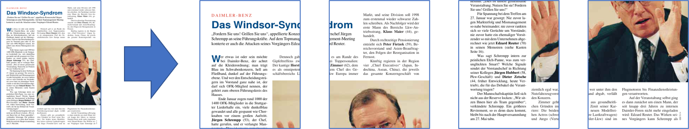
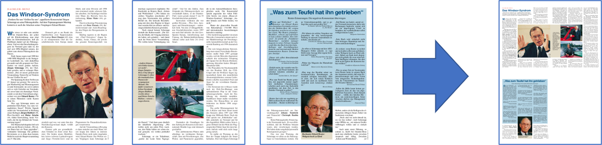

.. include:: header.rst

.. _TheBasics:

==============================
The Basics
==============================

.. _The_Basics_Opening_Files:

Opening a File
~~~~~~~~~~~~~~~~~~~~~~~~~~~~~~~~~~~~~~~~~~~~~~~~~~~~~~~~~~~~~~~~~~~~~~~~~~~~~~~~~

To open a file, do the following:

.. code-block:: python

    import pymupdf

    doc = pymupdf.open("a.pdf") # open a document

.. note::

    **Taking it further**

    See the :ref:`list of supported file types<Supported_File_Types>` and :ref:`The How to Guide on Opening Files <HowToOpenAFile>` for more advanced options.

----------

.. _The_Basics_Extracting_Text:

Extract text from a |PDF|
~~~~~~~~~~~~~~~~~~~~~~~~~~~~~~~~~~~~~~~~~~~~~~~~~~~~~~~~~~~~~~~~~~~~~~~~~~~~~~~~~

To extract all the text from a |PDF| file, do the following:

.. code-block:: python

    import pymupdf

    doc = pymupdf.open("a.pdf") # open a document
    out = open("output.txt", "wb") # create a text output
    for page in doc: # iterate the document pages
        text = page.get_text().encode("utf8") # get plain text (is in UTF-8)
        out.write(text) # write text of page
        out.write(bytes((12,))) # write page delimiter (form feed 0x0C)
    out.close()

Of course it is not just |PDF| which can have text extracted - all the :ref:`supported document file formats <About_Feature_Matrix>` such as :title:`MOBI`, :title:`EPUB`, :title:`TXT` can have their text extracted.

.. note::

    **Taking it further**

    If your document contains image based text content the use OCR on the page for subsequent text extraction:

    .. code-block:: python

        tp = page.get_textpage_ocr()
        text = page.get_text(textpage=tp)

    There are many more examples which explain how to extract text from specific areas or how to extract tables from documents. Please refer to the :ref:`How to Guide for Text<RecipesText>`.

    You can now also :ref:`extract text in Markdown format<rag_outputting_as_md>`.

    **API reference**

    - :meth:`Page.get_text`

----------

.. _The_Basics_Extracting_Images:

Extract images from a |PDF|
~~~~~~~~~~~~~~~~~~~~~~~~~~~~~~~~~~~~~~~~~~~~~~~~~~~~~~~~~~~~~~~~~~~~~~~~~~~~~~~~~

To extract all the images from a |PDF| file, do the following:

.. code-block:: python

    import pymupdf

    doc = pymupdf.open("test.pdf") # open a document

    for page_index in range(len(doc)): # iterate over pdf pages
        page = doc[page_index] # get the page
        image_list = page.get_images()

        # print the number of images found on the page
        if image_list:
            print(f"Found {len(image_list)} images on page {page_index}")
        else:
            print("No images found on page", page_index)

        for image_index, img in enumerate(image_list, start=1): # enumerate the image list
            xref = img[0] # get the XREF of the image
            pix = pymupdf.Pixmap(doc, xref) # create a Pixmap

            if pix.n - pix.alpha > 3: # CMYK: convert to RGB first
                pix = pymupdf.Pixmap(pymupdf.csRGB, pix)

            pix.save("page_%s-image_%s.png" % (page_index, image_index)) # save the image as png
            pix = None

.. note::

    **Taking it further**

    There are many more examples which explain how to extract text from specific areas or how to extract tables from documents. Please refer to the :ref:`How to Guide for Text<RecipesText>`.

    **API reference**

    - :meth:`Page.get_images`
    - :ref:`Pixmap<Pixmap>`

.. _The_Basics_Extracting_Vector_Graphics:

Extract vector graphics
~~~~~~~~~~~~~~~~~~~~~~~~~~~~~~~~~~~~~~~~~~~~~~~~~~~~~~~~~~~~~~~~~~~~~~~~~~~~~~~~~

To extract all the vector graphics from a document page, do the following:

.. code-block:: python

    doc = pymupdf.open("some.file")
    page = doc[0]
    paths = page.get_drawings()

This will return a dictionary of paths for any vector drawings found on the page.

.. note::

    **Taking it further**

    Please refer to: :ref:`How to Extract Drawings<RecipesDrawingAndGraphics_Extract_Drawings>`.

    **API reference**

    - :meth:`Page.get_drawings`

----------

.. _The_Basics_Merging_PDF:
.. _merge PDF:
.. _join PDF:

Merging |PDF| files
~~~~~~~~~~~~~~~~~~~~~~~~~~~~~~~~~~~~~~~~~~~~~~~~~~~~~~~~~~~~~~~~~~~~~~~~~~~~~~~~~

To merge |PDF| files, do the following:

.. code-block:: python

    import pymupdf

    doc_a = pymupdf.open("a.pdf") # open the 1st document
    doc_b = pymupdf.open("b.pdf") # open the 2nd document

    doc_a.insert_pdf(doc_b) # merge the docs
    doc_a.save("a+b.pdf") # save the merged document with a new filename

Merging |PDF| files with other types of file
"""""""""""""""""""""""""""""""""""""""""""""""""""""

With :meth:`Document.insert_file` you can invoke the method to merge :ref:`supported files<Supported_File_Types>` with |PDF|. For example:

.. code-block:: python

    import pymupdf

    doc_a = pymupdf.open("a.pdf") # open the 1st document
    doc_b = pymupdf.open("b.svg") # open the 2nd document

    doc_a.insert_file(doc_b) # merge the docs
    doc_a.save("a+b.pdf") # save the merged document with a new filename

.. note::

    **Taking it further**

    It is easy to join PDFs with :meth:`Document.insert_pdf` & :meth:`Document.insert_file`. Given open |PDF| documents, you can copy page ranges from one to the other. You can select the point where the copied pages should be placed, you can revert the page sequence and also change page rotation.

    The GUI script `join.py <https://github.com/pymupdf/PyMuPDF-Utilities/blob/master/examples/join-documents/join.py>`_ uses this method to join a list of files while also joining the respective table of contents segments. It looks like this:

    .. image:: images/img-pdfjoiner.*
       :scale: 60

    **API reference**

    - :meth:`Document.insert_pdf`
    - :meth:`Document.insert_file`

----------

Working with Coordinates
~~~~~~~~~~~~~~~~~~~~~~~~~~~~~

There is one *mathematical term* that you should feel comfortable with when using **PyMuPDF** -  **"coordinates"**. Please have a quick look at the :ref:`Coordinates` section to understand the coordinate system to help you with positioning objects and understand your document space.

----------

.. _The_Basics_Watermarks:

Adding a watermark to a |PDF|
~~~~~~~~~~~~~~~~~~~~~~~~~~~~~~~~~~~~~~~~~~~~~~~~~~~~~~~~~~~~~~~~~~~~~~~~~~~~~~~~~

To add a watermark to a |PDF| file, do the following:

.. code-block:: python

    import pymupdf

    doc = pymupdf.open("document.pdf") # open a document

    for page_index in range(len(doc)): # iterate over pdf pages
        page = doc[page_index] # get the page

        # insert an image watermark from a file name to fit the page bounds
        page.insert_image(page.bound(),filename="watermark.png", overlay=False)

    doc.save("watermarked-document.pdf") # save the document with a new filename

.. note::

    **Taking it further**

    Adding watermarks is essentially as simple as adding an image at the base of each |PDF| page. You should ensure that the image has the required opacity and aspect ratio to make it look the way you need it to.

    In the example above a new image is created from each file reference, but to be more performant (by saving memory and file size) this image data should be referenced only once - see the code example and explanation on :meth:`Page.insert_image` for the implementation.

    **API reference**

    - :meth:`Page.bound`
    - :meth:`Page.insert_image`

----------

.. _The_Basics_Images:

Adding an image to a |PDF|
~~~~~~~~~~~~~~~~~~~~~~~~~~~~~~~~~~~~~~~~~~~~~~~~~~~~~~~~~~~~~~~~~~~~~~~~~~~~~~~~~

To add an image to a |PDF| file, for example a logo, do the following:

.. code-block:: python

    import pymupdf

    doc = pymupdf.open("document.pdf") # open a document

    for page_index in range(len(doc)): # iterate over pdf pages
        page = doc[page_index] # get the page

        # insert an image logo from a file name at the top left of the document
        page.insert_image(pymupdf.Rect(0,0,50,50),filename="my-logo.png")

    doc.save("logo-document.pdf") # save the document with a new filename

.. note::

    **Taking it further**

    As with the watermark example you should ensure to be more performant by only referencing the image once if possible - see the code example and explanation on :meth:`Page.insert_image`.

    **API reference**

    - :ref:`Rect<Rect>`
    - :meth:`Page.insert_image`

----------

.. _The_Basics_Rotating:

Rotating a |PDF|
~~~~~~~~~~~~~~~~~~~~~~~~~~~~~~~~~~~~~~~~~~~~~~~~~~~~~~~~~~~~~~~~~~~~~~~~~~~~~~~~~

To add a rotation to a page, do the following:

.. code-block:: python

    import pymupdf

    doc = pymupdf.open("test.pdf") # open document
    page = doc[0] # get the 1st page of the document
    page.set_rotation(90) # rotate the page
    doc.save("rotated-page-1.pdf")

.. note::

    **API reference**

    - :meth:`Page.set_rotation`

----------

.. _The_Basics_Cropping:

Cropping a |PDF|
~~~~~~~~~~~~~~~~~~~~~~~~~~~~~~~~~~~~~~~~~~~~~~~~~~~~~~~~~~~~~~~~~~~~~~~~~~~~~~~~~

To crop a page to a defined :ref:`Rect<Rect>`, do the following:

.. code-block:: python

    import pymupdf

    doc = pymupdf.open("test.pdf") # open document
    page = doc[0] # get the 1st page of the document
    page.set_cropbox(pymupdf.Rect(100, 100, 400, 400)) # set a cropbox for the page
    doc.save("cropped-page-1.pdf")

.. note::

    **API reference**

    - :meth:`Page.set_cropbox`

----------

.. _The_Basics_Attaching_Files:

:index:`Attaching Files <triple: attach;embed;file>`
~~~~~~~~~~~~~~~~~~~~~~~~~~~~~~~~~~~~~~~~~~~~~~~~~~~~~~~~~~~~~~~~~~

To attach another file to a page, do the following:

.. code-block:: python

    import pymupdf

    doc = pymupdf.open("test.pdf") # open main document
    attachment = pymupdf.open("my-attachment.pdf") # open document you want to attach

    page = doc[0] # get the 1st page of the document
    point = pymupdf.Point(100, 100) # create the point where you want to add the attachment
    attachment_data = attachment.tobytes() # get the document byte data as a buffer

    # add the file annotation with the point, data and the file name
    file_annotation = page.add_file_annot(point, attachment_data, "attachment.pdf")

    doc.save("document-with-attachment.pdf") # save the document

.. note::

    **Taking it further**

    When adding the file with :meth:`Page.add_file_annot` note that the third parameter for the `filename` should include the actual file extension. Without this the attachment possibly will not be able to be recognized as being something which can be opened. For example, if the `filename` is just *"attachment"* when view the resulting PDF and attempting to open the attachment you may well get an error. However, with *"attachment.pdf"* this can be recognized and opened by PDF viewers as a valid file type.

    The default icon for the attachment is by default a "push pin", however you can change this by setting the `icon` parameter.

    **API reference**

    - :ref:`Point<Point>`
    - :meth:`Document.tobytes`
    - :meth:`Page.add_file_annot`

----------

.. _The_Basics_Embedding_Files:

:index:`Embedding Files <triple: attach;embed;file>`
~~~~~~~~~~~~~~~~~~~~~~~~~~~~~~~~~~~~~~~~~~~~~~~~~~~~~~~~~~~~~~~~~~

To embed a file to a document, do the following:

.. code-block:: python

    import pymupdf

    doc = pymupdf.open("test.pdf") # open main document
    embedded_doc = pymupdf.open("my-embed.pdf") # open document you want to embed

    embedded_data = embedded_doc.tobytes() # get the document byte data as a buffer

    # embed with the file name and the data
    doc.embfile_add("my-embedded_file.pdf", embedded_data)

    doc.save("document-with-embed.pdf") # save the document

.. note::

    **Taking it further**

    As with :ref:`attaching files<The_Basics_Attaching_Files>`, when adding the file with :meth:`Document.embfile_add` note that the first parameter for the `filename` should include the actual file extension.

    **API reference**

    - :meth:`Document.tobytes`
    - :meth:`Document.embfile_add`

----------

.. _The_Basics_Deleting_Pages:

Deleting Pages
~~~~~~~~~~~~~~~~~~~~~~~~~~~~~~~~~~~~~~

To delete a page from a document, do the following:

.. code-block:: python

    import pymupdf

    doc = pymupdf.open("test.pdf") # open a document
    doc.delete_page(0) # delete the 1st page of the document
    doc.save("test-deleted-page-one.pdf") # save the document

To delete a multiple pages from a document, do the following:

.. raw:: html

.. code-block:: python

    import pymupdf

    doc = pymupdf.open("test.pdf") # open a document
    doc.delete_pages(from_page=9, to_page=14) # delete a page range from the document
    doc.save("test-deleted-pages.pdf") # save the document

What happens if I delete a page referred to by bookmarks or hyperlinks?
""""""""""""""""""""""""""""""""""""""""""""""""""""""""""""""""""""""""""""

- A bookmark (entry in the Table of Contents) will become inactive and will no longer navigate to any page.

- A hyperlink will be removed from the page that contains it. The visible content on that page will not otherwise be changed in any way.

.. note::

    **Taking it further**

    The page index is zero-based, so to delete page 10 of a document you would do the following `doc.delete_page(9)`.

    Similarly, `doc.delete_pages(from_page=9, to_page=14)` will delete pages 10 - 15 inclusive.

    **API reference**

    - :meth:`Document.delete_page`
    - :meth:`Document.delete_pages`

----------

.. _The_Basics_Rearrange_Pages:

Re-Arranging Pages
~~~~~~~~~~~~~~~~~~~~~~~~~~~~~~~~~~~~~~

To change the sequence of pages, i.e. re-arrange pages, do the following:

.. code-block:: python

    import pymupdf

    doc = pymupdf.open("test.pdf") # open a document
    doc.move_page(1,0) # move the 2nd page of the document to the start of the document
    doc.save("test-page-moved.pdf") # save the document

.. note::

    **API reference**

    - :meth:`Document.move_page`

----------

.. _The_Basics_Copying_Pages:

Copying Pages
~~~~~~~~~~~~~~~~~~~~~~~~~~~~~~~~~~~~~~

To copy pages, do the following:

.. code-block:: python

    import pymupdf

    doc = pymupdf.open("test.pdf") # open a document
    doc.copy_page(0) # copy the 1st page and puts it at the end of the document
    doc.save("test-page-copied.pdf") # save the document

.. note::

    **API reference**

    - :meth:`Document.copy_page`

----------

.. _The_Basics_Selecting_Pages:

Selecting Pages
~~~~~~~~~~~~~~~~~~~~~~~~~~~~~~~~~~~~~~

To select pages, do the following:

.. code-block:: python

    import pymupdf

    doc = pymupdf.open("test.pdf") # open a document
    doc.select([0, 1]) # select the 1st & 2nd page of the document
    doc.save("just-page-one-and-two.pdf") # save the document

.. note::

    **Taking it further**

    With |PyMuPDF| you have all options to copy, move, delete or re-arrange the pages of a |PDF|. Intuitive methods exist that allow you to do this on a page-by-page level, like the :meth:`Document.copy_page` method.

    Or you alternatively prepare a complete new page layout in form of a :title:`Python` sequence, that contains the page numbers you want, in the sequence you want, and as many times as you want each page. The following may illustrate what can be done with :meth:`Document.select`

    .. code-block:: python

        doc.select([1, 1, 1, 5, 4, 9, 9, 9, 0, 2, 2, 2])

    Now let's prepare a PDF for double-sided printing (on a printer not directly supporting this):

    The number of pages is given by `len(doc)` (equal to `doc.page_count`). The following lists represent the even and the odd page numbers, respectively:

    .. code-block:: python

        p_even = [p in range(doc.page_count) if p % 2 == 0]
        p_odd  = [p in range(doc.page_count) if p % 2 == 1]

    This snippet creates the respective sub documents which can then be used to print the document:

    .. code-block:: python

        doc.select(p_even) # only the even pages left over
        doc.save("even.pdf") # save the "even" PDF
        doc.close() # recycle the file
        doc = pymupdf.open(doc.name) # re-open
        doc.select(p_odd) # and do the same with the odd pages
        doc.save("odd.pdf")

    For more information also have a look at this Wiki `article <https://github.com/pymupdf/PyMuPDF/wiki/Rearranging-Pages-of-a-PDF>`_.

    The following example will reverse the order of all pages (**extremely fast:** sub-second time for the 756 pages of the :ref:`AdobeManual`):

    .. code-block:: python

        lastPage = doc.page_count - 1
        for i in range(lastPage):
            doc.move_page(lastPage, i) # move current last page to the front

    This snippet duplicates the PDF with itself so that it will contain the pages *0, 1, ..., n, 0, 1, ..., n* **(extremely fast and without noticeably increasing the file size!)**:

    .. code-block:: python

        page_count = len(doc)
        for i in range(page_count):
            doc.copy_page(i) # copy this page to after last page

    **API reference**

    - :meth:`Document.select`

----------

.. _The_Basics_Adding_Blank_Pages:

Adding Blank Pages
~~~~~~~~~~~~~~~~~~~~~

To add a blank page, do the following:

.. code-block:: python

    import pymupdf

    doc = pymupdf.open(...) # some new or existing PDF document
    page = doc.new_page(-1, # insertion point: end of document
                        width = 595, # page dimension: A4 portrait
                        height = 842)
    doc.save("doc-with-new-blank-page.pdf") # save the document

.. note::

    **Taking it further**

    Use this to create the page with another pre-defined paper format:

    .. code-block:: python

        w, h = pymupdf.paper_size("letter-l")  # 'Letter' landscape
        page = doc.new_page(width = w, height = h)

    The convenience function :meth:`paper_size` knows over 40 industry standard paper formats to choose from. To see them, inspect dictionary :attr:`paperSizes`. Pass the desired dictionary key to :meth:`paper_size` to retrieve the paper dimensions. Upper and lower case is supported. If you append "-L" to the format name, the landscape version is returned.

    Here is a 3-liner that creates a |PDF|: with one empty page. Its file size is 460 bytes:

    .. code-block:: python

        doc = pymupdf.open()
        doc.new_page()
        doc.save("A4.pdf")

    **API reference**

    - :meth:`Document.new_page`
    - :attr:`paperSizes`

----------

.. _The_Basics_Inserting_Pages:

Inserting Pages with Text Content
~~~~~~~~~~~~~~~~~~~~~~~~~~~~~~~~~~~~~~~~~~

Using the :meth:`Document.insert_page` method also inserts a new page and accepts the same `width` and `height` parameters. But it lets you also insert arbitrary text into the new page and returns the number of inserted lines.

.. code-block:: python

    import pymupdf

    doc = pymupdf.open(...)  # some new or existing PDF document
    n = doc.insert_page(-1, # default insertion point
                        text = "The quick brown fox jumped over the lazy dog",
                        fontsize = 11,
                        width = 595,
                        height = 842,
                        fontname = "Helvetica", # default font
                        fontfile = None, # any font file name
                        color = (0, 0, 0)) # text color (RGB)

.. note::

    **Taking it further**

    The text parameter can be a (sequence of) string (assuming UTF-8 encoding). Insertion will start at :ref:`Point` (50, 72), which is one inch below top of page and 50 points from the left. The number of inserted text lines is returned.

    **API reference**

    - :meth:`Document.insert_page`

----------

.. _The_Basics_Spliting_Single_Pages:

Splitting Single Pages
~~~~~~~~~~~~~~~~~~~~~~~~~~

This deals with splitting up pages of a |PDF| in arbitrary pieces. For example, you may have a |PDF| with *Letter* format pages which you want to print with a magnification factor of four: each page is split up in 4 pieces which each going to a separate |PDF| page in *Letter* format again.

.. code-block:: python

    import pymupdf

    src = pymupdf.open("test.pdf")
    doc = pymupdf.open()  # empty output PDF

    for spage in src:  # for each page in input
        r = spage.rect  # input page rectangle
        d = pymupdf.Rect(spage.cropbox_position,  # CropBox displacement if not
                      spage.cropbox_position)  # starting at (0, 0)
        #--------------------------------------------------------------------------
        # example: cut input page into 2 x 2 parts
        #--------------------------------------------------------------------------
        r1 = r / 2  # top left rect
        r2 = r1 + (r1.width, 0, r1.width, 0)  # top right rect
        r3 = r1 + (0, r1.height, 0, r1.height)  # bottom left rect
        r4 = pymupdf.Rect(r1.br, r.br)  # bottom right rect
        rect_list = [r1, r2, r3, r4]  # put them in a list

        for rx in rect_list:  # run thru rect list
            rx += d  # add the CropBox displacement
            page = doc.new_page(-1,  # new output page with rx dimensions
                               width = rx.width,
                               height = rx.height)
            page.show_pdf_page(
                    page.rect,  # fill all new page with the image
                    src,  # input document
                    spage.number,  # input page number
                    clip = rx,  # which part to use of input page
                )

    # that's it, save output file
    doc.save("poster-" + src.name,
             garbage=3,  # eliminate duplicate objects
             deflate=True,  # compress stuff where possible
    )

Example:

.. note::

    **API reference**

    - :meth:`Page.cropbox_position`
    - :meth:`Page.show_pdf_page`

--------------------------

.. _The_Basics_Combining_Single_Pages:

Combining Single Pages
~~~~~~~~~~~~~~~~~~~~~~~~~~~~~

This deals with joining |PDF| pages to form a new |PDF| with pages each combining two or four original ones (also called "2-up", "4-up", etc.). This could be used to create booklets or thumbnail-like overviews.

.. code-block:: python

    import pymupdf

    src = pymupdf.open("test.pdf")
    doc = pymupdf.open()  # empty output PDF

    width, height = pymupdf.paper_size("a4")  # A4 portrait output page format
    r = pymupdf.Rect(0, 0, width, height)

    # define the 4 rectangles per page
    r1 = r / 2  # top left rect
    r2 = r1 + (r1.width, 0, r1.width, 0)  # top right
    r3 = r1 + (0, r1.height, 0, r1.height)  # bottom left
    r4 = pymupdf.Rect(r1.br, r.br)  # bottom right

    # put them in a list
    r_tab = [r1, r2, r3, r4]

    # now copy input pages to output
    for spage in src:
        if spage.number % 4 == 0:  # create new output page
            page = doc.new_page(-1,
                          width = width,
                          height = height)
        # insert input page into the correct rectangle
        page.show_pdf_page(r_tab[spage.number % 4],  # select output rect
                         src,  # input document
                         spage.number)  # input page number

    # by all means, save new file using garbage collection and compression
    doc.save("4up.pdf", garbage=3, deflate=True)

Example:

.. note::

    **API reference**

    - :meth:`Page.cropbox_position`
    - :meth:`Page.show_pdf_page`

--------------------------

.. _The_Basics_Encryption_and_Decryption:

|PDF| Encryption & Decryption
~~~~~~~~~~~~~~~~~~~~~~~~~~~~~~~~~~~~~~~~~~~~~~~~~~~~~~

Starting with version 1.16.0, |PDF| decryption and encryption (using passwords) are fully supported. You can do the following:

* Check whether a document is password protected / (still) encrypted (:attr:`Document.needs_pass`, :attr:`Document.is_encrypted`).
* Gain access authorization to a document (:meth:`Document.authenticate`).
* Set encryption details for PDF files using :meth:`Document.save` or :meth:`Document.write` and

    - decrypt or encrypt the content
    - set password(s)
    - set the encryption method
    - set permission details

.. note:: A PDF document may have two different passwords:

   * The **owner password** provides full access rights, including changing passwords, encryption method, or permission detail.
   * The **user password** provides access to document content according to the established permission details. If present, opening the |PDF| in a viewer will require providing it.

   Method :meth:`Document.authenticate` will automatically establish access rights according to the password used.

The following snippet creates a new |PDF| and encrypts it with separate user and owner passwords. Permissions are granted to print, copy and annotate, but no changes are allowed to someone authenticating with the user password.

.. code-block:: python

    import pymupdf

    text = "some secret information" # keep this data secret
    perm = int(
        pymupdf.PDF_PERM_ACCESSIBILITY # always use this
        | pymupdf.PDF_PERM_PRINT # permit printing
        | pymupdf.PDF_PERM_COPY # permit copying
        | pymupdf.PDF_PERM_ANNOTATE # permit annotations
    )
    owner_pass = "owner" # owner password
    user_pass = "user" # user password
    encrypt_meth = pymupdf.PDF_ENCRYPT_AES_256 # strongest algorithm
    doc = pymupdf.open() # empty pdf
    page = doc.new_page() # empty page
    page.insert_text((50, 72), text) # insert the data
    doc.save(
        "secret.pdf",
        encryption=encrypt_meth, # set the encryption method
        owner_pw=owner_pass, # set the owner password
        user_pw=user_pass, # set the user password
        permissions=perm, # set permissions
    )

.. note::

    **Taking it further**

    Opening this document with some viewer (Nitro Reader 5) reflects these settings:

    .. image:: images/img-encrypting.*

    **Decrypting** will automatically happen on save as before when no encryption parameters are provided.

    To **keep the encryption method** of a PDF save it using `encryption=pymupdf.PDF_ENCRYPT_KEEP`. If `doc.can_save_incrementally() == True`, an incremental save is also possible.

    To **change the encryption method** specify the full range of options above (`encryption`, `owner_pw`, `user_pw`, `permissions`). An incremental save is **not possible** in this case.

    **API reference**

    - :meth:`Document.save`

--------------------------

.. _The_Basics_Extracting_Tables:

Extracting Tables from a :title:`Page`
~~~~~~~~~~~~~~~~~~~~~~~~~~~~~~~~~~~~~~~~~~~~~~~~~~~~~~~~~~~~~~~~~~~~~~~~~~~~~~~~~

Tables can be found and extracted from any document :ref:`Page`.

.. code-block:: python

    import pymupdf
    from pprint import pprint

    doc = pymupdf.open("test.pdf") # open document
    page = doc[0] # get the 1st page of the document
    tabs = page.find_tables() # locate and extract any tables on page
    print(f"{len(tabs.tables)} found on {page}") # display number of found tables

    if tabs.tables:  # at least one table found?
       pprint(tabs[0].extract())  # print content of first table

.. note::

    **API reference**

    - :meth:`Page.find_tables`

.. important::

    There is also the `pdf2docx extract tables method`_ which is capable of table extraction if you prefer.

--------------------------

.. _The_Basics_Get_Page_Links:

Getting Page Links
~~~~~~~~~~~~~~~~~~~~~~~~~~~~~~~~~~~~

Links can be extracted from a :ref:`Page` to return :ref:`Link` objects.

.. code-block:: python

    import pymupdf

    for page in doc: # iterate the document pages
        link = page.first_link  # a `Link` object or `None`

        while link: # iterate over the links on page
            # do something with the link, then:
            link = link.next # get next link, last one has `None` in its `next`

.. note::

    **API reference**

    - :meth:`Page.first_link`

-----------------------------

.. _The_Basics_Get_All_Annotations:

Getting All Annotations from a Document
~~~~~~~~~~~~~~~~~~~~~~~~~~~~~~~~~~~~~~~~~~~~~~~~~

Annotations (:ref:`Annot`) on pages can be retrieved with the `page.annots()` method.

.. code-block:: python

    import pymupdf

    for page in doc:
        for annot in page.annots():
            print(f'Annotation on page: {page.number} with type: {annot.type} and rect: {annot.rect}')

.. note::

    **API reference**

    - :meth:`Page.annots`

--------------------------

.. _The_Basics_Redacting:

Redacting content from a **PDF**
~~~~~~~~~~~~~~~~~~~~~~~~~~~~~~~~~~~~~~~~~~~~~~~~~~~~~~~~~~~~~~~~~~~~~~~~~~~~~~~~~

Redactions are special types of annotations which can be marked onto a document page to denote an area on the page which should be securely removed. After marking an area with a rectangle then this area will be marked for *redaction*, once the redaction is *applied* then the content is securely removed.

For example if we wanted to redact all instances of the name "Jane Doe" from a document we could do the following:

.. code-block:: python

    import pymupdf

    # Open the PDF document
    doc = pymupdf.open('test.pdf')

    # Iterate over each page of the document
    for page in doc:
        # Find all instances of "Jane Doe" on the current page
        instances = page.search_for("Jane Doe")

        # Redact each instance of "Jane Doe" on the current page
        for inst in instances:
            page.add_redact_annot(inst)

        # Apply the redactions to the current page
        page.apply_redactions()

    # Save the modified document
    doc.save('redacted_document.pdf')

    # Close the document
    doc.close()

Another example could be redacting an area of a page, but not to redact any line art (i.e. vector graphics) within the defined area, by setting a parameter flag as follows:

.. code-block:: python

    import pymupdf

    # Open the PDF document
    doc = pymupdf.open('test.pdf')

    # Get the first page
    page = doc[0]

    # Add an area to redact
    rect = [0,0,200,200]

    # Add a redacction annotation which will have a red fill color
    page.add_redact_annot(rect, fill=(1,0,0))

    # Apply the redactions to the current page, but ignore vector graphics
    page.apply_redactions(graphics=0)

    # Save the modified document
    doc.save('redactied_document.pdf')

    # Close the document
    doc.close()

.. warning::

    Once a redacted version of a document is saved then the redacted content in the **PDF** is *irretrievable*. Thus, a redacted area in a document removes text and graphics completely from that area.

.. note::

    **Taking it further**

    The are a few options for creating and applying redactions to a page, for the full API details to understand the parameters to control these options refer to the API reference.

    **API reference**

    - :meth:`Page.add_redact_annot`

    - :meth:`Page.apply_redactions`

--------------------------

.. _The Basics_Coverting_PDF_Documents:

Converting PDF Documents
~~~~~~~~~~~~~~~~~~~~~~~~~~~~~~~~~~

We recommend the pdf2docx_ library which uses **PyMuPDF** and the **python-docx** library to provide simple document conversion from **PDF** to **DOCX** format.

.. include:: footer.rst
